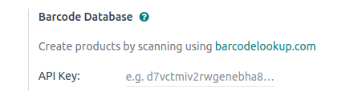
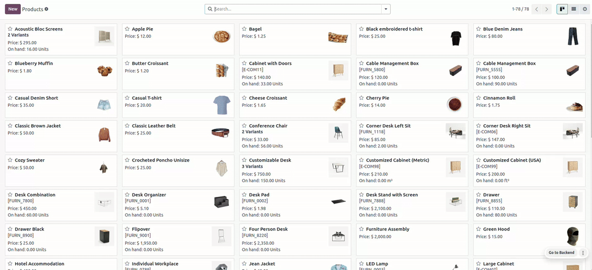

=============
Barcodelookup
=============

The Barcode Lookup feature enables users to efficiently retrieve detailed product information by scanning or entering barcode numbers.
In a retail context, this functionality allows businesses to quickly access essential details such as product names, descriptions, images, and categories for items identified by
UPC, EAN, or ISBN codes.

This streamlines management by minimizing manual data entry and enhancing accuracy in product identification.
In a broader application, such as in e-commerce or point-of-sale systems, Barcode Lookup facilitates rapid product creation and updates.
Users can scan barcodes to automatically populate product details in their databases, ensuring that information is both accurate and up-to-date.
This capability not only improves operational efficiency but also enhances the customer experience by providing instant access to product information.

Configuration
=============

.. _barcodelookup/credentials:

Locate your Barcodelookup API
-----------------------------

- `Create a Barcodelookup account <https://www.barcodelookup.com/api#sign-up>`_ and set it up
   on their website.
- You need the :doc:`supported <supported_versions>` `API key <https://www.barcodelookup.com/api/>`_ to set up the Barcodelookup in Odoo.

Configuration on Odoo
=====================

To use barcodelookup on odoo modules:

#. Access the :menuselection:`Settings --> Integrations --> Barcode Database`.
#. Fill in the field with your :ref:`Barcodelookup API key <barcodelookup/credentials>` to activate :guilabel:`Barcodelookup` feature.

Once the setup is completed, you can use barcodelookup features for your POS, Barcode, E-commerce modules.

Usage in different modules
==========================

.. _barcodelookup/productcreation:

Create product in backend
-------------------------

#. Go to :guilabel:`Products` and click :guilabel:`New`.
#. Fill the barcode field with the barcode value you have and you will have the all details about that product
   within a moment just save it and you are ready to use that product.

Create product from Point-of-sale
---------------------------------

First open session after setting up the API key:

.. _barcodelookup/creationcommonsteps:

#. Go to :guilabel:`Create Product` from :guilabel:`options` on the navbar.

    .. image:: barcodelookup/postab.png

#. To add a new product, simply fill in the barcode field in the product creation popup.
    You can either scan the barcode directly or manually enter its value. Within seconds,
    you’ll have all the relevant product details displayed for you. From there, you can set
    additional options such as category, inventory tracking, and tax settings.
    Once you’ve configured everything to your satisfaction, just click Save to finalize the process. :guilabel:`Save`.
#. If you have inserted the pos category you will be able to see it at the moment on the screen.

    .. image:: barcodelookup/posproductcreation.png

Create product from E-commerce
------------------------------

First open session after setting up the API key:

#. Go to :guilabel:`New` from top right of the navbar and select :guilabel:`Product` from options appear.

    .. image:: barcodelookup/ecomtab.png

#. Now you can follow same steps :ref:`from steps 2 <barcodelookup/creationcommonsteps>` mentioned in the POS product creation process.

Create product from Barcode
---------------------------

First open session after setting up the API key:

#. Go to :guilabel:`Operations` select any operation.
#. Click on :guilabel:`New` button and scan barcode you have you will have the same popup again.
#. Now you can follow same steps :ref:`from step 2 <barcodelookup/creationcommonsteps>` mentioned in the POS product creation process.
