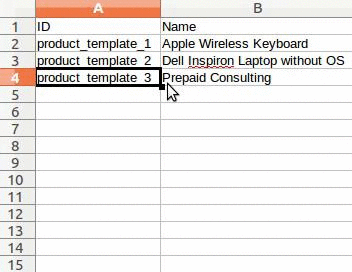

===============================
How to adapt an import template
===============================

Import templates are provided in the import tool of the most common data to
import (contacts, products, bank statements, etc.).
You can open them with any spreadsheets software (Microsoft Office, 
OpenOffice, Google Drive, etc.).

How to customize the file
=========================

* Remove columns you don't need. We advise to not remove the *ID* one (see
  why here below).
* Set a unique ID to every single record by dragging down the ID sequencing.

* When you add a new column, Odoo might not be able to map it automatically if its 
  label doesn't fit any field of the system. 
  If so, find the corresponding field using the search.

    .. image:: media/field_list.png
        :align: center

  Then, use the label you found in your import template in order to make it work
  straight away the very next time you try to import.

Why an “ID” column
==================

The **ID** (External ID) is an unique identifier for the line item.
Feel free to use the one of your previous software to ease the transition to Odoo.

Setting an ID is not mandatory when importing but it helps in many cases:

* Update imports: you can import the same file several times without creating duplicates;
* Import relation fields (see here below).

How to import relation fields
=============================

An Odoo object is always related to many other objects (e.g. a product is linked
to product categories, attributes, vendors, etc.). To import those relations you need to
import the records of the related object first from their own list menu.

You can do it using either the name of the related record or its ID. The ID is expected when
two records have the same name. In such a case add " / ID" at the end of the column title
(e.g. for product attributes: Product Attributes / Attribute / ID).