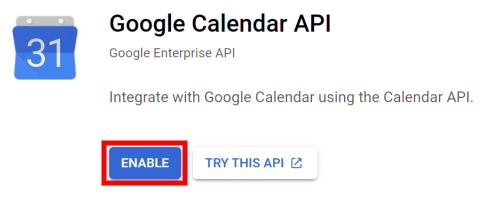
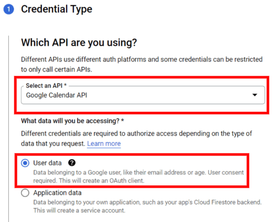
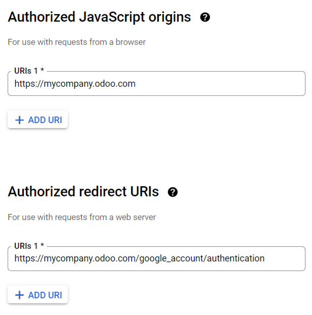
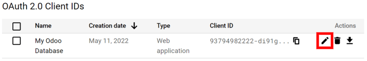
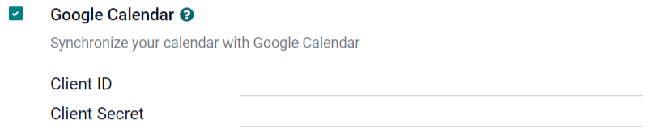
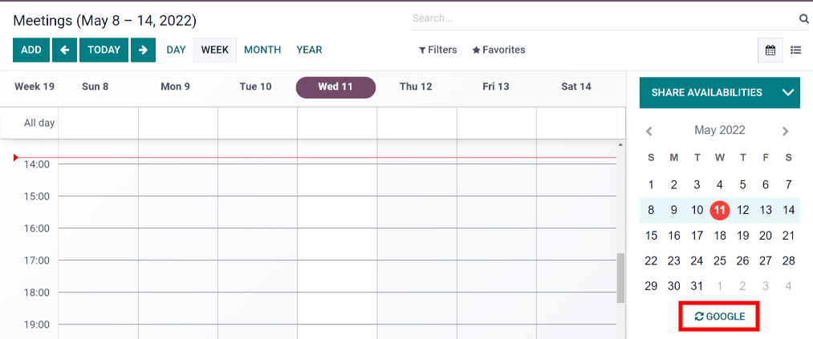
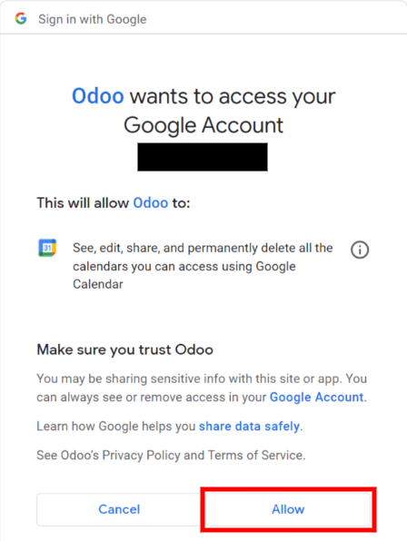

=====================================
Synchronize Google Calendar with Odoo
=====================================

Synchronize Google Calendar with Odoo to see and manage meetings from both platforms (updates go
in both directions). This integration helps organize your schedule so you never miss a meeting.

Setup in Google
===============

Enable Google Calendar API
--------------------------

Begin by creating a new Google API project and enabling the Google Calendar API. Then, go to the
`Google API Console <https://console.developers.google.com>`_ and log into your Google account.

.. note::
   If this is your first time visiting this page, Google will prompt you to enter a country and
   agree to the Terms of Service. Select a country from the drop-down list and agree to the
   :abbr:`ToS (Terms of Service)`.

Next, click :guilabel:`Select a project` and select or create an API project to store credentials.

.. image:: google_calendar_credentials/new-api-project.png
   :align: center
   :alt: Create a new API project to store credentials.

.. tip::
   Give the API Project a clear name like "Odoo Sync" so you can easily find it.

Then, open the API Project and click :guilabel:`Enable APIs and Services`.

.. image:: google_calendar_credentials/enable-apis-services.png
   :align: center
   :alt: Enable APIs and Services on the API Project.

After that, search for *Google Calendar API* using the search bar and select :guilabel:`Google
Calendar API` from the search results. Click :guilabel:`Enable`.

Create credentials
------------------

Now that you have created your API project and enabled the Google Calendar API, you need to create
credentials. Begin by clicking :guilabel:`Create Credentials`. Google will then guide you through
four steps to create your API credentials.

- In the first step, :guilabel:`Credential Type`, select the :guilabel:`Google Calendar API` and
  :guilabel:`User Data` options. Then, click :guilabel:`Next`.

- In the second step, :guilabel:`OAuth Consent Screen`, type *Odoo* in the :guilabel:`App name`
  field, select your email address for the :guilabel:`User support email` field, and type your email
  address for the :guilabel:`Developer contact information` section. Then, click :guilabel:`Save
  and Continue`.

- Skip the third step, :guilabel:`Scopes`, by clicking :guilabel:`Save and Continue`.

- In the last step, :guilabel:`OAuth Client ID`, select :guilabel:`Website application` for the
  :guilabel:`Application Type` field and type *My Odoo Database* for the :guilabel:`Name`.

  - Under the :guilabel:`Authorized JavaScript Origins` section, click :guilabel:`+ Add URI` and
    type your company's Odoo URL address.

  - Under the :guilabel:`Authorized redirect URIs` section, click :guilabel:`+ Add URI` and type
    your company's Odoo URL address followed by */google_account/authentication*. Finally, click
    :guilabel:`Create` and :guilabel:`Done`.

After successfully creating a new API project, enabling the Google Calendar API, and generating the
Google Calendar API credentials, you should now have a Client ID and Client Secret.

Client ID & Client Secret
-------------------------

The **Client ID** and the **Client Secret** are both needed to connect Google Calendar to Odoo. Find
the Client ID and the Client Secret by opening the Google Cloud Platform navigation menu and going
to :menuselection:`API & Services --> Credentials --> OAuth 2.0 Client IDs`.

Next, locate the credentials you just created for the Google Calendar API. Then, click on
:guilabel:`Edit OAuth Client` (the pencil icon). The page will redirect to the edit page, where you
can view the Client ID and the Client Secret.

Setup in Odoo
=============

Once the Client ID and the Client Secret are located, open the Odoo database and go to
:menuselection:`Settings --> General Settings --> Integrations --> Google Calendar`. Check the box
next to :guilabel:`Google Calendar`.

Next, copy and paste the Client ID and the Client Secret from the Google Calender API Credentials
page into their respective fields below the :guilabel:`Google Calendar` checkbox. Then, click
:guilabel:`Save`.

Finally, open the Calendar module in Odoo and click on the :guilabel:`Google` sync button to sync
Google Calendar with Odoo.

.. note::
   The first time you sync your Google Calendar with Odoo, the page will redirect to your Google
   Account. Click :guilabel:`OK` and :guilabel:`Allow` to authorize Odoo to access Google Calendar.

Now, Odoo Calendar is successfully synced with Google Calendar!

.. image:: google_calendar_credentials/successful-sync.png
   :align: center
   :alt: Successfully sync between Odoo and Google Calendar.
