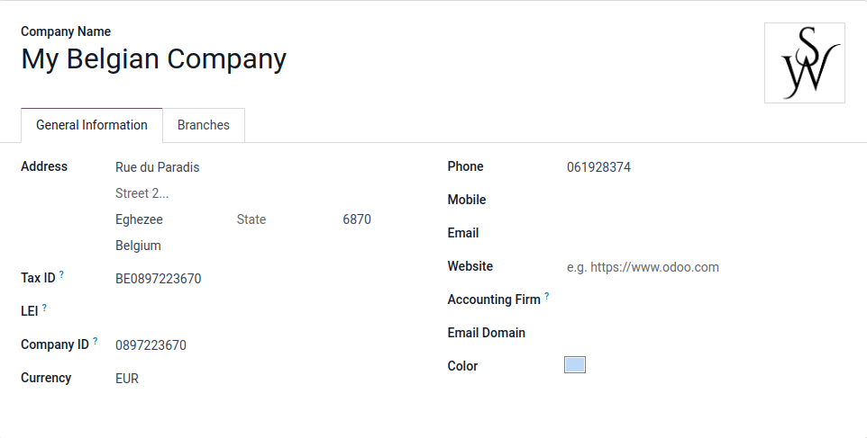
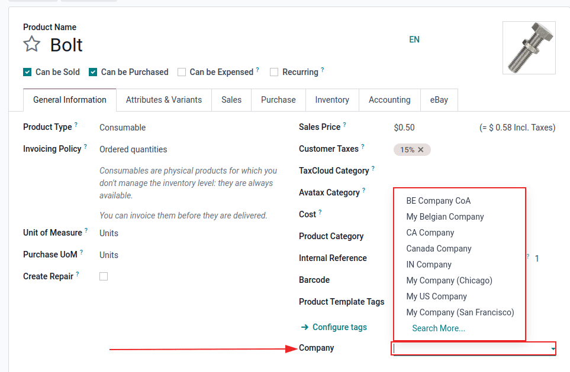
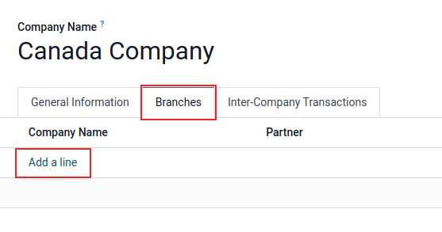
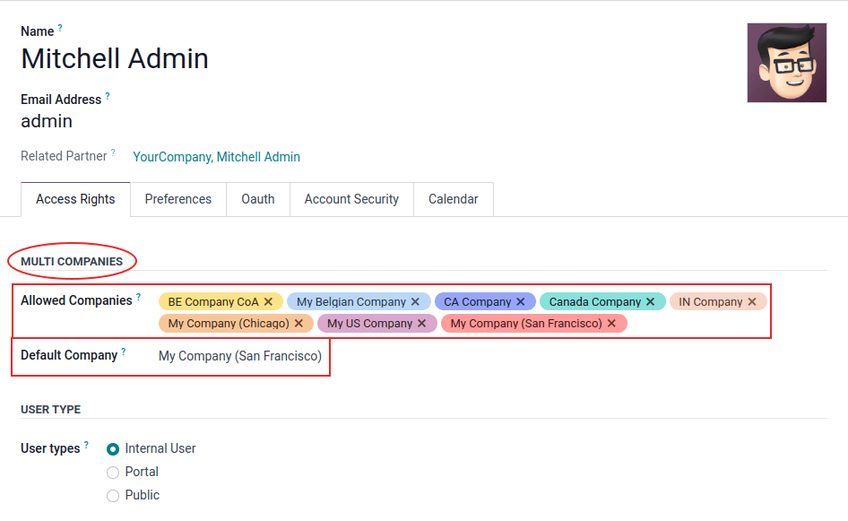
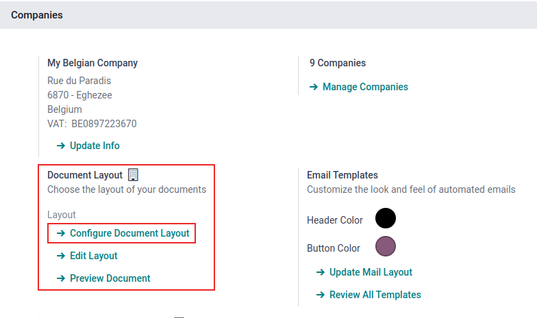
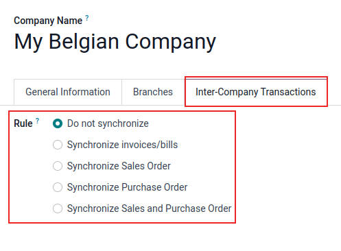

:show-content:

=========
Companies
=========

A centralized management environment allows an administrator to select multiple companies
simultaneously, and set their specific warehouses, customers, equipment, and contacts. It provides
the ability to generate reports of aggregated figures without switching interfaces, which
facilitates daily tasks, and enhances the overall management process.

.. danger::
   Utilizing a multi-company environment in an Odoo database warrants a subscription change from
   *Standard* (or *One App Free*) to a *Custom* plan. Should the administrator not migrate the
   subscription to a *Custom* plan after adding another company, the database risks being
   deactivated. For more information, consult the `Odoo Pricing page
   <https://www.odoo.com/pricing-plan>`_.

   If the customer is on the *Standard* plan, and adds multi-company functionality to the database,
   it triggers an upsell for the *Custom* plan.

   If they are on a *Yearly* or *Multi-year* contract, this creates an upsell order, with a 30-day
   limit (risking deactivation). If multi-company functionality is fully removed within that time
   period, the next time the database pings, the upsell order and limit are removed automatically.

   If the customer is on a *Monthly* contract, once the next bill is created, and multi-company
   functionality is still detected while they are on a *Standard* plan, they are automatically
   switched, and billed on the *Custom* plan.

   Should the customer want to go back to *Standard*, the Customer Success Team **must** be
   contacted.

To create a new company, navigate to :menuselection:`Settings app --> Companies section`, and click
:guilabel:`Manage Companies`. Then, click :guilabel:`New` to create a new company.

Proceed to fill out the new company form that appears.

.. tip::
   To archive a company, navigate to :menuselection:`Settings app --> Companies section --> Manage
   Companies`. Then, tick the checkbox to the left of the company to be archived. If the
   :guilabel:`Companies` page is not in list view, click the :guilabel:`≣ (four bars)` icon, located
   in the top-right corner of the page.

   After selecting the appropriate company, click the :guilabel:`⚙️ Actions` icon, and select
   :guilabel:`Archive` from the resulting drop-down menu.

   To ensure all records related to the archived company are archived, contact Odoo's `Support Team
   <https://www.odoo.com/help>`_.

   Should a record not be archived, there is a risk of reactivating the archived company, and
   creating the upsell again.

.. _companies/manage:

Manage companies and records
============================

Go to :menuselection:`Settings app --> Companies section --> Manage Companies`. Then, either click
:guilabel:`New`, and fill in the form with the company's information, or select a pre-existing
company to edit it.

.. tip::
   Activate the :ref:`developer mode <developer-mode>` to set social media accounts and
   company-specific email parameters. See this documentation on
   :doc:`../marketing/social_marketing` and :doc:`email_communication`.

   Companies also have a :guilabel:`Parent Company` set on the company form in :ref:`developer mode
   <developer-mode>`.

Switch between companies
------------------------

Switch between (or select) multiple companies, by clicking on the company name, located in the
far-right corner of the header menu, anywhere throughout the database. Tick the checkboxes next to
the desired company name(s) to activate them. The highlighted company represents the current
environment that is in use. To switch environments, click on the desired company name.

.. example::
   In the example below, the user has access to eight companies, two are activated, and the
   environment the database is in belongs to: *My Company (San Francisco)*.

   .. image:: companies/multi-companies-menu-dashboard.png
      :align: center
      :alt: View of the companies menu through the main dashboard in Odoo.

Share records
-------------

Data (such as, products, contacts, and equipment) can be shared, or set to be shown for a specific
company only. To do so, on their forms, choose between:

- *A blank field*: the record is shared within all companies.
- *Adding a company*: the record is visible to users logged in to that specific company.

When an environment is selected from the top menu, along with an additional company, records are
shared between the two companies.

Branches
========

Branches are available to add to a company. Branches can be added by navigating to
:menuselection:`Settings app --> Companies section --> Manage Companies`. Then, select the desired
company from the list. From the company detail form, open the :guilabel:`Branches` tab. To add a
branch, click :guilabel:`Add a line`, and fill out the :guilabel:`Create Branches` pop-up form that
appears.

.. tip::
   Activate the :ref:`developer mode <developer-mode>` to set social media accounts and
   company-specific email system parameters. See this documentation on
   :doc:`../marketing/social_marketing` and :doc:`email_communication`.

   Branches also have a :guilabel:`Parent Company` set on the branch form in :ref:`developer mode
   <developer-mode>`. Accounting and fiscal localizations for the branch are set on the
   :guilabel:`Parent Company`. To do so, select the company from the *company selector* in the top
   menu, and go to :menuselection:`Settings app --> Accounting --> Fiscal Localization`.

.. danger::
   If the database is on the standard *Paid* pricing plan, adding a branch to a company triggers an
   upsell. Since adding one or more branches turns the database into a multi-company setup, it
   will need to switch to the *Custom* pricing plan. This does not affect databases on the *One-app
   free* plan.

   For more information on pricing, see `Odoo's pricing <https://www.odoo.com/pricing-plan>`_ page.

.. _general/employee-access:

Employee access
===============

Once companies are created, manage the employees' :doc:`Access Rights <users/access_rights>` for
*Multi Companies*.

To access the *Access Rights*, navigate to :menuselection:`Settings app --> Users section --> Manage
Users`.

From the :guilabel:`Users` page, select a user from the list to modify. Then, either change the
fields for :guilabel:`Allowed Companies` or :guilabel:`Default Company`.

Multiple companies can be set for :guilabel:`Allowed Companies`, and *only one* can be set as the
:guilabel:`Default Company`.

         in Odoo.

If an administrator has multiple companies activated on the database, and is editing a record, the
editing occurs on the record's related company.

.. example::
   If editing a sale order issued under `JS Store US`, while working on the `JS Store Belgium`
   environment, the changes are applied under `JS Store US` (the company from which the sale order
   was issued).

When creating a record, the company taken into account is:

- The current company selected in the company selector, in the upper-right hand of the screen (the
  one that is highlighted/active)

**OR**

- No company is set (because none is set on the product and contact forms, for example)

**OR**

- The company set is the company linked to the document (the same as if a record is being edited)

Document format
===============

To set document formats according to each company, *activate* and *select* the respective company,
and, under the :menuselection:`Settings app --> Companies section`, click on :guilabel:`Configure
Document Layout` and edit the information as needed.

:guilabel:`Company Details` can be edited on the document layout. By default, this field is
populated from the company information listed, when navigating here: :menuselection:`Settings app
--> Companies section --> Manage Companies`, and select a company from the list.

.. _general/inter-company:

Inter-company transactions
==========================

First, activate the :ref:`developer mode <developer-mode>`. Then, make sure each one of the
companies is properly set in relation to:

- :doc:`Chart of Accounts <../finance/accounting/get_started/chart_of_accounts>`
- :doc:`Taxes <../finance/accounting/taxes>`
- :doc:`Fiscal Positions <../finance/accounting/taxes/fiscal_positions>`
- :doc:`Journals <../finance/accounting/bank>`
- :doc:`Fiscal Localizations <../finance/fiscal_localizations>`
- :doc:`Pricelists <../sales/sales/products_prices/prices/pricing>`

Next, navigate to :menuselection:`Settings app --> Companies section --> Manage Companies`. Then,
select the desired company from the list. On the company form, select the :guilabel:`Inter-Company
Transactions` tab, on the individual company's detail form.

With the respective company activated and selected, choose one of the following :guilabel:`Rule`
options:

- :guilabel:`Do not synchronize`: do not synchronize any inter-company transactions.
- :guilabel:`Synchronized invoice/bills`: generates a bill/invoice when a company confirms a
  bill/invoice for the selected company.
- :guilabel:`Synchronize Sales Order`: generates a drafted sales order using the selected company
  warehouse, when a sales order is confirmed for the selected company. If, instead of a drafted
  sales order, it should be validated, enable :guilabel:`Automatic Validation`.\*
- :guilabel:`Synchronize Purchase Order`: generates a drafted purchase order using the selected
  company warehouse, when a purchase order is confirmed for the selected company. If, instead of a
  drafted purchase order, it should be validated, enable :guilabel:`Automatic Validation`.\*
- :guilabel:`Synchronize Sales and Purchase Order`: generates a drafted purchase/sales order using
  the selected company warehouse, when a sales/purchase order is confirmed for the selected company.
  If, instead of a drafted purchase/sales order, it should be validated, enable :guilabel:`Automatic
  Validation`.\*

  \* The given option needs to be selected, so :guilabel:`Automatic Validation` appears in the
  configuration.

.. note::
   Products **must** be configured as :guilabel:`Can be sold` and shared between the companies. See
   :doc:`../inventory_and_mrp/inventory/product_management/configure/type`.

.. example::
   :guilabel:`Synchronize invoice/bills`: an invoice posted on `JS Store Belgium`, for `JS Store
   US`, automatically creates a vendor bill, and generates a drafted purchase/sales order using the
   selected company warehouse, when a sales/purchase order is confirmed for the selected company.
   If, instead of a drafted purchase/sales order, it should be validated, enable
   :guilabel:`Automatic Validation`.

   :guilabel:`Synchronize sales/purchase order`: when a sale order for `JS Store US` is confirmed on
   `JS Store Belgium`, a purchase order on `JS Store Belgium` is automatically created (and
   confirmed, if the :guilabel:`Automatic Validation` feature was enabled).

.. tip::
   Remember to test all workflows as a user *other* than the administrator.

.. seealso::
   - :doc:`Multi-company Guidelines <../../developer/howtos/company>`
   - :doc:`../finance/accounting/get_started/multi_currency`

.. toctree::
   :titlesonly:

   companies/digest_emails
   companies/email_template
