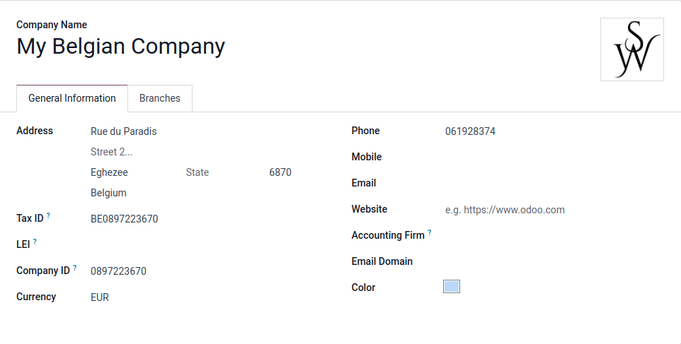
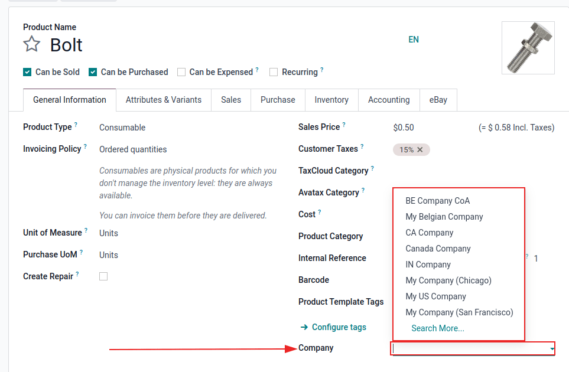
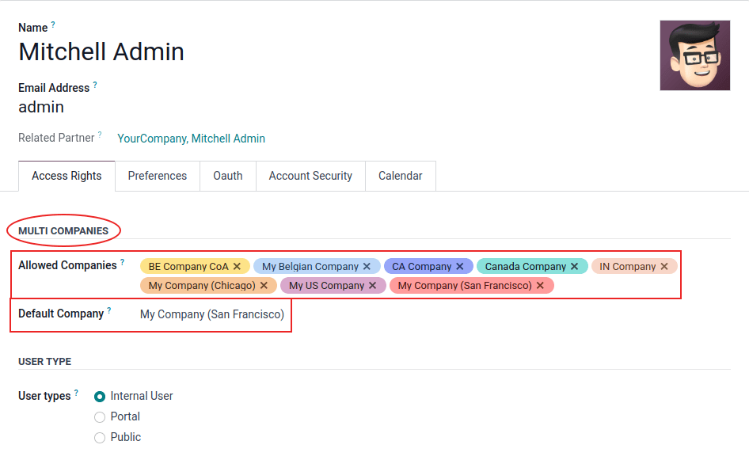
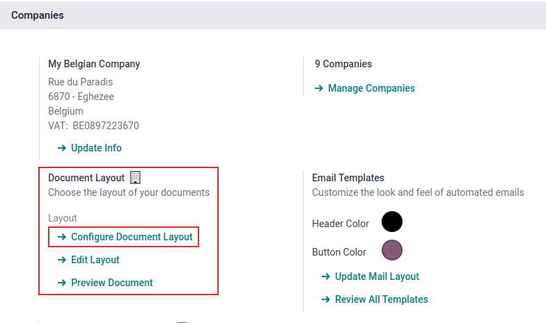
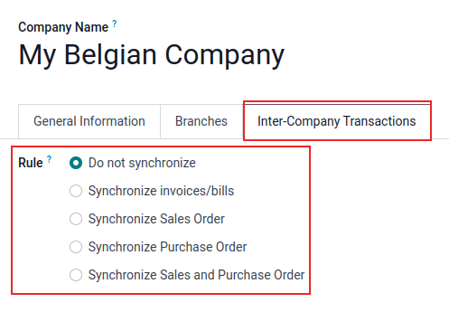

:show-content:

=========
Companies
=========

A centralized management environment allows an administrator to select multiple companies
simultaneously, and set their specific warehouses, customers, equipment, and contacts. It provides
the ability to generate reports of aggregated figures without switching interfaces, which
facilitates daily tasks, and enhances the overall management process.

.. warning::
   Enabling multi-company functionality in an Odoo database on a *Standard* plan automatically
   triggers an upsell to the *Custom* plan. This does not apply to databases on the *One-App Free*
   plan.

   - **For yearly or multi-year contracts**: An upsell order is created with a 30-day limit.
   - **For monthly contracts**: The subscription automatically switches to the *Custom* plan and
     the new rate is applied when the next bill is generated.

   For more information, refer to `Odoo's pricing page <https://www.odoo.com/pricing-plan>`_ or
   contact your account manager.

To create a new company, navigate to :menuselection:`Settings app --> Companies section`, and click
:guilabel:`Manage Companies`. Then, click :guilabel:`New` to create a new company.

Proceed to fill out the new company form that appears.

.. tip::
   To archive a company, navigate to :menuselection:`Settings app --> Companies section --> Manage
   Companies`. Then, tick the checkbox to the left of the company to be archived. If the
   :guilabel:`Companies` page is not in list view, click the :guilabel:`≣ (four bars)` icon, located
   in the top-right corner of the page.

   After selecting the appropriate company, click the :guilabel:`⚙️ Actions` icon, and select
   :guilabel:`Archive` from the resulting drop-down menu.

   To ensure all records related to the archived company are archived, contact Odoo's `Support Team
   <https://www.odoo.com/help>`_.

   Should a record not be archived, there is a risk of reactivating the archived company, and
   creating the upsell again.

.. _general/manage:

Manage companies and records
============================

Go to :menuselection:`Settings app --> Companies section --> Manage Companies`. Then, either click
:guilabel:`New`, and fill in the form with the company's information, or select a pre-existing
company to edit it.

.. tip::
   Activate the :ref:`developer mode <developer-mode>` to set social media accounts and
   company-specific email parameters. See this documentation on
   :doc:`../marketing/social_marketing` and :doc:`email_communication`.

   Companies also have a :guilabel:`Parent Company` set on the company form in :ref:`developer mode
   <developer-mode>`.

.. _general/switch:

Switch between companies
------------------------

Switch between (or select) multiple companies, by clicking on the company name, located in the
far-right corner of the header menu, anywhere throughout the database. Tick the checkboxes next to
the desired company name(s) to activate them. The highlighted company represents the current
environment that is in use. To switch environments, click on the desired company name.

.. example::
   In the example below, the user has access to eight companies, two are activated, and the
   environment the database is in belongs to: *My Company (San Francisco)*.

   .. image:: companies/multi-companies-menu-dashboard.png
      :alt: View of the companies menu through the main dashboard in Odoo.

.. _general/share-records:

Share records
-------------

Data (such as, products, contacts, and equipment) can be shared, or set to be shown for a specific
company only. To do so, on their forms, choose between:

- *A blank field*: the record is shared within all companies.
- *Adding a company*: the record is visible to users logged in to that specific company.

When an environment is selected from the top menu, along with an additional company, records are
shared between the two companies.

.. _general/branches:

Branches
========

.. warning::
   Adding a branch to a :doc:`company <../general/companies>` enables multi-company functions.

The branch feature enables the creation of a hierarchical structure among different companies within
a database, which helps manage a group with multiple subsidiaries or a company with various retail
locations. Legally, a branch is a dependent extension of the main company, and Odoo follows the same
logic.

.. note::
   For an independent subsidiary, it is preferable to create it as a new company.

.. seealso::
   - :doc:`Multi-company </applications/general/multi_company>`
   - :ref:`Accounting branch management <accounting/branch-management>`

.. _general/branches/configuration:

Configuration
-------------

Each branch is linked to its parent company, but may contain different or specific information, such
as its address or logo. A branch can be a parent company of branches at a lower level to create a
multi-level architecture.

.. note::
   - The first company created should be the highest in the hierarchy.
   - It is important to note that once a company has been created as a main company, it cannot be
     defined as a branch afterwards. Errors in the record rules can lead to access rights issues. It
     is therefore essential to be certain of the structure and hierarchy of each entity before
     creating them as a company or branch.

To create a branch, open the Settings app, navigate to the :guilabel:`Companies` section, and click
:icon:`oi-arrow-right` :guilabel:`Manage Companies`. In the :guilabel:`Companies` list view, open
the desired parent company form. Then, in the :guilabel:`Branches` tab, click :guilabel:`Add a line`
and fill in the information in the :guilabel:`Create Branches` window.

To create branches from a branch and create a multi-level architecture, click :guilabel:`Add a line`
in the new branch's :guilabel:`Branches` tab.

Branches can be accessed from the top-right corner of the main Odoo menu bar, where the active
company is displayed. When the parent company is selected, all associated branches are automatically
connected.

.. tip::
   - Activate the :ref:`developer mode <developer-mode>` to set social media accounts and
     company-specific email system parameters. See this documentation on
     :doc:`../marketing/social_marketing` and :doc:`email_communication`.
   - A :guilabel:`Parent Company` field is available on the branch form in :ref:`developer mode
     <developer-mode>`.

.. _general/branches/access-rights:

Access rights
-------------

User :doc:`access </applications/general/users/access_rights>` can be restricted or granted to
specific companies, including parent companies and branches, to limit visibility to records
associated only with the companies users are authorized to access. As a result, records such as
purchase orders, projects, and invoices are displayed based on the user’s profile and access rights.

For example, certain users can be restricted to a specific shop, while an administrator with access
to the parent company can manage all related shops and branches.

To do so, open the Settings app, navigate to the :guilabel:`Users` section, and click
:guilabel:`Manage Users`. Open the user form and add or remove companies in the :guilabel:`Allowed
Companies` field.

.. tip::
   Alternatively, access can be set in :menuselection:`Settings --> Users & Companies -->
   Users`.

.. _general/branches/shared-records:

Shared records
--------------

Each record strictly linked to a specific entity, whether a branch or parent company, is only
accessible within that entity. For example, quotations, invoices, and vendor bills linked to a
branch will only be visible when logged into that specific branch.

In contrast, elements not tied to any particular entity, such as products or contacts, are shared
across the parent company and all its branches.

.. _general/branches/consolidated-view:

Consolidated or branch view
---------------------------

Focusing on the parent company allows automatic connection to all related branches, providing a
consolidated activity view across the entire database.

Each branch operates in its own environment, where activities such as accounting, HR, inventory
management, and production can be managed independently. By restricting user access, each branch can
function like a standalone company.

Except for :ref:`accounting <accounting/branch-management>` settings, inherited from the parent
company, other configurations must be created or adjusted individually in each branch. This allows
for branch-specific setups such as loyalty programs, price lists, or inventory locations.

.. _general/employee-access:

Employee access
===============

Once companies are created, manage the employees' :doc:`Access Rights <users/access_rights>` for
*Multi Companies*.

To access the *Access Rights*, navigate to :menuselection:`Settings app --> Users section --> Manage
Users`.

From the :guilabel:`Users` page, select a user from the list to modify. Then, either change the
fields for :guilabel:`Allowed Companies` or :guilabel:`Default Company`.

Multiple companies can be set for :guilabel:`Allowed Companies`, and *only one* can be set as the
:guilabel:`Default Company`.

         in Odoo.

If an administrator has multiple companies activated on the database, and is editing a record, the
editing occurs on the record's related company.

.. example::
   If editing a sale order issued under `JS Store US`, while working on the `JS Store Belgium`
   environment, the changes are applied under `JS Store US` (the company from which the sale order
   was issued).

When creating a record, the company taken into account is:

- The current company selected in the company selector, in the upper-right hand of the screen (the
  one that is highlighted/active)

**OR**

- No company is set (because none is set on the product and contact forms, for example)

**OR**

- The company set is the company linked to the document (the same as if a record is being edited)

.. _general/document-format:

Document format
===============

To set document formats according to each company, *activate* and *select* the respective company,
and, under the :menuselection:`Settings app --> Companies section`, click on :guilabel:`Configure
Document Layout` and edit the information as needed.

:guilabel:`Company Details` can be edited on the document layout. By default, this field is
populated from the company information listed, when navigating here: :menuselection:`Settings app
--> Companies section --> Manage Companies`, and select a company from the list.

.. _general/inter-company:

Inter-company transactions
==========================

First, activate the :ref:`developer mode <developer-mode>`. Then, make sure each one of the
companies is properly set in relation to:

- :doc:`Chart of Accounts <../finance/accounting/get_started/chart_of_accounts>`
- :doc:`Taxes <../finance/accounting/taxes>`
- :doc:`Fiscal Positions <../finance/accounting/taxes/fiscal_positions>`
- :doc:`Journals <../finance/accounting/bank>`
- :doc:`Fiscal Localizations <../finance/fiscal_localizations>`
- :doc:`Pricelists <../sales/sales/products_prices/prices/pricing>`

Next, navigate to :menuselection:`Settings app --> Companies section --> Manage Companies`. Then,
select the desired company from the list. On the company form, select the :guilabel:`Inter-Company
Transactions` tab, on the individual company's detail form.

With the respective company activated and selected, choose one of the following :guilabel:`Rule`
options:

- :guilabel:`Do not synchronize`: do not synchronize any inter-company transactions.
- :guilabel:`Synchronized invoice/bills`: generates a bill/invoice when a company confirms a
  bill/invoice for the selected company.
- :guilabel:`Synchronize Sales Order`: generates a drafted sales order using the selected company
  warehouse, when a sales order is confirmed for the selected company. If, instead of a drafted
  sales order, it should be validated, enable :guilabel:`Automatic Validation`.\*
- :guilabel:`Synchronize Purchase Order`: generates a drafted purchase order using the selected
  company warehouse, when a purchase order is confirmed for the selected company. If, instead of a
  drafted purchase order, it should be validated, enable :guilabel:`Automatic Validation`.\*
- :guilabel:`Synchronize Sales and Purchase Order`: generates a drafted purchase/sales order using
  the selected company warehouse, when a sales/purchase order is confirmed for the selected company.
  If, instead of a drafted purchase/sales order, it should be validated, enable :guilabel:`Automatic
  Validation`.\*

  \* The given option needs to be selected, so :guilabel:`Automatic Validation` appears in the
  configuration.

.. note::
   Products **must** be configured as :guilabel:`Can be sold` and shared between the companies. See
   :doc:`../inventory_and_mrp/inventory/product_management/configure/type`.

.. example::
   :guilabel:`Synchronize invoice/bills`: an invoice posted on `JS Store Belgium`, for `JS Store
   US`, automatically creates a vendor bill, and generates a drafted purchase/sales order using the
   selected company warehouse, when a sales/purchase order is confirmed for the selected company.
   If, instead of a drafted purchase/sales order, it should be validated, enable
   :guilabel:`Automatic Validation`.

   :guilabel:`Synchronize sales/purchase order`: when a sale order for `JS Store US` is confirmed on
   `JS Store Belgium`, a purchase order on `JS Store Belgium` is automatically created (and
   confirmed, if the :guilabel:`Automatic Validation` feature was enabled).

.. tip::
   Remember to test all workflows as a user *other* than the administrator.

.. seealso::
   - :doc:`Multi-company Guidelines <../../developer/howtos/company>`
   - :doc:`../finance/accounting/get_started/multi_currency`

.. toctree::
   :titlesonly:

   companies/digest_emails
   companies/email_template
