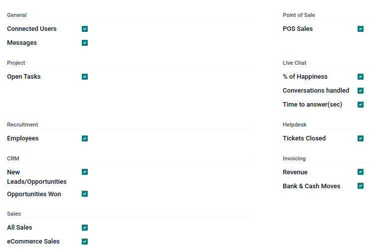

=============
Digest emails
=============

*Digest Emails* are periodic snapshots sent via email to users in an organization that include
high-level information about how the business is performing.

To start sending digest emails, begin by navigating to :menuselection:`Settings app --> Statistics
section`, activate the :guilabel:`Digest Emails` feature, and click :guilabel:`Save`.

.. image:: digest_emails/digest-email-settings.png
   :align: center
   :alt: Digest Emails section inside General Settings.

A variety of settings can be configured for digest emails, such as:

- Deciding which :abbr:`KPIs (key performance indicators)` are shared in the digest emails
- Determining how often digest emails are sent
- Choosing who in the organization receives digest emails
- Creating custom digest email templates
- Adding additional :abbr:`KPIs (key performance indicators)` (*Studio* app required)

.. note::
   By default, the :guilabel:`Digest Email` feature is enabled. :guilabel:`Your Odoo Periodic
   Digest` serves as the primary template, which includes all :abbr:`KPI (key performance
   indicator)` measurements across the Odoo database, and is sent daily to administrators.

.. warning::
   When creating duplicates of databases that have sending capabilities (not testing-mode), the
   digest emails continue to send from the duplicate database, unless deactivated.

   To deactivate the digest email, navigate to :menuselection:`Settings --> Statistics section`.
   Then, deactivate the :guilabel:`Digest Emails` feature, by un-ticking the checkbox, and clicking
   :guilabel:`Save`. See the section on :ref:`digest-emails/deactivate`.

.. _digest-emails/customize-digest:

Customize default digest email
==============================

To customize the default digest email (*Your Odoo Periodic Digest*), go to :menuselection:`Settings
app --> Statistics section --> Digest Email field`. Then, select :guilabel:`Your Odoo Periodic
Digest`, and click on the :guilabel:`↗️ (External link)` icon, next to the drop-down menu selection.

A pop-up window appears, and presents a variety of editable settings, which include:

- :guilabel:`Digest Name`: the name of the digest email.
- :guilabel:`Periodicity`: control how often digest emails are sent (:guilabel:`Daily`,
  :guilabel:`Weekly`, :guilabel:`Monthly`, or :guilabel:`Quarterly`).
- :guilabel:`Next Send Date`: the date on which the digest email will be sent again.
- :guilabel:`KPIs` tab: check/uncheck each calculated :abbr:`KPI (key performance indicator)` that
  appears in digest emails. A ticked box indicates an active :abbr:`KPI (key performance indicator)`
  in the digest email. See the section on :ref:`digest-emails/kpis`.
- :guilabel:`Recipients` tab: add/remove users who receive the digest emails. See the section on
  :ref:`digest-emails/recipients`.

.. note::
   The :abbr:`KPIs (key performance indicators)` can be customized using Odoo *Studio*. Additional
   costs to the database subscription are incurred should *Studio* need to be installed. See this
   section on :ref:`digest-emails/custom-kpi`.

.. image:: digest_emails/periodic-digest.png
   :align: center
   :alt: Customize default Digest Email settings and custom KPIs.

.. _digest-emails/deactivate:

Deactivate digest email
=======================

To manually deactivate an individual digest email, first navigate to :menuselection:`Settings app
--> Statistics section`, and click :guilabel:`Configure Digest Emails`. Then, select the desired
digest email from the list that should be deactivated.

Next, click :guilabel:`DEACTIVATE FOR EVERYONE` to deactivate the digest email for everyone, or
:guilabel:`UNSUBSCRIBE ME` to remove the logged in user from the mailing list. These buttons are
located in the top menu, just above the :guilabel:`Digest Name`.

Manually send digest email
==========================

To manually send a digest email, first navigate to :menuselection:`Settings app --> Statistics
section`, and click :guilabel:`Configure Digest Emails`. Then, select the desired digest email, and
click :guilabel:`SEND NOW`. This button is located in the top menu, just above the :guilabel:`Digest
Name`.

.. _digest-emails/kpis:

KPIs
====

Pre-configured :abbr:`KPIs (key performance indicators)` can be added to the digest email from the
:guilabel:`KPIs` tab of the digest email template form.

First, navigate to :menuselection:`Settings app --> Statistics section`, and click
:guilabel:`Configure Digest Emails`.

Then, select the desired digest email, and open the :guilabel:`KPIs` tab.

To add a :abbr:`KPI (key performance indicator)` to the digest email, tick the checkbox next to the
desired :abbr:`KPI (key performance indicator)`. After all :abbr:`KPIs (key performance indicators)`
are added (or deselected), click :guilabel:`Save`.

The following :abbr:`KPIs (key performance indicators)` are available in the :guilabel:`KPIs` tab on
a digest email template form out-of-box in Odoo:

:guilabel:`General`
   - :guilabel:`Connected Users`
   - :guilabel:`Messages`

:guilabel:`Project`
   - :guilabel:`Open Tasks`

:guilabel:`Recruitment`
   - :guilabel:`Employees`

:guilabel:`CRM`
   - :guilabel:`New Leads/Opportunities`
   - :guilabel:`Opportunities Won`

:guilabel:`Sales`
   - :guilabel:`All Sales`
   - :guilabel:`eCommerce Sales`

:guilabel:`Point of Sale`
   - :guilabel:`POS Sales`

:guilabel:`Live Chat`
   - :guilabel:`% of Happiness`
   - :guilabel:`Conversations handled`
   - :guilabel:`Time to answer (sec)`

:guilabel:`Helpdesk`
   - :guilabel:`Tickets Closed`

:guilabel:`Invoicing`
   - :guilabel:`Revenue`
   - :guilabel:`Banks and Cash Moves`

.. _digest-emails/recipients:

Recipients
==========

Digest email recipients are added from the :guilabel:`Recipients` tab of the digest email template
form.

To add a recipient, navigate to :menuselection:`Settings app --> Statistics section`, and click
:guilabel:`Configure Digest Emails`. Then, select the desired digest email, and open the
:guilabel:`Recipients` tab.

To add a recipient, click :guilabel:`Add a line`, and an :guilabel:`Add Recipients` pop-up window
appears, with all available users to add as recipients.

From the pop-up window, tick the checkbox next to the :guilabel:`Name` of the user(s), and click the
:guilabel:`Select` button.

To remove a user as a recipient, click the :guilabel:`❌ (remove)` icon to the far-right of the user
listed in the :guilabel:`Recipients` tab.

Click :guilabel:`Save` to implement the changes.

.. _digest-emails/custom-emails:

Create digest emails
====================

To create a new digest email, navigate to :menuselection:`Settings app --> Statistics section`, and
click :guilabel:`Configure Digest Emails`. Then, click :guilabel:`Create` to create a new digest
email.

A separate page, with a blank digest email template appears, and presents a variety of editable
settings, including:

- :guilabel:`Digest Name`: the name of the digest email.
- :guilabel:`Periodicity`: control how often digest emails are sent (:guilabel:`Daily`,
  :guilabel:`Weekly`, :guilabel:`Monthly`, or :guilabel:`Quarterly`).
- :guilabel:`Next Send Date`: the date on which the digest email will be sent again.
- :guilabel:`KPIs` tab: check/uncheck each calculated :abbr:`KPI (key performance indicator)` that
  appears in digest emails. A ticked box indicates an active :abbr:`KPI (key performance indicator)`
  in the digest email. See the section on :ref:`digest-emails/kpis`.
- :guilabel:`Recipients` tab: add/remove users who receive the digest emails. See the section on
  :ref:`digest-emails/recipients`.

From there, give the digest email a :guilabel:`Digest Name`, specify :guilabel:`Periodicity`,
choose the desired :abbr:`KPIs (key performance indicators)`, and add :guilabel:`Recipients`, as
needed.

After clicking :guilabel:`Save`, the new custom digest email is available as a selection in the
:guilabel:`Digest Email` field, located in the :menuselection:`Settings app --> Statistics section`.

.. _digest-emails/custom-kpi:

Custom KPIs with Odoo Studio
============================

The :abbr:`KPIs (key performance indicators)` on a digest email template form, in the
:guilabel:`KPIs` tab, can be customized using Odoo *Studio*.

.. warning::
   Additional costs to the database subscription are incurred, should Odoo *Studio* need to be
   installed.

To begin, click the :guilabel:`🛠️ (tools)` icon in the top-right of the screen. This is the link to
the Odoo *Studio* application.

In order to create additional fields, create two fields on the digest object:

#. Create a boolean field called `kpi_myfield`, and display it in the :guilabel:`KPIs` tab.
#. Create a computed field called `kpi_myfield_value` that computes the customized :abbr:`KPI (key
   performance indicator)`.
#. Select the :abbr:`KPIs (key performance indicators)` in the :guilabel:`KPIs` tab.

.. tip::
   Here is the `source code
   <https://github.com/odoo/odoo/blob/15.0/addons/digest/models/digest.py>`_ for the `digest.py`
   file, which guides the programmer in the coding of the computed field.

.. seealso::
   Users can also click the :guilabel:`Recipients` tab, and then the vertical three-dot
   :guilabel:`(kebab)` menu to edit this view. Either click :guilabel:`EDIT LIST VIEW` or
   :guilabel:`EDIT FORM VIEW` to modify this tab.

Computed values reference table
-------------------------------

+-----------------------+-------------------------------------------+
| LABEL                 | VALUE                                     |
+=======================+===========================================+
| Connected Users       | `kpi_res_users_connected_value`           |
+-----------------------+-------------------------------------------+
| Messages Sent         | `kpi_mail_message_total_value`            |
+-----------------------+-------------------------------------------+
| New Leads             | `kpi_crm_lead_created_value`              |
+-----------------------+-------------------------------------------+
| Opportunities Won     | `kpi_crm_opportunities_won_value`         |
+-----------------------+-------------------------------------------+
| Open Tasks            | `kpi_project_task_opened_value`           |
+-----------------------+-------------------------------------------+
| Tickets Closed        | `kpi_helpdesk_tickets_closed_value`       |
+-----------------------+-------------------------------------------+
| % of Happiness        | `kpi_livechat_rating_value`               |
+-----------------------+-------------------------------------------+
| Conversations handled | `kpi_livechat_conversations_value`        |
+-----------------------+-------------------------------------------+
| Time to answer (sec)  | `kpi_livechat_response_value`             |
+-----------------------+-------------------------------------------+
| All Sales             | `kpi_all_sale_total_value`                |
+-----------------------+-------------------------------------------+
| eCommerce Sales       | `kpi_website_sale_total_value`            |
+-----------------------+-------------------------------------------+
| Revenue               | `kpi_account_total_revenue_value`         |
+-----------------------+-------------------------------------------+
| Bank & Cash Moves     | `kpi_account_bank_cash_value`             |
+-----------------------+-------------------------------------------+
| POS Sales             | `kpi_pos_total_value`                     |
+-----------------------+-------------------------------------------+
| New Employees         | `kpi_hr_recruitment_new_colleagues_value` |
+-----------------------+-------------------------------------------+
