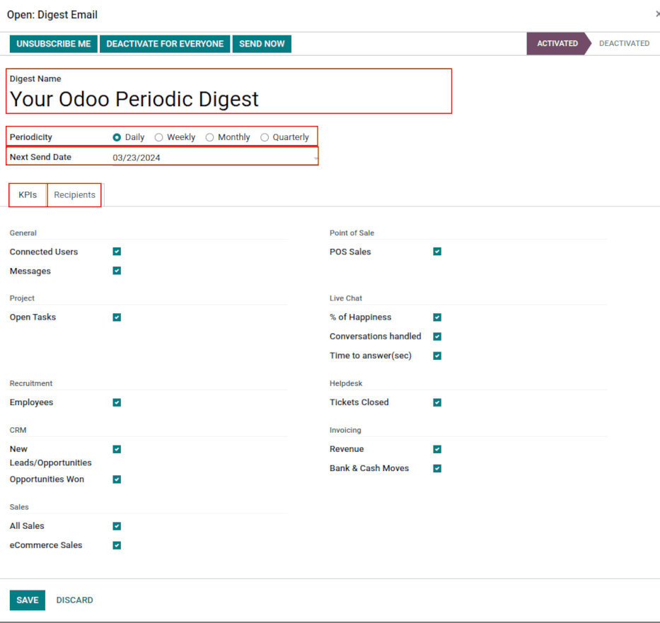

=============
Digest Emails
=============

**Digest Emails** are periodic snapshots sent to your organization via email that include high-level
information about how your business is performing.

Navigate to Digest Emails by going to :menuselection:`Settings --> General Settings --> Statistics`,
then activate the **Digest Emails** feature and click on save.

.. image:: digest_emails/digest-email-settings.png
   :align: center
   :alt: Digest Emails section inside General Settings.

You can control a variety of settings for your Digest Emails, such as:

- which KPIs are shared in the Digest
- how often Digest Emails are sent
- who in your organization receives Digest Emails
- creating custom Digest Email templates
- adding additional KPIs (Studio required)

.. note::
   By default, Digest Email is *enabled*, and *Your Odoo Periodic Digest* serves as the primary
   template, which includes all KPI measurements across your Odoo database and is sent daily to
   administrators.

.. _digest-emails/customize-digest:

Customize *Your Odoo Periodic Digest*
=====================================

To customize the default Digest Email (*Your Odoo Periodic Digest*), go to :menuselection:`Settings
--> General Settings --> Statistics --> Digest Email`, select *Your Odoo Periodic Digest* and click
on the *external link* next to the dropdown selection.

A popup window appears and presents a variety of editable settings, which include:

- **Digest Title** - what you want your Digest Email to be called
- **Periodicity** - control the regimen in how often Digest Emails are sent
- **KPIs** - check/uncheck each calculated KPI that appears in Digest Emails
- **Recipients** - add/remove users who receive your Digest Emails
- **Custom** - add your own KPIs (Studio required)

.. _digest-emails/custom-emails:

Custom digest emails
====================

To do so, click on **Configure Digest Emails** and then **Create**.

From there, give your Digest Email a title, specify periodicity, and choose your desired KPIs and
recipients fields as needed.

After you click **Save**, your new custom Digest Email is available as a selection in the **General
Settings** dropdown menu.

.. _digest-emails/custom-kpi:

Custom KPIs with Studio
-----------------------

For either *Your Odoo Periodic Digest* or your own custom Digest Email, you can add your own KPIs
by using Odoo Studio.

To begin, click the **Toggle Studio** icon or click the **Recipients** tab and then the ellipses
:menuselection:`… icon --> Add Custom Field` to edit the template or add additional fields.

In order to create additional fields, you must create two fields on the digest object:

#. create a boolean field called `kpi_myfield` and display it in the KPIs tab
#. create a computed field called `kpi_myfield_value` that computes your customized KPI
#. select your KPI(s) in the KPIs tab.

Computed values reference table
~~~~~~~~~~~~~~~~~~~~~~~~~~~~~~~

+-----------------------+-------------------------------------------+
| LABEL                 | VALUE                                     |
+=======================+===========================================+
| Connected Users       | `kpi_res_users_connected_value`           |
+-----------------------+-------------------------------------------+
| Messages Sent         | `kpi_mail_message_total_value`            |
+-----------------------+-------------------------------------------+
| New Leads             | `kpi_crm_lead_created_value`              |
+-----------------------+-------------------------------------------+
| Opportunities Won     | `kpi_crm_opportunities_won_value`         |
+-----------------------+-------------------------------------------+
| Open Tasks            | `kpi_project_task_opened_value`           |
+-----------------------+-------------------------------------------+
| Tickets Closed        | `kpi_helpdesk_tickets_closed_value`       |
+-----------------------+-------------------------------------------+
| % of Happiness        | `kpi_livechat_rating_value`               |
+-----------------------+-------------------------------------------+
| Conversations handled | `kpi_livechat_conversations_value`        |
+-----------------------+-------------------------------------------+
| Time to answer (sec)  | `kpi_livechat_response_value`             |
+-----------------------+-------------------------------------------+
| All Sales             | `kpi_all_sale_total_value`                |
+-----------------------+-------------------------------------------+
| eCommerce Sales       | `kpi_website_sale_total_value`            |
+-----------------------+-------------------------------------------+
| Revenue               | `kpi_account_total_revenue_value`         |
+-----------------------+-------------------------------------------+
| Bank & Cash Moves     | `kpi_account_bank_cash_value`             |
+-----------------------+-------------------------------------------+
| POS Sales             | `kpi_pos_total_value`                     |
+-----------------------+-------------------------------------------+
| New Employees         | `kpi_hr_recruitment_new_colleagues_value` |
+-----------------------+-------------------------------------------+
