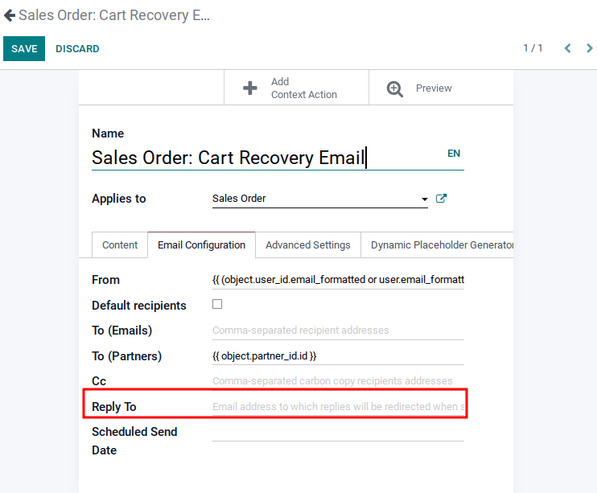
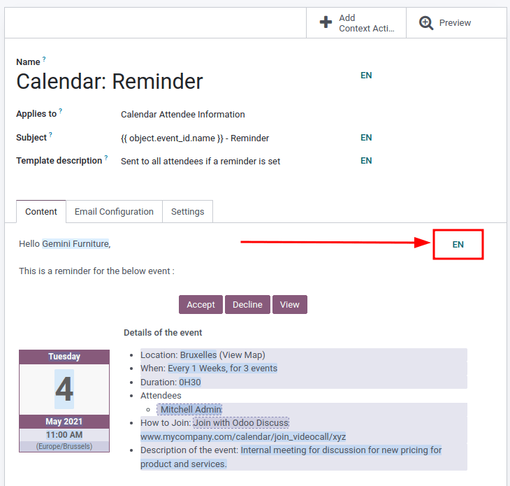

===============
Email templates
===============

Email templates are saved emails that are used repeatedly to send emails from the database. They
allow users to send quality communications, without having to compose the same text repeatedly.

Creating different templates that are tailored to specific situations lets users choose the right
message for the right audience. This increases the quality of the message and the overall
engagement rate with the customer.

.. note::
   Email templates in Odoo use QWeb or XML, which allows for editing emails in their final
   rendering, making customizations more robust, without having to edit any code whatsoever. This
   means that Odoo can use a Graphical User Interface (GUI) to edit emails, which edits the backend
   code. When the received email is read by the end user's program different formatting and graphics
   will appear in the final form of it.

Access email templates in :ref:`developer mode <developer-mode>` by navigating to
:menuselection:`Settings app --> Technical menu --> Email --> Email Templates`.

Editing email templates
=======================

The *powerbox* feature can be used when working with email templates. This feature provides the
ability to directly edit the formatting and text in an email template, as well as the ability to add
links, buttons, appointment options, or images.

Additionally, the XML/HTML code of the email template can be edited directly, via the
:guilabel:`</>` icon.

*Dynamic placeholders* (text that references fields within Odoo to auto-fill information on the
template) are available for the :guilabel:`Email Configuration` fields, the :guilabel:`Subject`, and
the :guilabel:`Language`.

Powerbox
--------

The *powerbox* feature is an enriched text editor with various formatting, layout, and text options.
It can also be used to add XML/HTML features in an email template. The powerbox feature is activated
by typing a forward slash `/` in the body of the email template.

When a forward slash `/` is typed in the body of an email template, a drop-down menu appears with
the following options:

:guilabel:`Basic Blocks`

- :guilabel:`Heading 1`: Big section heading.
- :guilabel:`Heading 2`: Medium section heading.
- :guilabel:`Heading 3`: Small section heading.
- :guilabel:`Text`: Paragraph block.
- :guilabel:`Bulleted list`: Create a simple bulleted list.
- :guilabel:`Numbered list`: Create a list with numbering.
- :guilabel:`Checklist`: Track tasks with a checklist.
- :guilabel:`Table`: Insert a table.
- :guilabel:`Switch direction`: Switch the text's direction.
- :guilabel:`Separator`: Insert a horizontal rule separator.
- :guilabel:`Quote`: Add a blockquote section.
- :guilabel:`Code`: Add a code section.
- :guilabel:`Appointment`: Add a specific appointment.
- :guilabel:`Calendar`: Schedule an appointment.

:guilabel:`Navigation`

- :guilabel:`Link`: Add a link.
- :guilabel:`Button`: Add a button.

:guilabel:`Medias`

- :guilabel:`Image`: Insert an image.

.. tip::
   To use any of these options, click on the desired feature from the powerbox drop-down menu. To
   format existing text with a text-related option (e.g. :guilabel:`Heading 1`, :guilabel:`Switch
   direction`, etc.), highlight the text, then type in the activator key (forward slash) `/`, and
   select the desired option from the drop-down menu.

   .. image:: email_template/powerbox-feature.png
      :align: center
      :alt: Powerbox feature in the email template.

XML/HTML code editor
--------------------

To access the XML/HTML editor for an email template, first enter :ref:`developer mode
<developer-mode>`. Then, click the :guilabel:`</>` icon in the upper-right corner of the template,
and proceed to edit the XML/HTML. To return to the standard text editor, click the :guilabel:`</>`
icon again.

.. image:: email_template/html-code-editor.png
   :align: center
   :alt: HTML editor in the email template.

.. warning::
   The XML/HTML editor should be accessed with caution as this is the backend code of the template.
   Editing the code can cause the email template to break immediately or when upgrading the
   database.

Dynamic placeholders
--------------------

*Dynamic placeholders* reference certain fields within the Odoo database to produce unique data in
the email template.

.. example::
   Many companies like to customize their emails with a personalized piece of customer information
   to grab attention. This can be accomplished in Odoo by referencing a field within a model by
   inserting a dynamic placeholder. For example, a customer's name can be referenced in the email
   from the :guilabel:`Customer` field on the :guilabel:`Sales Order` model. The dynamic placeholder
   for this field is: `{{ object.partner_id }}`.

Dynamic placeholders are encoded to display fields from within the database. Dynamic placeholders
can **only** be used in the fields present in the :guilabel:`Email Configuration` tab, the
:guilabel:`Subject` of the email, and the :guilabel:`Language`.

Dynamic placeholders can be used with the following fields on an email template:

- :guilabel:`Subject` (:guilabel:`Content` tab)
- :guilabel:`From` (:guilabel:`Email Configuration` tab)
- :guilabel:`To (Emails)` (:guilabel:`Email Configuration` tab)
- :guilabel:`To (Partners)` (:guilabel:`Email Configuration` tab)
- :guilabel:`CC` (:guilabel:`Email Configuration` tab)
- :guilabel:`Reply-To` (:guilabel:`Email Configuration` tab)
- :guilabel:`Language` (:guilabel:`Advanced Settings` tab)

The :guilabel:`Dynamic Placeholder Generator`, which is the last tab on the email template, creates
placeholders for the aforementioned fields. Dynamic placeholders may also be inserted in the HTML
code, but this task is out of the scope of Odoo Support.

To use the *Dynamic Placeholder Generator*, navigate to the :guilabel:`Dynamic Placeholder
Generator` tab. Select the field that the dynamic placeholder should reference using the
:guilabel:`Field` drop-down menu. Should a :guilabel:`Sub-Model` or :guilabel:`Sub-Field` need to be
specified, set those by selecting the corresponding drop-down menu. These fields should be set
automatically after setting the :guilabel:`Field`, although in some instances these fields will
remain empty. The dynamic placeholder will appear in the :guilabel:`Placeholder Expression` field.
Copy and paste the placeholder expression into the appropriate field in the tabs of the email
template, as listed in the bulleted list above.

.. note::
   Each unique combination of :guilabel:`Fields`, :guilabel:`Sub-models` and :guilabel:`Sub-fields`
   creates a different dynamic placeholder. Imagine it as a combination to the field that is being
   created.

   To search the available fields, simply click the drop-down menu next to :guilabel:`Field` and
   select one, or click :guilabel:`Search More` to select from all of the available fields for the
   model that the email template is created for.

   .. seealso::
      :doc:`/applications/studio/models_modules_apps`.

.. tip::
   These fields can also be accessed in :ref:`developer mode <developer-mode>`. On a contact form
   (or other relevant form in Odoo), navigate to the information that should be referenced in the
   dynamic placeholder, and hover over the field name. A box of backend information will reveal
   itself with the specific Odoo :guilabel:`Field` name in the backend. Search for this field in the
   :guilabel:`Field` drop-down menu in the email template.

   .. image:: email_template/information-box.png
      :align: center
      :alt: Backend information box of fields on a model.

.. seealso::
   :ref:`Views and fields in the developer documentation <developer/fields>`.

.. warning::
   Customizing email templates are out of the scope of Odoo Support.

Default reply on email templates
--------------------------------

Under the :guilabel:`Email Configuration` tab on an email template, there is a :guilabel:`Reply To`
field. In this field, add email addresses to which replies are redirected when sending emails en
masse using this template.

.. tip::
   A Add multiple email addresses by adding a comma `,` between the addresses or dynamic
   placeholders.

The :guilabel:`Reply To` field is **only** used for mass mailing (sending emails in bulk). Bulk
emails can be sent in almost every Odoo application that has a list view option.

To send mass mails, while in :guilabel:`list` view, check the boxes next to the desired records
where the emails are to be sent, click the :guilabel:`Action` button (represented by a :guilabel:`⚙️
(gear)` icon), and select the desired email option from the :guilabel:`Action` drop-down menu. Email
options can vary by the particular list view and application.

If it is possible to send an email, a mail composer pop-up window appears, with values that can be
defined and customized. This option will be available on the :guilabel:`Action` button on pages
where emails can be sent in bulk---for example, on the :guilabel:`Customers` page of the CRM app.
This action occurs throughout the Odoo database.

.. image:: email_template/composer-mass-mailing.png
   :align: center
   :alt: Email composer in mass mailing mode with reply-to highlighted.

Transactional emails and corresponding URLs
===========================================

In Odoo, multiple events can trigger the sending of automated emails. These emails are known as
*transactional emails*, and sometimes contain links redirecting to the Odoo database.

By default, links generated by the database use the dynamic `web.base.url` key defined in the system
parameters. For more information about this, see :ref:`system parameters
<domain-name/web-base-url>`.

If the *Website* application is not installed, the `web.base.url` key will always be the default
parameter used to generate all the links.

.. important::
   The `web.base.url` key can only have a single value, meaning that, in a multi-website or
   multi-company database environment, even if there is a specific domain name for each website, the
   links generated to share a document (or the links within a transactional email) may remain the
   same, regardless of which website/company is related to the sending of the email/document.

   .. example::
      If the :guilabel:`Value` of the :guilabel:`web.base.url` system parameter is equal to
      `https://www.mycompany.com` and there are two separate companies in Odoo with different
      website URLs: `https://www.mycompany2.com` and `https://www.mycompany1.com`, the links created
      by Odoo to share a document, or send a transactional email, come from the domain:
      `https://www.mycompany.com`, regardless of which company sends the document or email.

   This is not always the case, as some Odoo applications (*eCommerce*, for example) have a link
   established in the database with the *Website* application. In that case, if a specific domain is
   defined for the website, the URL generated in the email template uses the domain defined on the
   corresponding website of the company.

   .. example::
      When a customer makes a purchase on an Odoo *eCommerce* website, the order has an established
      link with that website. As a result, the links in the confirmation email sent to the customer
      use the domain name for that specific website.

.. note::
   A document shared using the *Documents* application will **always** use the `web.base.url` key,
   as the document shared is not associated with any particular website. This means that the URL
   will always be the same (the `web.base.url` key value), no matter what company it's shared from.
   This is a known limitation.

For more information about how to configure domains, check out the :doc:`domain name documentation
</applications/websites/website/configuration/domain_names>`.

Updating translations within email templates
--------------------------------------------

In Odoo, email templates are automatically translated for all users in the database for all of the
languages installed. Changing the translations shouldn't be necessary. However, if for a specific
reason, some of the translations need to be changed, it can be done.

.. warning::
   Like any modification in the code, if translation changes are not done correctly (for example,
   modifications leading to bad syntax), it can break the template, and as a result, the template
   will appear blank.

In order to edit translations, first enter :ref:`developer mode <developer-mode>`. Then, on the
email template, click on the :guilabel:`Edit` button, and then click on the language button,
represented by the initials of the language currently being used (e.g. :guilabel:`EN` for English).

.. note::
   If there aren't multiple languages installed and activated in the database, or if the user does
   not have administration access rights, the language button will not appear.

A pop-up window with the different languages installed on the database appears. From this pop-up,
editing of translations is possible. When the desired changes have been made, click the
:guilabel:`Save` button to save the changes.

.. image:: email_template/translation-body.png
  :align: center
  :alt: Translation of the body of the Appointment Booked template.

.. note::
   When editing the translations, the default language set in the database appears in **bold**.
