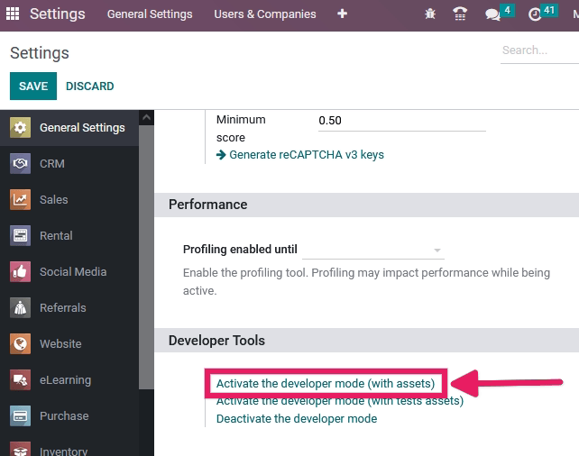
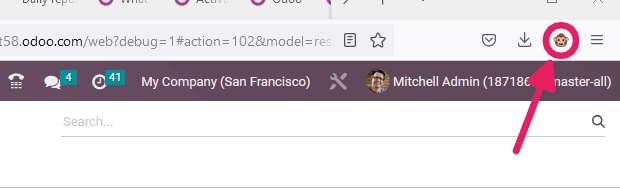
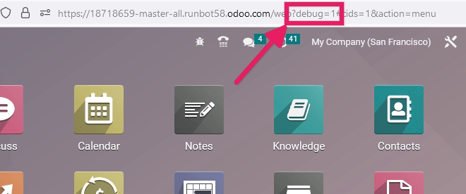
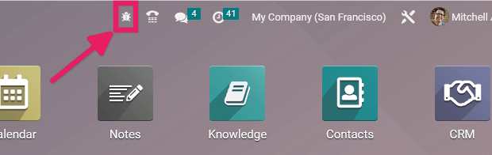

.. _developer-mode:

===========================
Developer Mode (debug mode)
===========================

The developer mode (or debug mode) unlocks access to extra and advanced tools in Odoo. There are
several ways to activate the developer mode: through the
:ref:`settings <general/developer_mode/settings>`, the
:ref:`browser extension <general/developer_mode/browser-extension>`, through
the :ref:`command palette <general/developer_mode/command-palette>`  or the
:ref:`URL <general/developer_mode/url>`.

.. _general/developer_mode/settings:

Activate through the Settings
=============================

The debug mode can be activated in the Odoo database settings. Go to :menuselection:`Settings -->
General Settings --> Developer Tools` and click on :guilabel:`Activate the developer mode`. At
least one application needs to be installed for the :guilabel:`Developer Tools` section to appear
in the :guilabel:`Settings` module.

.. note::
   :guilabel:`Activate the developer mode (with assets)` is used by developers; :guilabel:`Activate
   the developer mode (with tests assets)` is used by developers and testers.

Once activated, the :guilabel:`Deactivate the developer mode` option becomes available.

.. _general/developer_mode/browser-extension:

Activate through the browser extension
======================================

Within a web browser, navigate to the browser settings and extensions and search for the `Odoo
Debug` extension. Once the extension is installed, a new icon will be shown on the browser's
toolbar.

For the *Odoo Debug* extension, a single click enables a normal version of the mode, while a
double click enables it with assets. To deactivate it, use a single click.

.. _general/developer_mode/command-palette:

Activate through the command palette
====================================

In Odoo, the command palette tool has a command to activate the debug mode. First, open the command
palette tool with the keyboard shortcut `ctrl+k` and then type `debug`. A command will show up to
activate the debug mode.

.. _general/developer_mode/url:

.. _developer-mode/url:

Activate through the URL
========================

The debug mode can also be activated by adding an extra query string to the database's URL. In the
URL, add `?debug=1` or `?debug=true` after `/web`. To deactivate the debug mode, change the
value to `?debug=0` instead.

.. tip::
   Additional modes are available for developers: `?debug=assets` enables the
   :ref:`assets mode <frontend/framework/assets_debug_mode>`, and `?debug=tests` enables
   the :ref:`tests mode <frontend/framework/tests_debug_mode>`.

.. _developer-mode/mode-tools:

Locate the developer mode tools
===============================

Once developer mode is activated, the developer mode tools can be accessed from the :guilabel:`Open
Developer Tools` button, the bug icon located in the header of the Odoo database.

This menu contains additional tools that are useful to understand or edit technical data, such as
the views or actions of a page. On a page that has filters, actions, and view options, the
developer mode tools contain some useful menu items such as:

- :guilabel:`Edit Action`
- :guilabel:`Manage Filters`
- Edit the current view (e.g. Kanban, List, Graph, etc.)
- See the :guilabel:`Fields View Get`
