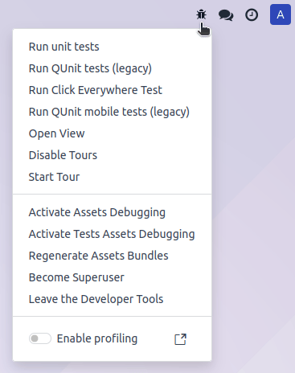
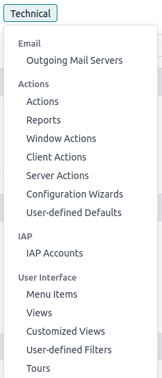

.. _developer-mode:

===========================
Developer mode (debug mode)
===========================

The developer mode, also known as debug mode, unlocks access to advanced :ref:`tools and settings
<developer-mode/tools>` in Odoo.

.. warning::
   Proceed with caution, as some developer tools and technical settings are considered advanced and
   may have associated risks. Only use them if you understand the implications and are confident in
   your actions.

.. note::
   The developer mode is also available with :ref:`assets <frontend/framework/assets_debug_mode>`,
   which are used to debug JavaScript code, and with :ref:`tests assets
   <frontend/framework/tests_debug_mode>`, which are used to run test tours.

.. _developer-mode/activation:

Activation
==========

To activate it, open the :guilabel:`Settings` app, scroll down to the :guilabel:`Developer Tools`
section, and click :guilabel:`Activate the developer mode`.

Once activated, the :guilabel:`Deactivate the developer mode` option becomes available.

.. image:: developer_mode/settings.png
   :alt: Activating the developer mode in the Settings app

To activate the developer mode **from anywhere in the database**, add `?debug=1` to the URL after
`/web` (e.g., `https://example.odoo.com/web?debug=1#action=menu&cids=1`). To deactivate it, use
`?debug=0` instead.

Use `?debug=assets` to activate the developer mode with assets and `?debug=tests` to activate it
with tests assets.

.. tip::
   Open the **command palette** by pressing `Ctrl + K` or `Cmd ⌘ + K`, then type `debug` to
   activate the developer mode with assets or deactivate it.

.. admonition:: Browser extension

   The `Odoo Debug <https://github.com/Droggol/OdooDebug>`_ browser extension adds an icon to toggle
   developer mode on or off from the browser's toolbar. It is available on the `Chrome Web Store
   <https://chromewebstore.google.com/detail/odoo-debug/hmdmhilocobgohohpdpolmibjklfgkbi>`_ and
   `Firefox Add-ons <https://addons.mozilla.org/firefox/addon/odoo-debug/>`_.

.. _developer-mode/tools:

Developer tools and technical menu
==================================

Once the developer mode is activated, the developer tools can be accessed by clicking the
:icon:`fa-bug` :guilabel:`(bug)` icon. The menu contains tools useful for understanding or editing
technical data, such as a view's field, filters, or actions. The options available depend on where
the menu is accessed from.

Database administrators can access the technical menu from the :guilabel:`Settings` app. It contains
advanced database settings, such as ones related to the database structure, security, actions, etc.

