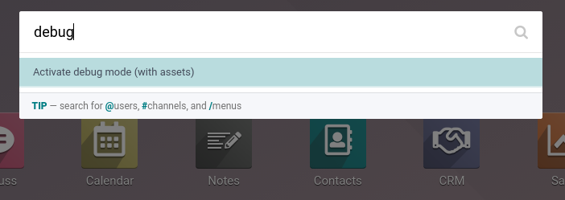

.. _developer-mode:

===========================
Developer Mode (debug mode)
===========================

The developer mode (or debug mode) gives you access to extra and advanced tools.

Activate through the Settings
=============================

Go to :menuselection:`Settings --> Activate the developer mode`.

.. image:: developer_mode/settings.png
   :align: center
   :alt: Overview of the debug options under settings in Odoo

.. note::
   *Activate the developer mode (with assets)* is used by developers; *Activate the developer mode
   (with tests assets)* is used by developers and testers.

Once activated, the *Deactivate the developer mode* option becomes available.

Activate through a browser extension
====================================

| Go to the settings and extensions of your web browser, and search for *Odoo Debug*. Once the
  extension is installed, a new icon will be shown on your toolbar.
| For the *Odoo Debug* extension, a single click enables a normal version of the mode, while a
  double click enables it with assets. To deactivate it, use a single click.

.. image:: developer_mode/monkey.png
   :align: center
   :alt: View of odoo’s debug icon in a chrome’s toolbar

Activate through the command palette
====================================

The command palette tool has a command to activate the debug mode: open it with
the keyboard shortcut `ctrl+k`, then type `debug`: a command will show up to
activate the debug mode.

Activate through the URL
========================

In the URL, add ``?debug=1`` or ``?debug=true`` after *web*. To deactivate the
debug mode, add `?debug=0` instead.

.. image:: developer_mode/url.png
   :align: center
   :alt: Overview of an url with the debug mode command added in Odoo

.. tip::
   Additional modes are available for developers: `?debug=assets` enables the
   :ref:`assets mode <frontend/framework/assets_debug_mode>`, and `?debug=tests` enables
   the :ref:`tests mode <frontend/framework/tests_debug_mode>`.

.. _developer-mode/mode-tools:

Locate the mode tools
=====================

The Developer mode tools can be accessed from the *Open Developer Tools* button,
located on the header of your pages. This menu contains additional tools that
are useful to understand or edit technical data, such as the views or the actions.
It contains some useful menu items such as:

- edit action
- manage filters
- edit the current view
- see the `fields view get`
- and much more.

.. image:: developer_mode/button_location.png
   :align: center
   :alt: Overview of a console page and the debug icon being shown in Odoo
