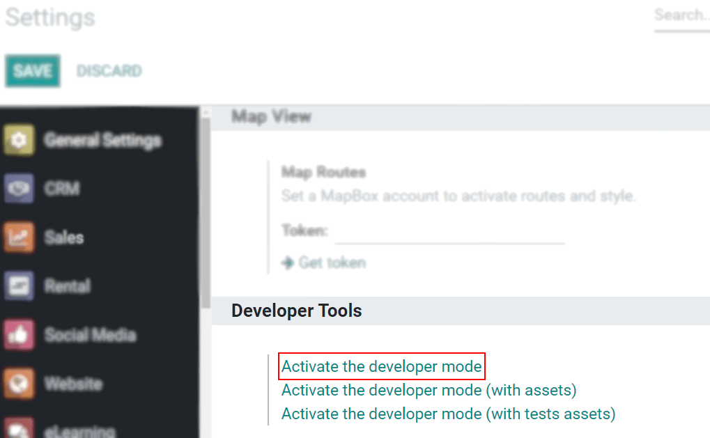
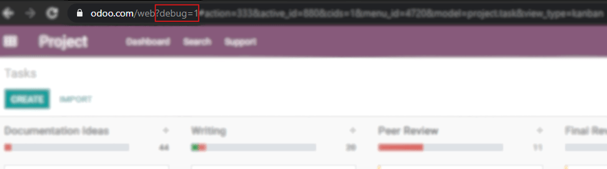
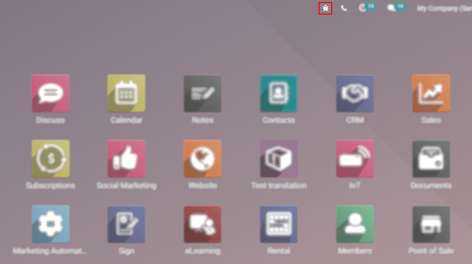

===================================
Activate the Developer (Debug) Mode
===================================

The Developer or Debug Mode gives you access to extra and advanced tools.

Through the Settings application
--------------------------------

Go to :menuselection:`Settings --> Activate the developer mode`.

.. note::
   *Activate the developer mode (with assets)* is used by developers; *Activate the developer mode
   (with tests assets)* is used by developers and testers.

Once activated, the *Deactivate the developer mode* option becomes available.

Through a browser extension
---------------------------

| Go to the settings and extensions of your web browser, and search for *Odoo Debug*. Once the
  extension is installed, a new icon will be shown on your toolbar.
| For the *Odoo Debug* extension, a single click enables a normal version of the mode, while a
  double click enables it with assets. To deactivate it, use a single click.

Through the URL
---------------

In the URL add ``?debug=1`` or ``?debug=true`` after *web*.

.. tip::
   Developers: type ``?debug=assets`` and activate the mode with assets.

Locate the mode tools
---------------------

The Developer mode tools can be accessed from the *Open Developer Tools* button, located on the
header of your pages.

