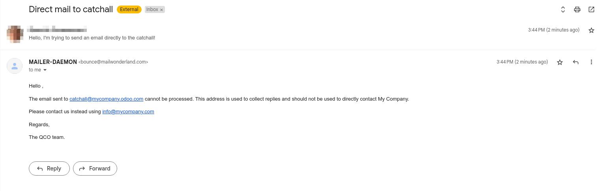

.. _emails_servers_inbound:

======================= 
Manage inbound messages 
=======================

An inbound message is an email delivered to the Odoo database. Anyone can send
an email to an email alias created in the database or reply to an email that
was previously sent from the database, based on the Reply-to header.

.. _emails_servers_inbound/mail_alias:

Email Aliases 
=============

Model specific aliases
----------------------

Some applications have their specific aliases (sales teams, helpdesk teams,
projects, …). These aliases are used to:

- Create a record when an email is sent directly to the alias,
- Receive the replies to an email initially sent from this record.

.. image:: email_servers_inbound/sales_team_alias_config.png
   :align: center
   :alt: The local-part "info" is used for the alias of the sales team.

Based on the screenshot, sending an email to `info\@mycompany.odoo.com` will
create a new opportunity or a new lead automatically assigned to the
corresponding sales team. If an email is sent from the chatter of an existing
opportunity,  the Reply-to will be `info\@mycompany.odoo.com`. The reply will
be posted in the right chatter, according to the message-id header.

Catchall
--------

If the application doesn’t have an alias, a generic fallback alias is used: the
catchall. An email sent from a chatter has a reply address set to this catchall
alias. A reply sent to the catchall is posted to the right chatter thanks to
the message-id header.

By default the local-part `catchall` will be used. This is handled in the Alias
Domains menu.
:menuselection:`Settings --> Technical --> Email --> Alias Domains` in
:ref:`developer-mode`.

An email to the catchall always needs to be a reply to a previous email sent
from the database. If an email is sent directly to the catchall, the sender
will receive the following message:

    from "MAILER-DEAMON" explaning how to contact the db.

.. note:: The email address `info\@mycompany.com` displayed in this email is the
   email address set on the company. This can be modified
   through :menuselection:`Settings --> Users --> Companies --> Companies`
   while connected in :ref:`developer-mode`.

.. example:: An alias can be configured on a sales team in the CRM app. When a
   customer replies to an email coming from the CRM, the `reply-to` is
   `info\@mycompany.odoo.com`.

   When an email is sent from the Contact app, the reply address is
   `catchall\@mycompany.odoo.com` because there is no alias on the contact
   model.

.. note:: It’s advised to keep the local part of the catchall unchanged. If this
   value is modified, previous emails sent from the database would still have
   the previous catchall value. This could lead to replies not correctly
   received in the database.

Bounce
------

The same way the catchall alias is used to build the reply address, the bounce
alias is used to build the `return-path` of the email. This `return-path` is used
when emails cannot be delivered to the recipient and an error is return to the sender.

By default the name `bounce` will be used. This is handled in the Alias Domains
menu: :menuselection:`Settings --> Technical --> Email --> Alias Domains` while in 
:ref:`developer-mode`.

.. note:: On Odoo Online, when using the default outgoing email server, the
   return path address is forced to the value `bounce\@mycompany.odoo.com`
   independing on the value set as bounce alias.

When an error occurs, a notification is received and displayed in the red
envelope in the chatter. In some cases, the red envelope can just contain a `no
error` message. It means that there is an error but it couldn’t be handled by
Odoo.

A notification will also be displayed in the Discuss icon on the navigation
bar.

.. image:: email_servers_inbound/mail_error_notif_navbar.png
   :align: center
   :alt: An email sent to a contact had an issue and the error is reported on
    the navbar.

.. example:: If the email address of the recipient is incorrect, it will provide
   an error message containing the reason for the failure. This error can be
   found by clicking on the red envelope in the chatter.

   .. image:: email_servers_inbound/red_envelope_info.png
      :align: center
      :alt: An email sent to a wrong domain, will generate a bounce that will be
       displayed as a red envelop in Odoo. Clicking on the envelop provide more
       information.

Receive emails with Odoo standard configuration
===============================================

On Odoo Online and Odoo Sh, every email alias, reply and bounce addresses
already exist. These addresses use the alias domain automatically created in
standard in the database.

.. example:: Assuming the database URL is `https://mydatabase.odoo.com`, the
   alias domain `mydatabase.odoo.com` is automatically created. Catchall and
   bounce can be used and their address is respectively
   `catchall\@mydatabase.odoo.com` and `bounce\@mydatabase.odoo.com`.

If the CRM app is added and I create a sales team with an alias `info`,
`info\@mydatabase.odoo.com` can be used immediately. Same goes for any other
alias created in :ref:`other applications <emails_servers/other_documentation>`.

The database domain is ready to be used to receive emails without any additional
configuration.

Use several Odoo subdomains 
===========================

On Odoo online, the only Odoo subdomain is the one defined at the database
creation.

On Odoo SH, it is possible to use several Odoo subdomains. In the settings of
the branch, additional Odoo subdomains can be added, as long as they are not
used yet in another branch. These domains must then be added in the alias
domains in order to be used by a company.

.. image:: email_servers_inbound/custom_subdomain_sh.png
   :align: center
   :alt: Setting up the Odoo subdomain `my_new_domain.odoo.com` on the settings
    of a branch.

.. _email_servers_inbound/custom_domain_inbound_emails:

Use a custom domain for inbound messages
========================================

The alias domain must be selected in the general settings. If you have several
companies, this configuration must be done for each one of them. This
configuration is detailed in the :ref:`Alias Domain documentation <email_servers_outbound/alias_domain>`.

.. image:: email_servers_inbound/mad_general_settings.png
   :align: center
   :alt: The Alias domain can be added on the General settings.

All the aliases will now use this custom domain. Thanks to this configuration,
replies on models for which an alias is configured will be done to 
:literal:`\[alias\]\@my_custom_domain.com`. Replies to other models are sent to the
catchall through `catchall\@my_custom_domain.com`.

.. image:: email_servers_inbound/schema_mail_custom_domain.png
   :align: center
   :alt: Technical schema of mailing route when using a custom domain in Odoo.

.. warning:: If the emails are sent with Odoo email servers while using a custom
   domain, this domain must be configured following our :ref:`guidelines <email_servers_outbound/_custom_domain_w_Odoo_MS>`.

Since this custom domain is now used everywhere, all emails using an alias
(replies, bounces and direct sends) are sent to an address of your domain. They
are thus delivered to your email server. In order to get them in the chatters
or to create new records, we need a way to retrieve all these incoming emails
in the Odoo database. This can be achieved through three different methods. To
simplify the handling of these configurations, we recommend choosing only one
of the following methods to handle all the incoming emails.

.. warning:: Refer to your provider’s documentation for more detailed
   information on how to handle the methods detailed below.

.. _email_servers_inbound/redirections:

Redirections
------------

If the database’s hosting type is Odoo Online or Odoo.sh, redirections are the
recommended method. Redirections allow the messages to be received without
delay in the database.

It is mandatory to redirect catchall and bounce to the Odoo subdomain of the
database. Every other alias used must be redirected as well. For example, if we
only have one sales team, we need the following redirections:

- `catchall@mycompany.com` → `catchall@mycompany.odoo.com` 
- `bounce@mycompany.com` → `bounce@mycompany.odoo.com` 
- `info@mycompany.com` → `info@mycompany.odoo.com`

.. note:: Some providers ask to validate the redirection by sending a link to
   the target email address. This procedure is an issue for catchall and bounce
   since they are not used to create records.

   #. Modify the catchall value on the mail alias domain. :ref:`developer-mode`
      must be enabled in order to access this menu. For
      example, it can be changed from `catchall` to `catchall1`. This will
      allow to use `catchall` as local part of another alias.
   #. Open an app that uses an alias. For example, CRM contains aliases for each
      sales team. Set `catchall` as the local part of the alias of a sales
      team.
   #. The validation email will create a record in the CRM. The email sent will
      be visible in the chatter, allowing you to validate the redirection.
   #. Don’t forget to change back the alias of the sales team and the catchall
      value on the mail alias domain, just as they were before this procedure.

.. _email_servers_inbound/forwarding:

An alternative to redirecting is **forwarding**. The main difference is that
with forwarding, **the address forwarding the email will be identified as the
sender**. While with redirection, the original sender will always remain.

.. _email_servers_inbound/incoming_mail_servers:

Incoming mail servers
---------------------

As mentioned earlier, redirections are the recommended method to receive emails
in Odoo. But it is also possible to set up incoming mail servers. Using this
method means creating an incoming email server for each mailbox on your server,
catchall, bounce and every alias of the database, in order to fetch all the
incoming emails. Incoming mail servers are created
in :menuselection:`Settings --> Technical --> Emails --> Incoming Mail
Servers`.

.. Warning:: We advise using the IMAP protocol over POP. While IMAP will fetch
   all the unread emails, using the POP protocol will result in fetching all
   the history of the emails and then deleting them in your mailbox.

Odoo also provides the possibility to connect a mailbox through Gmail or Outlook
Oauth Authentication. More information about this configuration can be found in
our documentation.

- :doc:`Gmail Oauth <../google_oauth>`
- :doc:`Outlook Oauth <../azure_oauth>`

For on premise customers, incoming mail servers offer the `Local Server` type.
This alternative must be used with the :ref:`Mail Gateway script
<email_servers_inbound/_mail_gateway_script>`.

Regardless of the option chosen, emails will be fetched thanks to the `Mail:
Fetchmail Service` scheduled action.

Additionally, using an incoming mail server in Odoo gives the opportunity to
create new records in a specified model. Each incoming mail server can create
records in a different model.

.. example:: The emails received on `task@mycompany.com` will be fetched by the
   Odoo database. All these fetched emails will create a new task in the
   database.

   .. image:: email_servers_inbound/incoming_mail_server.png
      :align: center
      :alt: Technical schema of mailing route when using a custom domain in
       Odoo.

.. _email_servers_inbound/mx_record:

MX record
---------

A last option is to create a MX record in your DNS zone. Note that this
configuration **requires advanced technical knowledge**.

The MX record specifies the mail server managing emails sent to your domain.

.. warning:: This configuration works only with a subdomain on our SaaS and SH
   infrastructure (eg: `\@mail.mydomain.com`)

Some specification considering the hosting type:

.. tabs::

   .. group-tab:: Odoo.sh

      The custom subdomain must be added in the :doc:`settings of the project
      <../../../../../administration/odoo_sh/getting_started/settings>`:

      .. image:: email_servers_inbound/custom_subdomain_sh.png
         :align: center
         :alt: Adding a custom subdomain for mail in Odoo SH project settings.

   .. group-tab:: Odoo Online

      The custom subdomain must be added on your :doc:`Odoo portal
      <../../../websites/website/configuration/domain_names>`.

Pro’s and Cons of each alternative
----------------------------------

.. list-table::
   :header-rows: 2
   :stub-columns: 0

   * -
     - Pro's
     - Cons
   * - Redirections
     - Easy to set up, emails are directly sent to the database.
     - Needs to be done for all the aliases of the database.
   * - Incoming mail servers
     - Allows to keep a copy of the email in your mailbox (only with IMAP).
       Allows to create records in the chosen model.
     - Depends on a CRON -> emails are not retrieved immediately in the
       database. Needs to be done for all aliases.
   * - MX record
     - Only one record to create to make all the aliases work correctly.
     - Needs to use a subdomain. Requires advanced technical knowledge.

.. _email_servers_inbound/_mail_gateway_script:

Mail gateway (only for On Premise databases)
============================================

If you are on premise and the option chosen is either MX record, redirections or
incoming mail server with the “Local Server” option, you will have to use
the :ref:`Mail Gateway script <email_gateway>`.

Pay attention that going through this script requires **advanced technical and
infrastructure knowledge**.

.. _email_servers_inbound/mail_loops:

Avoid infinite emails loops
===========================

In some cases, like wrong mailing configuration, infinite mailing loops can be
created. Odoo provides a protection against such loops. Its default behavior
can be modified with the two following system parameters:

- `mail.gateway.loop.minutes` (120 min by default)
- `mail.gateway.loop.threshold` (20 min by default)

Add these records in Odoo by first enabling :ref:`developer-mode`, 
and then navigating to :menuselection:`Settings -->
Technical Menu --> Parameters --> System Parameters`. Change the value of these
parameters, as needed.

These parameters will make sure that the same sender cannot send too many
emails (defined by `mail.gateway.loop.threshold`) that would create a record in
Odoo to an alias in a specific time span (defined by
`mail.gateway.loop.minutes`). It does not include the replies.

.. warning:: These parameters are only used to prevent the creation of new
   records. **Not to prevent replies** from being added to the chatter.

.. note:: With the default values, if more than 20 emails are sent in a time
   span of 120 minutes, the emails will be blocked. This check is based on the
   email address of the sender.

   He will then receive the following message:

      .. image:: email_servers_inbound/bounce_mail_loop.png
         :align: center
         :alt: Bounce email received after attempting contact too many times an
          alias.
