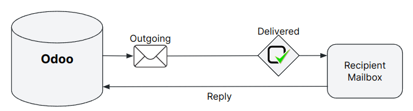
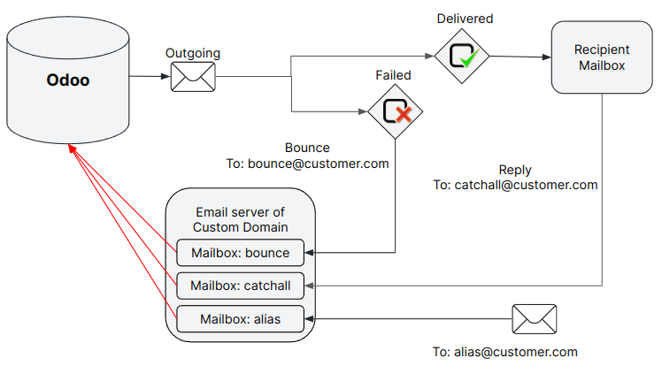
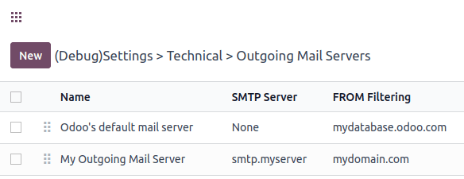

.. _email_servers_outbound:

==========================================
Send emails out of Odoo with email servers
==========================================

Manage outbound messages
========================

.. _email_servers_outbound/email_odoo_default:

Send emails with Odoo default configuration
-------------------------------------------

When Odoo online or SH is used, the sending and receiving of emails can be accomplished without any further configuration.

When a database *mycompany* is created, the subdomain `*mycompany*.odoo.com` 
is used to send and receive emails. :ref:`The deliverability is optimized for this subdomain as it uses Odoo’s domain DNS configurations<email_domain/email_odoo_default>`.

.. example:: 
   If the database subdomain’s is *mycompany*.odoo.com and all mailing configurations are the default’s one, all emails will be sent from `notification\@*mycompany*.odoo.com`. 

In order to ensure a complete email flow, emails are sent with a reply address composed of a dedicated alias `catchall\@mycompany.odoo.com`. In addition, the delivery errors are sent to another dedicated alias `bounce\@mycompany.odoo.com`. 

.. note::
   The catchall and the bounce and notification addresses are not considered as aliases. They do not have the vocation to create records in a database. That’s why, emails sent to any alias are automatically routed and will reply to an existing and linked record, or will create a new one in the database.

.. _email_servers_outbound/custom_domain_email:

Using a custom domain to send emails
------------------------------------

The database can be configured to use a custom domain, in which case all default email addresses are built using the custom domain. Assuming the custom domain is mycompany.com, the sender address is now `notifications\@mycompany.com`, the reply address is `catchall\@mycompany.com` and the bounce address is `bounce\@mycompany.com`. The custom domain can be utilized when sending emails either with Odoo’s email server or an external one. This chapter operates under the assumption that ownership of a custom domain is in place. If ownership is not established, it must initially be purchased from a domain registrar such as Godaddy, Namecheap, or any alternative provider.

.. _email_servers_outbound/_custom_domain_w_Odoo_MS:

Using owned custom domain with Odoo’s email server
~~~~~~~~~~~~~~~~~~~~~~~~~~~~~~~~~~~~~~~~~~~~~~~~~~

On Odoo Online or Odoo SH, some configurations are mandatory in the custom domain DNS to ensure a good deliverability. 

.. warning::
   Most of the configuration will be done on the domain provider’s side, and it might require some configuration on the mail server itself. If the user doesn't have any IT knowledge or an IT person in the company, it’s advised to keep Odoo’s default configuration. 

The first step is to configure your SPF, DKIM to be compliant with Odoo’s mail server. In our documentation, it’s possible to find all the keys needed to configure the :ref:`SPF <email_domain/spf_compliant>` and :ref:`DKIM <email_domain/DKIM_compliant>` records.

Then the custom domain must be set as the alias domain of a company. Select the current company, then goto :menuselection:`Settings --> General Settings --> Discuss --> Alias domain`, and set your domain.

In this screen you can assign the companies that use the custom domain. If the debug mode is on, the default aliases can also be modified:

- Bounce Alias: the mailbox used to catch all delivery errors and populate the :ref:`red envelope <email_issues/_red_envelop>` on the corresponding message.
- Catchall Alias: default mailbox used to centralize all the replies.
- Default From Alias: the default sender address.

Besides, all emails aliases (ie. related to CRM teams, Helpdesk teams, etc…) must also have their corresponding mailbox in the custom domain mail server.

   
To receive emails in the Odoo database within the corresponding chatter (CRM, Invoices, Sales order), one of these three methods must be used:

- Configuration of :ref:`incoming mail servers <email_servers_inbound/incoming_mail_servers>`,
- :ref:`Redirections/forwarding <email_servers_inbound/redirections>`,
- :ref:`MX record <email_servers_inbound/mx_record>` (due to the technical knowledge required, we do not recommend it)

For inbound emails, :ref:`configuration of incoming emails <email_servers_inbound/custom_domain_inbound_emails>` is also required. 

Using a custom domain implies that specific :ref:`local-parts <email_servers_outbound/_default_local_part>` might be used by Odoo to send emails.

.. _email_servers_outbound/_external_smtp:

Send emails with an external SMTP server
~~~~~~~~~~~~~~~~~~~~~~~~~~~~~~~~~~~~~~~~

.. note::
   If utilizing your own OMS, it must be paired with your own domain, as updating the DNS of Odoo’s subdomain is not feasible.

To create a external SMTP server in Odoo, as a user with the administrator rights, go to :menuselection:`Settings --> General Settings --> Discuss`, and enable the Use Custom Email Servers option.

Then, save the configuration. Next, in the outgoing server menu, click `New` to create a new outgoing mail server record in Odoo. Fill in the required information. Most fields are the common parameters usually used to set up a connection to an SMTP server. They are provided by the email provider.

Once all the information has been filled in, click `Test Connection`. A successful test does not mean that the outgoing server is perfectly configured but give first information in case of issue.

Be aware that some additional configuration might need to be added depending on your outgoing server provider. We invite you to consult your provider’s documentation and support if needed.

.. _email_servers_outbound/_default_local_part:

Here is the different local-part values that can be used by Odoo to send email and that might be required to whitelist in your mail server:
- The Alias Domain Bounce Alias (default value = bounce),
- The Alias Domain Default From (default value = notifications),
- The default admin address admin@dbname.odoo.com and/or if changed, also the new value),
- The default Odoobot address: odoobot@dbname.odoo.com and if changed, also the new value),
- The specific FROM defined on your email marketing campaign,
- The specific FROM that can be defined in your email templates.

.. seealso::
   - :doc:`../google_oauth`
   - :doc:`../azure_oauth`

Set up different dedicated servers for transactional and mass emails
--------------------------------------------------------------------

Employing personalized mail servers
~~~~~~~~~~~~~~~~~~~~~~~~~~~~~~~~~~~

Transactional emails and mass mailings can be sent using a separate email server in Odoo. The day-to-day emails, quotations, or invoices sent to your client will be handled as transactional emails. Mass mailings, including the sending of batches of invoices or quotations, will be managed by your marketing automation or email marketing application, for example.

.. example::
   Using Gmail, Amazon SES or Brevo for transactional emails, and services like Mailgun, Sendgrid or Mailjet for mass mailings.

To do this, first activate the :ref:`developer-mode`, and then go to :menuselection:`Settings --> Technical --> Outgoing email servers`. There, create two outgoing email server settings; one for the transactional emails and one for the mass mailing server. Make sure to give priority to the transactional server over the mass mailing server by providing a lower priority number for the transactional email server.

.. image:: email_servers_outbound/split_transaction_massmail_mail_servers.png
   :align: center
   :alt: Example of split between transaction and mass mailing mail servers.

Now, go to :menuselection:`Email Marketing --> Configuration --> Settings` and `enable Dedicated Server`. Choose the appropriate email server. With these settings, Odoo uses the server with the lower priority for transactional emails, and the server selected here for mass mails. 

.. image:: email_servers_outbound/dedicated_mass_mail_server.png
   :align: center
   :alt: Dedicated mail server on Email Marketing app settings.

.. warning::
   It’s **highly recommended** to configure the FROM Filtering on the outgoing mail servers, depending on the recommendation of your providers.

.. _email_servers_outbound/from_filtering:

The FROM Filtering field allows for the use of a specific outgoing email server depending on the From email address or domain that Odoo is sending on behalf of. Setting a value is **highly recommenced** and it must be a domain, or a complete address that matches the sender’s email address and is trusted on the Outgoing mail server provider side. 

If nothing is defined in the FROM filtering, the email will go out using the :abbr:`notification address (a full email added in the alias domain default from address, or a combination of the alias domain local-part default from alias@alias domain name)`.

.. warning::
   Some outgoing mail servers require a specific configuration of the from filter.

When an email is sent from Odoo, an email server is chosen in the following sequence:

- First, Odoo searches for an email server that has the same FROM Filtering value as the From value (email address) defined in the outgoing email. This configuration is ideal if all users of a company share the same domain but have different local-parts

.. example::
   If the sender's email address is `test@example.com`, only the email servers having a FROM Filtering value equal to `test@example.com` or `example.com` are used. 

- If no outgoing email server is found based on the from filter, Odoo will use the first outgoing without a FROM Filtering set. The email will be override with the notifications address.

- If no outgoing mail server is found, and that it does not match any FROM Filtering, the email will be sent using the first outgoing mail server, and will be override with the notifications address.

.. note::
   If several outgoing are found, Odoo will use the first that matches the FROM Filtering, then the priority is used, and after that, the alphabetical order of the outgoings..

It is also possible to use Odoo's mail server for transactional emails in addition to a mass mailing mail server.

.. _email_servers_outbound/external_outgoing_servers_with_odoo_server:

Using an outgoing mail server with the Odoo’s
~~~~~~~~~~~~~~~~~~~~~~~~~~~~~~~~~~~~~~~~~~~~~

In our SaaS & SH infrastructure, our databases are started with our own SMTP server (the one that will be used by default in our instances).

.. image:: email_servers_outbound/command_line_interface_option_mailserver.png
   :align: center
   :alt: Adding a mail server using the Odoo's mail server with the CLI authentication.

.. example::
   If an outgoing mail server is used simultaneously with Odoo’s default server (CLI), the FROM filter of the outgoing mail server must contain a custom domain, and the FROM filter of the CLI must contain Odoo’s subdomain. In the case there is no FROM filtering, the email will go out using the notification address.

.. note:: 
   In our SaaS & SH infrastructure, the command line interface is equivalent to the default Odoo mail server. Using the same limit as if there is no outgoing mail server in place.

.. tip::
   The page also shows your daily email usage and your daily limit if you use a Saas database. For SH database, you need check on the monitor page the number of outgoing mail that were sent

.. warning::
   The Odoo’s mail server is meant for transactional mailing and small marketing campaigns. The daily limit depends on the database type and the applications used. See our :ref:`FAQ <email_issues/daily_limit_mail>`.

.. _email_servers_outbound/custom_domain_external_outgoing_servers:

Configure your custom domain to use it with your email server
-------------------------------------------------------------

Similar to the :ref:`previous chapter <email_servers_outbound/external_outgoing_servers_with_odoo_server>`, proper configuration might be needed to ensure that the custom email server is allowed to send emails using your custom domain. Please refer to your email server provider’s documentation to properly set up the relevant records (SPF, DKIM and DMARC). We added a list of the common providers :ref:`here <email_domain/mail_config_common_providers>`.

.. note::
   DNS configuration is only required when you use Odoo’s default mail server with your custom domain. If an external outgoing mail server is used, configuring the records as described in our :ref:`DNS configuration documentation <email_domain>` **will not have the desired effect**, as it is independent of Odoo when using your custom email server. Odoo does not allow the configuration of the Odoo's subdomain.

.. _email_servers_outbound/port_restriction:

Port restriction
----------------

Note that port 25 is blocked for security reasons on the Odoo Online and Odoo.sh platforms. Try
using ports 465, 587, or 2525 instead.

.. _email_servers_outbound/alias_domain:

Alias Domain
------------

The catchall domain is company specific. By default, all companies will share Odoo’s subdomain (e.g. mycompany.odoo.com) but each company may have its own custom email domain.

The alias domain menu is accessible via the General settings, or on the company settings. 

.. image:: email_servers_outbound/alias_domain_company.png
   :align: center
   :alt: Alias domain on company view.

When the debug mode is activated, the Alias Domain Menu is accessible through :menuselection:`General Settings --> Technical menu --> Alias domain`.

.. Warning::
  Any modification of the alias domain must be done very carefully. If one of the aliases (bounce, notification, catchall) is changed, all previous emails that are not properly redirected to the new aliases will be lost.

The Default FROM field can be filled with a local part of the email address (by default the value `notifications`) or a full email address. You will configure it to determine the `FROM` header of your emails. If a full email address is filled, all outgoing emails will be overwritten with this address.

.. _email_servers_outbound/notification_system:

Notification system
-------------------

When an email is sent from the chatter, the customer will be able to reply directly to it. If the customer replies directly to the email, the answer will be logged in the same chatter, thus functioning as a message thread related to the record.

Upon receiving the reply, Odoo then uses the subscribed followers (based on the subscribed subtypes) to send them a notification by email, or in the Odoo inbox, depending on the user’s preferences.µ

.. example::
   If a customer with the email address :literal:`“Mary” <mary\@customer.example.com>` makes a direct reply to an email coming from the Odoo database, Odoo's default behavior is to redistribute the content of the email to all other followers within the thread.

As Mary’s domain does not belong to the alias domain, Odoo will override the email address and use the notification email address to notify the followers. This override will depend on the configuration done in the database. But by default, on our Odoo Online and SH environment, the email FROM address will be overridden with the value `notifications@mydbname.odoo.com` instead of `mary@customer.example.com`.

This address is constructed using the name of the sender and `{alias domain, default From alias}`@`{alias domain, domain name}`. By default,  `“notifications@mydbname.odoo.com”`.

.. _email_servers_outbound/unique_outgoing_address:

Use a unique email address for all outgoing emails
--------------------------------------------------

To force the email address from which emails are sent, access the Alias domain menu by activating :ref:`developer-mode` and going to :menuselection:`Settings --> Technical --> Alias domain`.

- `Default from alias`: accepts the local part or a complete email address as value.

.. warning:: 
   If a **complete address** is used as value for the `Default from Alias` **all** outgoing emails are overwritten by this address.
