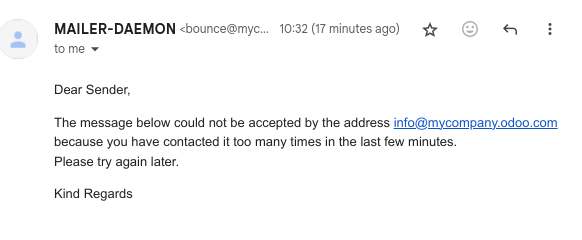

=======================
Manage inbound messages
=======================

An inbound message is an email delivered to an Odoo database. Anyone can send an email to an email
alias created in the database or reply to an email that was previously sent from the database based
on the *reply-to* header.

.. _email-inbound-aliases:

Email aliases
=============

.. _email-inbound-aliases-model:

Model specific aliases
----------------------

Some applications have their specific aliases (sales teams, helpdesk teams, projects, etc.). These
aliases are used to:

- Create a record when an email is sent directly to the alias,
- Receive replies to an email initially sent from a record.

.. example::

   .. image:: email_servers_inbound/sales-team-alias-config.png
      :alt: The local-part "info" is used for the alias of the sales team.

   In the example displayed above, sending an email to `info@company-name.odoo.com` will create a
   new opportunity or a new lead automatically assigned to the corresponding sales team. If an email
   is sent from the chatter of an existing opportunity, the *reply-to* will be
   `info@company-name.odoo.com`. The reply will be posted in the right chatter, according to the
   *message-id* header.

.. _email-inbound-aliases-catchall:

Catchall
--------

If an application does not have an alias, a generic fallback alias is used: the catchall. An email
sent from a chatter has a reply address set to this catchall alias. A reply sent to the catchall is
posted to the right chatter thanks to the *message-id* header.

By default, the local-part *catchall* will be used. Enable :ref:`developer-mode` and go to
:menuselection:`Settings --> Technical --> Emails: Alias Domains` to access the configuration.

An email to the catchall always needs to be a reply to a previous email sent from the database. If
an email is sent directly to the catchall, the sender will receive the following message:

.. image:: email_servers_inbound/direct-mail-to-catchall.png
   :alt: Bounce email from "MAILER-DEAMON" explaining how to contact the database.

.. note::
   The email address `info@company-name.com` displayed in the screenshot above is the email address
   set on the company. Upon entering the developer mode on a company profile, additional
   configuration options (such as catchall and bounce) become readable. It can be modified by
   clicking on the internal link of the Email Domain. It is generally not recommended to modify
   these options unless specific needs dictate, as it will affect all replies to previously sent
   emails.

.. example::
   An alias can be configured on a sales team in the CRM app. When a customer replies to an email
   coming from the CRM app, the *reply-to* is `info@company-name.odoo.com`.

   When an email is sent from the Contact app, the reply address is `catchall@company-name.odoo.com`
   because there is no alias on the contact model.

.. note::
   It is advised to keep the local-part of the catchall and the bounce unchanged. If this value is
   modified, previous emails sent from the database will still have the previous local-part values.
   This could lead to replies not being correctly received in the database.

.. _email-inbound-aliases-bounce:

Bounce
------

In the same way the catchall alias is used to build the reply address, the bounce alias is used to
build the *return-path* of the email. The *return-path* is used when emails cannot be delivered to
the recipient and an error is returned to the sender.

By default the name *bounce* will be used. Enable :ref:`developer-mode` and go to
:menuselection:`Settings --> Technical --> Emails: Alias Domains` to access the configuration.

.. note::
   On Odoo Online, when using the default outgoing email server, the return-path address is forced
   to the value `bounce@company-name.odoo.com` independently of the value set as bounce alias.

When an error occurs, a notification is received and displayed in a red envelope in the chatter. In
some cases, the red envelope can just contain a `no error` message, meaning there is an error that
could not be handled by Odoo.

A notification will also be displayed in the Discuss icon on the navigation bar.

.. image:: email_servers_inbound/mail-error-notif-navbar.png
   :alt: An email sent to a contact had an issue and the error is reported on the navbar.

.. example::
   If the email address of the recipient is incorrect, by clicking on the red envelope in the
   chatter an error message containing the reason for the failure will be given.

   .. image:: email_servers_inbound/red-envelope-info.png
      :alt: An email sent to a wrong domain generates a bounce displayed as a red envelope.

.. _email-inbound-default:

Receive emails with Odoo's default configuration
================================================

On **Odoo Online** and **Odoo.sh**, the email alias, reply, and bounce addresses are pre-configured.
These addresses use the alias domain automatically added to a standard database.

.. example::
   Assuming the database URL is `https://mydatabase.odoo.com`, the alias domain
   `mydatabase.odoo.com` is automatically created. Catchall and bounce can be used and their address
   is respectively `catchall@mydatabase.odoo.com`, and `bounce@mydatabase.odoo.com`.

   If the CRM app is installed, and a sales team with the alias `info` is created, the
   `info@mydatabase.odoo.com` address can be used immediately. The same goes for any other alias
   created in other applications.

The database domain is ready to be used to receive emails without any additional configuration.

.. _email-inbound-multiple-subdomains:

Use multiple Odoo subdomains
============================

On **Odoo Online**, the only Odoo subdomain is the one defined at the database creation.

On **Odoo.sh**, it is possible to use several Odoo subdomains. In the settings of the branch,
additional Odoo subdomains can be added as long as they are not used yet in another branch. These
domains must then be added to the alias domains to be used by a company.

.. _email-inbound-custom-domain:

Use a custom domain for inbound messages
========================================

The :ref:`alias domain <email-outbound-alias-domain>` must be selected in the general
settings. If you have multiple companies, each one must be configured.

All the aliases will use this custom domain. Replies on models for which an alias is configured
are done to `[alias]@my-custom-domain.com`. Replies to other models are sent to the catchall through
`catchall@my-custom-domain.com`.

.. important::
   If emails are sent using Odoo's email servers while using a custom domain, follow the
   :ref:`"Using a custom domain with Odoo’s email server" instructions
   <email-outbound-custom-domain-odoo-server>`.

Since this custom domain is used, all emails using an alias (replies, bounces and direct
sends) are sent to an address of the domain. They are thus delivered to the email server linked to the domain (MX record). To
display them in the chatter or to create new records, it is necessary to retrieve these incoming
emails in the Odoo database.

.. list-table::
   :header-rows: 1
   :stub-columns: 1

   * - Method
     - Benefits
     - Drawbacks
   * - :ref:`Redirections <email-inbound-custom-domain-redirections>`
     - Easy to set up, emails are directly sent to the database.
     - Each alias of a database needs to be configured.
   * - :ref:`Incoming mail servers <email-inbound-custom-domain-incoming-server>`
     - Allows to keep a copy of the email in your mailbox (with IMAP).
       Allows to create records in the chosen model.
     - Depends on a CRON, meaning emails are not retrieved immediately in the database.
       Each alias of a database needs to be configured.
   * - :ref:`MX record <email-inbound-custom-domain-mx>`
     - Only one record needs to be created to make all aliases work properly.
     - Using a subdomain is required.
       Requires advanced technical knowledge.

.. important::
   For **on-premise databases**, the redirection and the MX record methods also require configuring
   the :doc:`mail gateway script <../../../../administration/on_premise/email_gateway>`. Going
   through this script requires **advanced technical and infrastructure knowledge**.

.. important::
   Refer to your provider’s documentation for more detailed information on how to handle the methods
   detailed below.

.. _email-inbound-custom-domain-redirections:

Redirections
------------

If the database is hosted on **Odoo Online** or **Odoo.sh**, using redirections is recommended. They
allow messages to be received without delay in the database.

It is mandatory to redirect the catchall and bounce address to the Odoo subdomain of the database.
Every other alias used must be redirected as well.

.. example::
   With one sales team, the following redirections are required:

   - `catchall@company-name.com` → `catchall@company-name.odoo.com`
   - `bounce@company-name.com` → `bounce@company-name.odoo.com`
   - `info@company-name.com` → `info@company-name.odoo.com`

.. important::
   Some providers ask to validate the redirection by sending a link to the target email address.
   This procedure is an issue for catchall and bounce since they are not used to create records.

   #. Modify the catchall value on the mail alias domain. :ref:`developer-mode` must be enabled to
      access this menu. For example, it can be changed from `catchall` to `temp-catchall`. This will
      allow to use `catchall` as the local-part of another alias.
   #. Open an app that uses an alias. For example, CRM contains aliases for each sales team. Set
      `catchall` as the local-part of the alias of a sales team.
   #. The validation email will create a record in the CRM app. The email sent will be visible in
      the chatter, allowing you to validate the redirection.
   #. Do not forget to change back the alias of the sales team and the catchall value on the mail
      alias domain, just as they were before this procedure.

.. note::
   An alternative to redirections is **forwarding**. With forwarding, **the address forwarding the
   email will be identified as the sender**, while with redirections, the original sender will
   always remain.

.. _email-inbound-custom-domain-incoming-server:

Incoming mail servers
---------------------

As mentioned earlier, using redirections is the recommended method to receive emails in Odoo.
However, it is also possible to set up incoming mail servers. Using this method means creating an
incoming email server for each mailbox on your server, catchall, bounce, and every alias of the
database, in order to fetch all incoming emails. Incoming mail servers are created by going to
:menuselection:`Settings --> Technical --> Emails: Incoming Mail Servers`.

.. important::
   We recommend using the IMAP protocol over the POP protocol, as IMAP fetches all unread emails,
   while POP fetches all the emails' history and then tags them as deleted in your mailbox.

.. tip::
   It is also possible to connect a mailbox through :doc:`Gmail with Google OAuth <google_oauth>` or
   :doc:`Outlook with Microsoft Azure OAuth <azure_oauth>`.

Regardless of the protocol chosen, emails are fetched using the *Mail: Fetchmail Service* scheduled
action.

Additionally, using an incoming mail server in Odoo gives the opportunity to create new records in a
specified model. Each incoming mail server can create records in a different model.

.. example::
   Emails received on `task@company-name.com` are fetched by the Odoo database. All fetched emails will
   create a new project task in the database.

   .. image:: email_servers_inbound/incoming-mail-server.png
      :alt: Technical schema of mailing route when using a custom domain in Odoo.

.. _email-inbound-custom-domain-mx:

MX record
---------

A third option is to create a MX record in your DNS zone which specifies the mail server managing
emails sent to your domain. **Advanced technical knowledge is required.**

.. important::
   This configuration only works with a subdomain on the Odoo Online or Odoo.sh infrastructure
   (e.g., `@mail.mydomain.com`)

Below are presented some specifications depending on the hosting type:

.. tabs::

   .. group-tab:: Odoo Online

      The custom subdomain must be added to your :doc:`Odoo Portal
      <../../websites/website/configuration/domain_names>`.

   .. group-tab:: Odoo.sh

      The custom subdomain must be added to the :doc:`settings of the project
      <../../../administration/odoo_sh/getting_started/settings>`:

      .. image:: email_servers_inbound/custom-subdomain-sh.png
         :alt: Adding a custom subdomain for mail to Odoo.sh project settings.

.. _email-inbound-loops:

Infinite email loops
====================

In some cases, infinite mailing loops can be created. Odoo provides some protection against such
loops, ensuring the same sender cannot send too many emails **that would create records** to an alias in
a specific time span.

By default, an email address can send up to 20 emails in 120 minutes. If more emails are sent, they
are blocked and the sender receives the following message:

To change the default behavior, enable :ref:`developer-mode`, then go to :menuselection:`Settings
--> Technical --> Parameters: System Parameters` to add two parameters.

- For the first parameter, enter `mail.gateway.loop.minutes` as the :guilabel:`Key` and choose a
  number of minutes as the :guilabel:`Value` (`120` is the default behavior).
- For the second parameter, enter `mail.gateway.loop.threshold` as the :guilabel:`Key` and choose a
  number of emails as the :guilabel:`Value` (`20` is the default behavior).

.. important::
   These parameters are only used to prevent the creation of new records. They **do not prevent
   replies** from being added to the chatter.
