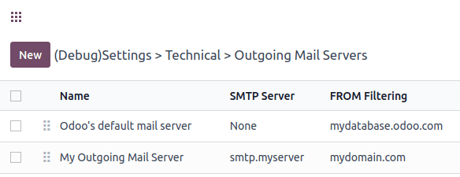

========================
Manage outbound messages
========================

.. _email-outbound-default:

Sending emails with Odoo's default configuration
================================================

On **Odoo Online** and **Odoo.sh**, sending and receiving emails works out of the box. No
configuration is required.

When a database is created, the subdomain `company-name.odoo.com` is used to send and receive
emails. The deliverability is optimized for this subdomain as it uses Odoo’s DNS configuration.

.. example::
   If the database subdomain is `company-name.odoo.com` and all mailing configurations are the
   default ones, all emails will be sent from `notifications@company-name.odoo.com`.

.. image:: email_servers_outbound/diagram-inbound-mailing-method.png
   :alt: Odoo’s default outbound messages configuration.

Emails are sent with `catchall@company-name.odoo.com` as the *reply-to* address. In addition,
delivery errors are sent to `bounce@company-name.odoo.com`.

.. note::
   The catchall, bounce, and notification addresses do not work like other aliases. They do not have
   the vocation to create records in a database. Emails sent to an alias are automatically routed
   and will reply to an existing and linked record or will create a new one in the database.

.. _email-outbound-custom-domain:

Using a custom domain to send emails
====================================

The database can be configured to use a custom domain, in which case all default email addresses are
built using the custom domain. If the custom domain is `company-name.com`, the sender address will
be `notifications@company-name.com`, the *reply-to* address `catchall@company-name.com`, and the
*bounce* address `bounce@company-name.com`. The custom domain can be utilized when sending emails
either with Odoo’s email servers or an external one.

This section assumes ownership of a custom domain. If not, a custom domain must be purchased from a
domain registrar such as GoDaddy, Namecheap, or any alternative provider.

.. _email-outbound-custom-domain-odoo-server:

Using a custom domain with Odoo’s email server
----------------------------------------------

On **Odoo Online** or **Odoo.sh**, some configurations are mandatory in the custom domain's DNS to
ensure good deliverability.

.. warning::
   Most of the configuration will be done on the domain provider’s side, and it might require some
   configuration on the mail server itself. **Some technical knowledge is required.**

The first step is to configure the :ref:`SPF <email-domain-spf>` and :ref:`DKIM <email-domain-dkim>`
to be compliant with Odoo’s mail server.

Next, the custom domain must be set as the alias domain of a company. Select the company, open the
:guilabel:`Settings`, and add the custom domain under the :guilabel:`Alias Domain` field.

After adding the alias domain, click the :icon:`oi-arrow-right` (:guilabel:`internal link`) icon to
assign more companies to the custom domain if needed. Enable the :ref:`developer-mode` mode to
modify the default aliases if desired:

- :guilabel:`Bounce Alias`: the mailbox used to catch delivery errors and populate the :ref:`red
  envelope <email-issues-outgoing-delivery-failure>` on the corresponding message.
- :guilabel:`Catchall Alias`: the default mailbox used to centralize all replies.
- :guilabel:`Default From Alias`: the default sender address.

.. note::
   At the creation of the first alias domain, all companies will use it. If you create a new
   company, the alias domain automatically set is the one with the lowest priority (ad displayed on
   the alias domain list in :ref:`developer-mode`).

All email aliases (e.g., related to CRM or Helpdesk teams) must have their corresponding mailbox in
the custom domain mail server.

.. image:: email_servers_outbound/diagram-owned-domain-odoo-server.png
   :alt: Technical schema of external mail server configuration with Odoo.

To receive emails in the Odoo database within the corresponding chatter (CRM, invoices, sales
orders, etc.), one of these three methods must be used:

- :ref:`Redirections/forwarding <email-inbound-custom-domain-redirections>`,
- :ref:`Incoming mail servers <email-inbound-custom-domain-incoming-server>`,
- :ref:`MX record <email-inbound-custom-domain-mx>` (requires advanced technical knowledge)

Using a custom domain implies that specific :ref:`local-parts
<email-outbound-custom-domain-smtp-server-local-part>` might be used by Odoo to send emails.

.. _email-outbound-custom-domain-smtp-server:

Sending emails with an external SMTP server
-------------------------------------------

.. note::
   If utilizing your own outgoing mail server, it must be paired with your own domain, as updating
   the DNS of an Odoo subdomain is not feasible.

To add an external SMTP server in Odoo, open :guilabel:`Settings`, and enable the :guilabel:`Use
Custom Email Servers` option found under the :guilabel:`Discuss` section.

Still under the :guilabel:`Discuss` section, click :guilabel:`Outgoing Email Servers`, then `New` to
create an outgoing mail server record. Most fields are the common parameters used to set up a
connection to an SMTP server; use the values provided by your email provider.

Once completed, click :guilabel:`Test Connection`. Note that a successful test connection does not
confirm that the email will go out as some restriction might remain on the provider side, thus, it
is recommended to consult your provider’s documentation.

.. _email-outbound-custom-domain-smtp-server-local-part:

Local-part values
~~~~~~~~~~~~~~~~~

Below are presented the different local-part values that can be used by Odoo to send emails. It
might be required to whitelist them in your mail server:

- The Alias Domain Bounce Alias (default value = `bounce`),
- The Alias Domain Default From (default value = `notifications`),
- The default admin address `admin@company-name.odoo.com` or, if changed, the new value),
- The default Odoobot address `odoobot@company-name.odoo.com` or, if changed, the new value),
- The specific FROM defined on an email marketing campaign,
- The specific FROM that can be defined in an email template.

.. seealso::
   - :doc:`google_oauth`
   - :doc:`azure_oauth`

.. _email-outbound-different-servers:

Setting up different servers for transactional and mass emails
==============================================================

.. _email-outbound-different-servers-personalized:

Personalized mail servers
-------------------------

Transactional emails and mass mailings can be sent using separate email servers in Odoo. Doing so
means day-to-day emails, quotations, or invoices sent to clients will be handled as *transactional
emails*. *Mass mailing emails*, including the sending of batches of invoices or quotations, will be
managed by the Marketing Automation or Email Marketing application.

.. example::
   You can use services like Gmail, Amazon SES, or Brevo for transactional emails, and services like
   Mailgun, Sendgrid, or Mailjet for mass mailings.

First, activate the :ref:`developer-mode` and go to :menuselection:`Settings --> Technical -->
Email: Outgoing Mail Servers`. There, add two outgoing email server records, one for the
transactional emails server and one for the mass mailings server. Enter a lower :guilabel:`Priority`
value for the transactional server (e.g., `1`) over the mass mailings server (e.g., `2`) so
transactional emails are given priority.

Now, go to :menuselection:`Email Marketing --> Configuration --> Settings`, enable
:guilabel:`Dedicated Server`, and select the appropriate email server. Odoo uses the server
with the lowest priority value for transactional emails, and the server selected here for mass
mailings.

.. image:: email_servers_outbound/dedicated-mass-mail-server.png
   :alt: Dedicated mail server on Email Marketing app settings.

.. _email-outbound-different-servers-personalized-from-filtering:

FROM filtering
~~~~~~~~~~~~~~

.. important::
   It’s **highly recommended** to configure the FROM Filtering on the outgoing mail servers as per
   the instructions of your provider.

The :guilabel:`FROM Filtering` field allows for the use of a specific outgoing email server
depending on the *From* email address or domain that Odoo is sending on behalf of. The **value must
be a domain or a complete address** that matches the sender’s email address and is trusted on the
outgoing mail server provider's side.

If FROM filtering is not used, emails will go out using the notification address.

.. warning::
   Some outgoing mail servers require a specific configuration of the FROM filter.

When an email is sent from Odoo, the following sequence is used to choose the outgoing email server:

- First, Odoo searches for a server that has the same FROM filtering value as the From value (i.e.,
  email address) defined in the outgoing email. This configuration is ideal if all users of a
  company share the same domain but have different local-parts.

.. example::
   If the sender's email address is `test@example.com`, only an email server having a FROM filtering
   value equal to `test@example.com` or `example.com` can be used.

- If no server is found based on the first criteria, Odoo looks for the first server
  without a FROM filtering value set. The email will be overridden with the notification address.

- If no server is found based on the second criteria, Odoo uses the first server, and the email will
  be overridden with the notification address.

.. note::
   To determine which server is first, Odoo uses the priority value (the lower the value is, the
   higher the priority is). Failing to do so, the first server is determined by the servers' names,
   using alphabetical order.

It is also possible to use Odoo's mail server for transactional emails in addition to mass mailings.

.. _email-outbound-different-servers-external-odoo:

Using an external email server and Odoo’s default server
--------------------------------------------------------

On Odoo Online and Odoo.sh, databases are started with Odoo's SMTP server. If no outgoing mail
server is set, the default Odoo's SMTP server will be used.

.. example::
   If an outgoing mail server is used simultaneously with Odoo’s default server (CLI), the FROM
   filter of the outgoing mail server must contain a custom domain, and the FROM filter of the CLI
   must contain Odoo’s subdomain. If there is no FROM filtering, the email will go out using the
   notification address.

.. note::
   On Odoo Online, the command line interface is equivalent to the default Odoo mail
   server, using the same limit as if there was no outgoing mail server in place.

.. tip::
   On Odoo Online, the page also shows your daily email usage and your daily limit. On Odoo.sh, you
   need to check on the monitor page the number of outgoing emails that were sent.

.. note::
   On Odoo.sh, to use the command-line interface, an outgoing mail server can be configured on the
   configuration file.

.. warning::
   Odoo’s mail server is meant for transactional emails and small-scale marketing campaigns. The
   :ref:`daily limit <email-issues-outgoing-delivery-failure-messages-limit>` depends on the
   database type and the applications used.

.. _email-outbound-custom-domain-external-server:

Using a custom domain with an external email server
===================================================

Similar to the :ref:`previous chapter <email-outbound-different-servers-external-odoo>`, proper
configuration might be needed to ensure that the external email server is allowed to send emails
using your custom domain. Refer to your provider’s documentation to properly set up the relevant
records (SPF, DKIM, and DMARC). A list of the :ref:`most common providers is available
<email-domain-providers-documentation>`.

.. note::
   DNS configuration is required when you use your own domain. If an external outgoing mail server
   is used, configuring the records as described in the :doc:`Odoo DNS configuration for our mail
   servers documentation <email_domain>` **will not have the desired effect**, as it is independent
   of Odoo when using a custom email server. Odoo does not allow the configuration of Odoo's
   subdomain.

.. _email-outbound-port-restriction:

Port restriction
================

Port 25 is blocked for security reasons on Odoo Online and Odoo.sh. Try using port 465, 587, or 2525
instead.

.. _email-outbound-alias-domain:

Alias domain
============

The catchall domain is company-specific. By default, all companies share Odoo’s subdomain (e.g.,
`company-name.odoo.com`), but each company may have its own custom email domain.

When the :ref:`developer-mode` is activated, the alias domain options are available by going to
:menuselection:`Settings --> Technical --> Email: Alias Domains`.

.. warning::
   Any modification of the alias domain must be done very carefully. If one of the aliases (bounce,
   catchall, default from) is changed, all previous emails that are not properly redirected to the
   new aliases will be lost.

The :guilabel:`Default From Alias` field can be filled with a local-part of the email address (by
default `notifications`) or a full email address. Configure it to determine the `FROM` header of
your emails. If a full email address is used, all outgoing emails will be overwritten with this
address.

.. _email-outbound-notifications:

Notification system
===================

When an email is sent from the chatter, customers can reply directly to it. If a customer replies
directly to an email, the answer is logged in the same chatter, thus functioning as a message thread
related to the record.

Upon receiving the reply, Odoo then uses the subscribed followers (based on the subscribed subtypes)
to send them a notification by email, or in the Odoo inbox, depending on the user’s preferences.

.. example::
   If a customer with the email address `“Mary” <mary@customer.example.com>` makes a direct reply to
   an email coming from the Odoo database, Odoo's default behavior is to redistribute the email's
   content to all other followers within the thread.

   As Mary’s domain does not belong to the alias domain, Odoo overrides the email address and uses
   the notification email address to notify the followers. This override depends on the
   configuration done in the database. By default, on Odoo Online and Odoo.sh, the email `FROM`
   address will be overridden with the value `notifications@company-name.odoo.com` instead of
   `mary@customer.example.com`.

   The address is constructed using the name of the sender and
   `{alias domain, default from alias}`@`{alias domain, domain name}`, by default,
   `notifications@company-name.odoo.com`.

.. _email-outbound-unique-address:

Using a unique email address for all outgoing emails
====================================================

To force the email address from which emails are sent, activate the :ref:`developer-mode`, and go to
:menuselection:`Settings --> Technical --> Email: Alias Domains`. On the :guilabel:`Default From
Alias`, use the the local-part or a complete email address as the value.

.. warning::
   If a **complete address** is used as the :guilabel:`Default From Alias` value, **all** outgoing
   emails will be overwritten by this address.
