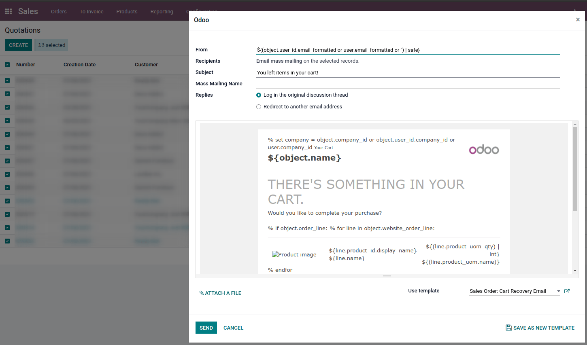
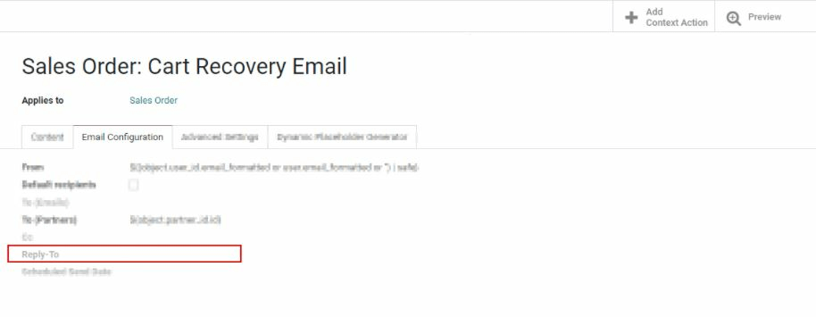

===============
Email Templates
===============

We all know writing good emails is vital to get a high response rate, but you do not want to
rewrite the same structure every time, do you? That is where email templates come in.
Without the need to rewrite the entire email structure every time, you save time to focus on
the content. Multiple templates also let you deliver the right message to the right audience,
improving their overall experience with the company.

.. note::
   The email templates use QWeb. The composer allows you to edit emails in their final rendering,
   making customizations more robust as you don’t have to edit code. 

Defining a default reply to on your mail template
~~~~~~~~~~~~~~~~~~~~~~~~~~~~~~~~~~~~~~~~~~~~~~~~~

Although the field *reply to* is available within the mail templates, **this field is only used 
for mass mailing** mode (this means when sending templates on what we call bulk emailing). You 
can send emails in bulk in almost every app that has a list view. Select the records you want 
and click on the action button. If you have an option to send an email, you will see a mail 
composer with possible values to define:

You can also define them by default on the template:

Because of this, setting a value in this field is useless as the value defined will be totally 
ignored. The default *reply-to* value is the default catchall email address to ensure a 
communication between your customer and your Odoo database. For more information about the way
the catchall works, please check :ref:`how to manage inbound messages <email_communication/inbound_messages>`.

Transactional emails and corresponding URL for each company 
~~~~~~~~~~~~~~~~~~~~~~~~~~~~~~~~~~~~~~~~~~~~~~~~~~~~~~~~~~~

When using Odoo, multiple events trigger the sending of automated emails. These emails are known
as transactional emails and sometimes contain links pointing to your Odoo database.

By default, links generated by the database use the dynamic web.base.url key defined in the system
parameters. More information about this :ref:`parameter <domain-name/web-base-url>`.

If the website application isn't installed, the web.base.url key will always be the default 
parameter used to generate all the links.

It’s important to know that this key can only have a single value, meaning that in a 
multi-website/company database environment, even if you have a specific domain name for each 
website, the links generated to share a document or within a transactional email might remain the
same, whatever the website/company related to the sending of the email/document.

This is not always the case as some Odoo applications have a link established in the database with 
the website application, meaning that in this case, if a specific domain is defined for the 
websites, the URL generated in the email template will use the domain defined on the corresponding
website of the company.

.. caution::
   A document shared using the documents application will always use the web.base.url key, as the 
   document shared isn't associated with any particular website. Meaning that the URL will always be 
   the same (the web.base.url key value), whatever the company it's shared from, this is a known 
   limitation!

On the other hand, sales orders made by a customer on one of your Odoo e-commerce websites have a 
link established with the website from which the order was made. As a result, the e-mail sent for 
the sales orders uses the domain name defined for the corresponding website to generate the links.

For more information about how to configure your domains, we invite you to check :doc:`our domain name 
documentation </administration/maintain/domain_names>`.

Updating translations within email templates
********************************************

Email templates are automatically translated. Changing the translations shouldn’t be necessary. 
However, if for a specific reason you’d like to change some of the translations, this can be done.

Like any modification in the code, keep in mind that modifications that aren’t done correctly (for
example modifications leading to bad syntax) can break the template, as a result, the template
will appear blank.

In order to edit your translations, follow these steps from the template.

#. Click on the edit button, then on the language button

   .. image:: email_template/edit-language-template.png
      :align: left
      :alt: Edit the language of a template

#. A pop-up window with the different languages installed on the database will be displayed. From 
   here, editing the translations will be possible. Don't forget to hit the save button to preserve
   your changes.

   .. image:: email_template/translation-body.png
      :align: left
      :alt: Translation of the body of the Application template in the different languages installed.
