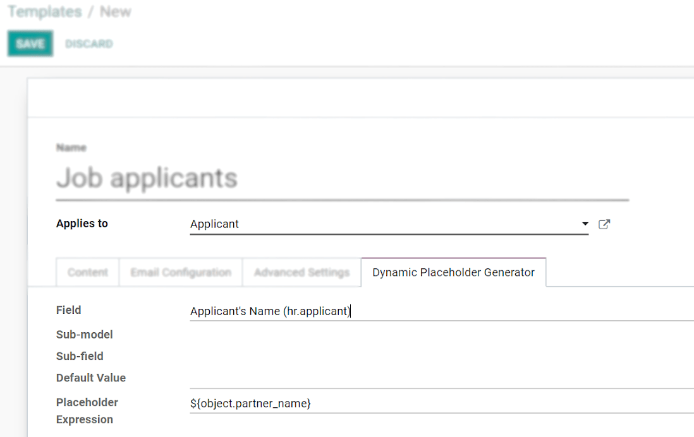
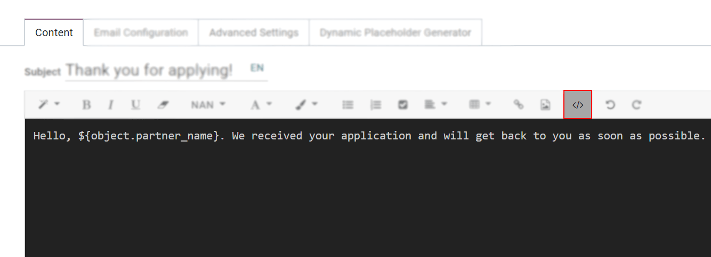
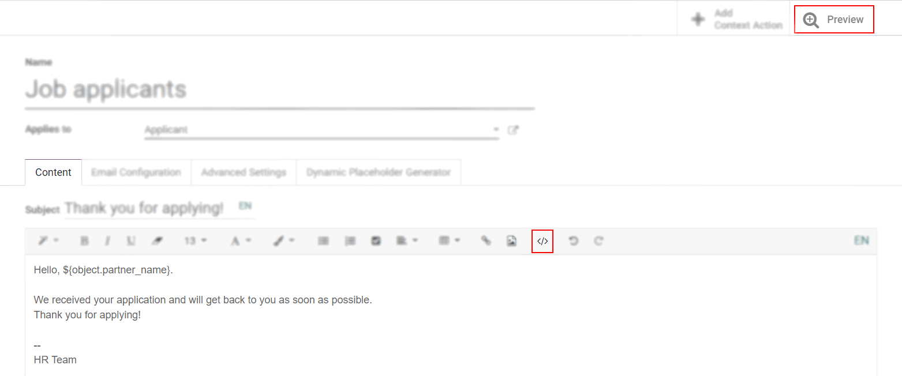
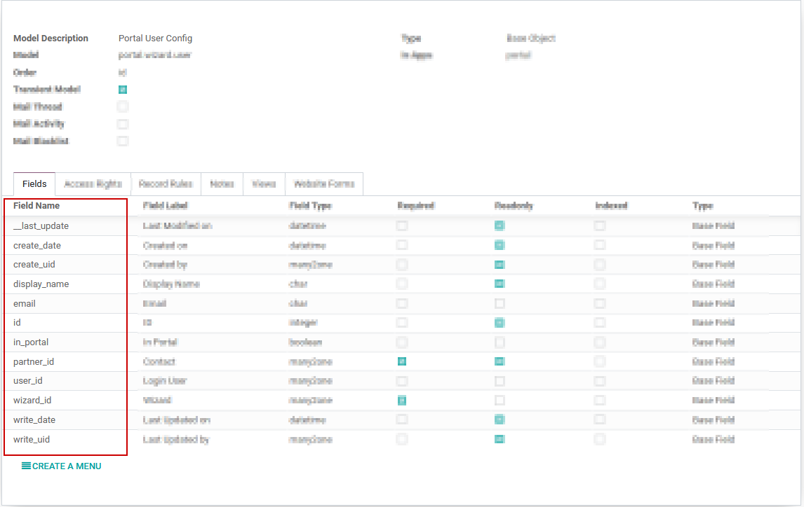

===============
Email Templates
===============

We all know writing good emails is vital to get a high response rate, but you do not want to
rewrite the same structure every time, do you? That is where email templates come in.
Without the need to rewrite the entire email structure every time, you save time to focus on
the content. Multiple templates also let you deliver the right message to the right audience,
improving their overall experience with the company.

Enable it and understand a few concepts
=======================================

The :doc:`Developer mode </applications/general/developer_mode>` must be activated. Then, go to
:menuselection:`Settings --> Technical --> Templates`. A view of the existing templates is shown.

.. warning::
   **It is highly recommended not to change the content in existing templates unless the user has
   prior knowledge about placeholders.**

To add a new one, click on *Create* and choose the type of document this template is used with. In
the example below, the template would be sent to job applicants.

.. image:: email_template/newtemplate.png
   :align: center
   :alt: New email template form in Odoo

| Under *Email Configuration*, fields such as *From*, *To (Emails)*, *To (Partners)*, require
  placeholders. If the *From* field is not set, the default value is the author’s email alias, if
  configured, or email address.
| Under *Advanced Settings*, if an *Outgoing Mail Server* is not set, the one with the highest
  priority is used.
| The option *Auto Delete* permanently deletes the emails after they are sent, saving space in your
  database.

Writing content including placeholder expressions
-------------------------------------------------

A placeholder is a string of characters that temporarily takes the place of the final data. With email templates, for example, placeholders let you put dynamic content in order to personalize the email for the recipient.

A common use is to use it to indicate the name of the recipient in the newsletter so that each recipient gets a personalized newsletter.

Placeholders and more specifically fields that are available for a template will depend on the template you modify, one way to see the fields that are available is to check the Dynamic Placeholder Generator tab.

:: _dynamic_placeholder_generator:

Under the tab *Dynamic Placeholder Generator*, look for the *Field* you would like to use.

Next, copy the *Placeholder Expression* and paste it in the *Body* of the email, under the *Content*
tab, using - essentially - the *Code View*.

Deactivate the *Code View* option by simply clicking on it again, and easily design the message.
Click on *Preview* to check how the email looks before sending it.

Using functions with placeholders 
---------------------------------

Functions can be used along with your placeholders in order to format the data as you'd like within your mail templates, for example, the time format can be changed using a function such as ``format_time``.

In order to use functions, you have to know what are the available fields to format. To know that, you have to check the fields (the properties) of the object that are available to be used.

How to check the fields (properties) available on the object? 
~~~~~~~~~~~~~~~~~~~~~~~~~~~~~~~~~~~~~~~~~~~~~~~~~~~~~~~~~~~~~

To check the **fields available**, click on the link next to Applies to. For the example we use the Portal: new user template, so we click on Portal user Config.

.. image:: email_template/apply_to_model.png
   :align: center
   :alt: Template is capable of using the field of the defined Models.

By clicking on the link, you are redirected to the model, in this case the ``Portal user Config`` model that lists all the fields that you can use within your mail template.

As a side note, you can also see the fields that are available by accessing the dynamic placeholder generator, as described previously :ref:`here <dynamic_placeholder_generator>`.

See below an example with the email field that was added in the template and its result as well as some other placeholders already present by default.

.. image:: email_template/field_and_rendering.png
   :align: center
   :alt: Adding a field on a template and see the result

Using fields with functions 
~~~~~~~~~~~~~~~~~~~~~~~~~~~

Now that you know the *fields* that can be used, you can use one of them with a function. For this example, we add the creation date, *create_date* field to the body of the template ‘Portal: new user’ along with the ``format_date`` function so that the user knows when he was invited.

.. image:: email_template/format_date_functions_example.png
   :align: center
   :alt: Example of the format_date on a create_date field

As you can see we use the placeholder *${}* with the ``format_date`` function which uses as a parameter the field create_date available on the current object, this gives the following line of code ``${format_date(object.create_date)}``.

.. warning: