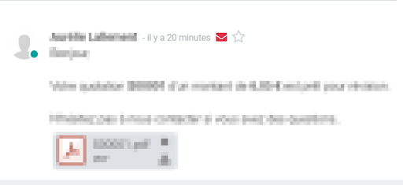
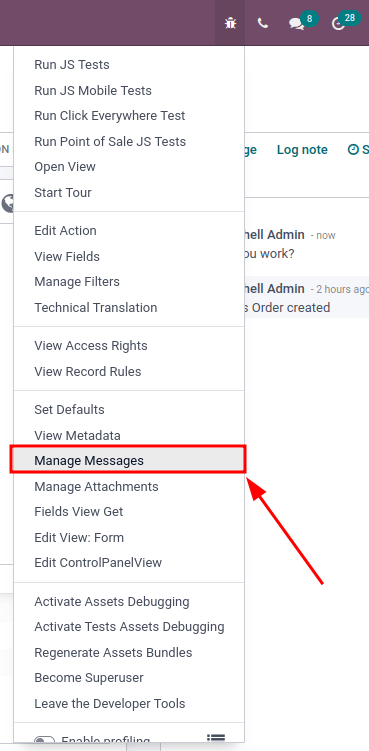

============
Email issues
============

This document contains an explanation of the most recurring emailing issues in Odoo.

Outgoing emails
===============

.. _red_envelop:

Email is not sent
-----------------

The first indicator showing that an email has not been sent is the presence of a red :guilabel:`✉️
(envelope)` icon, next to the date and time of the message, located in the chatter.

Unsent emails also appear in the Odoo email queue. In :ref:`developer mode <developer-mode>`, the
email queue can be accessed by going to :menuselection:`Settings app --> Technical menu --> Email
--> Emails`. Unsent emails appear in turquoise, while sent emails appear in grey.

Common error messages
~~~~~~~~~~~~~~~~~~~~~

.. _email_communication/daily_limit_mail:

Daily limit reached
*******************

Each email service provider has its own email sending limits. The limits may be daily, hourly, or
sometimes, per minute. This is the same for Odoo, which limits a customer's sending to prevent
Odoo's email servers from being blacklisted.

Here are the default limits for new databases:

- **200 emails per day** for Odoo Online and Odoo.sh databases with an active subscription.
- **20 emails per day** for one-app free databases.
- **50 emails per day** for trial databases.
- In the case of migration, the daily limit might be reset to 50 emails per day.

If the daily limit is reached:

- Contact the Odoo support team, who may increase the daily limit depending on the following
  factors:

  #. How many users are in the database?
  #. Which apps are installed?
  #. The bounce rate: the percentage of email addresses that did not receive emails because they
     were returned by a mail server on its way to the final recipient.

- Use an external outgoing email server to be independent of Odoo's mail limit (refer to the
  corresponding :doc:`email documentation
  </applications/general/email_communication/email_servers>`).
- Wait until 11 PM (UTC) for the daily limit to reset, and retry sending the email. In
  :ref:`developer mode <developer-mode>`, go to :menuselection:`Settings app --> Technical menu -->
  Email --> Emails`, then click the :guilabel:`Retry` button next to an unsent email.

.. warning::
   The daily email limit is comprehensive to the database. By default, any internal message,
   notification, logged note, etc. counts as an email in the daily limit if it notifies someone via
   email. This can be mitigated by receiving :ref:`notifications in Odoo
   <discuss_app/notification_preferences>`, instead of emails.

SMTP error
**********

Simple Mail Transport Protocol (SMTP) error messages explain why an email wasn't transmitted
successfully. :abbr:`SMTP (Simple Mail Transport Protocol)` is a protocol to describe the email
structure, and transmits data from messages over the Internet. The error messages generated by email
services are helpful tools to diagnose and troubleshoot email problems.

.. example::
   This is an example of a 554 SMTP permanent delivery error: `554: delivery error: Sorry, your
   message to ------@yahoo.com cannot be delivered. This mailbox is disabled (554.30). -
   mta4471.mail.bf1.yahoo.com --- Below this line is a copy of the message.`

The debug menu can be used to investigate SMTP sending issues from a database. To access the menu,
:ref:`developer mode <developer-mode>` must be activated. Once activated, navigate to the
:menuselection:`Debug Menu` in the top right of the menu bar (the :guilabel:`🐞 (bug)` icon),
:menuselection:`Debug Menu --> Manage Messages`

The :guilabel:`Manage Messages` menu opens a list of all the messages sent in a particular record.
Within each message there is information on sending, including the type, and subtype, of the
message.

Other information includes to whom the message was sent, and whether Odoo received a bounce-back
message from an email server.

.. note::
   A user must be on a view in Odoo that has a chatter in order for the :guilabel:`Manage Messages`
   menu option to appear.

No error populated
^^^^^^^^^^^^^^^^^^

Odoo is not always capable of providing information for the reason it failed. The different email
providers implement a personalized policy of bounced emails, and it is not always possible for Odoo
to interpret it correctly.

If this is a recurring problem with the same client, or the same domain, do not hesitate to contact
`Odoo Support <https://www.odoo.com/help>`_ for help in finding a reason.

.. note::
   One of the most common reasons for an email failing to send with no error message is related to
   :ref:`SPF <email_communication/spf_compliant>` and/or :ref:`DKIM
   <email_communication/DKIM_compliant>` configuration. Also, check to make sure the
   `mail.bounce.alias` is defined in the *system parameters*. Access system parameters in
   :ref:`developer mode <developer-mode>` by navigating to :menuselection:`Settings app -->
   Technical menu --> Parameters --> System Parameters`.

Email is sent late
------------------

Email campaigns send at a scheduled time, using a delay pre-programed in the database. Odoo uses a
delayed task to send emails that are considered "not urgent" (newsletter formats, such as: mass
mailing, marketing automation, and events). The system utility **cron** can be used to schedule
programs to run automatically at predetermined intervals. Odoo uses that policy in order to avoid
cluttering the mail servers and, instead, prioritizes individual communication. This **cron** is
called :guilabel:`Mail: Email Queue Manager`, and can be accessed in :ref:`developer mode
<developer-mode>` by going to :menuselection:`Settings app --> Technical menu --> Automation -->
Scheduled Actions`.

.. tip::
   What is a **cron**? A cron is an action that Odoo runs in the background to execute particular
   code to complete a task.

.. important::
   By default, the *Mass Mailing cron* runs every 60 minutes. This can be changed to no less than 5
   minutes. However, running the action every 5 minutes would bog down the Odoo database (stress the
   system), so this is not recommended. To edit the mass mailing cron, select the scheduled action
   :guilabel:`Mail: Email Queue Manager`, and proceed to make any necessary adjustments.

Emails that are considered urgent (communication from one person to another, such as sales orders,
invoices, purchase orders, etc.) are sent immediately.

Incoming emails
===============

When there is an issue with incoming emails, there might not be an indication, per se, in Odoo. It
is the sending email client, who tries to contact a database, that will get a bounce-back message
(most of the time a :guilabel:`550: mailbox unavailable` error message).

Email is not received
---------------------

The steps that should be taken depend on the Odoo platform where the database is hosted.

**Odoo.sh** users can find their live logs on the folder :file:`~/logs/`.

Logs are a stored collection of all the tasks completed in a database. They are a text-only
representation, complete with timestamps of every action taken on the Odoo database. This can be
helpful to track emails leaving the database. Failure to send can also be seen by logs that indicate
that the message tried to send repeatedly. Logs will show every action to the email servers from the
database.

The folder :file:`~/logs/` (accessed by the command line or on the Odoo.sh dashboard) of an Odoo.sh
database contains a list of files containing the logs of the database. The log files are created
everyday at 5:00 AM (UTC).

.. tip::
   The two most recent days (today and yesterday) are not compressed, while the older ones are, in
   order to save space. The naming of the files for today and yesterday are respectively:
   :file:`odoo.log` and :file:`odoo.log.1`.

   For the following days, they are named with their dates, and then compressed. Use the command
   :command:`grep` and :command:`zgrep` (for the compressed ones) to search through the files.

.. seealso::
   For more information on logs and how to access them via the Odoo.sh dashboard, see :ref:`this
   administration documentation <odoosh/logs>`.

   For more information on accessing logs via the command line visit :ref:`this developer
   documentation <reference/cmdline/server/logging>`.

**Odoo Online** users won't have access to the logs. However `Odoo Support
<https://www.odoo.com/help>`_ can be contacted if there is a recurring issue with the same client or
domain.

Get help from Odoo support
==========================

In order to get helped efficiently, please provide as much information as possible. Here is a list
of what can be helpful when reaching out to the Odoo Support team about an issue:

#. Send a copy of the email headers. The `.EML` file (or **headers**) of the email is the file
   format containing all the technical information required for an investigation. The documentation
   from the email provider might explain how to access the EML file/header files. Once the headers
   of the email are obtained, adding it into the Odoo Support ticket is the most efficient way for
   the Odoo Support team to investigate.

   .. seealso::
      - `Gmail documentation on headers <https://support.google.com/mail/answer/29436>`_
      - `Outlook documentation on headers
        <https://support.microsoft.com/en-us/office/view-internet-message-headers-in-outlook-cd039382-dc6e-4264-ac74-c048563d212c#tab=Web>`_

#. Explain the exact flow that is being followed to normally receive those emails in Odoo. Here are
   examples of questions whose answers can be useful:

   - Is this a notification message from a reply being received in Odoo?
   - Is this a message being sent from the Odoo database?
   - Is there an incoming email server being used, or is the email somehow being redirected?
   - Is there an example of an email that has been correctly forwarded?

#. Provide answers to the following questions:

   - Is it a generic issue, or is it specific to a use case? If specific to a use case, which one
     exactly?
   - Is it working as expected? In case the email is sent using Odoo, the bounce email should reach
     the Odoo database, and display the :ref:`red envelope <red_envelop>`.

.. note::
   The bounce system parameter needs to be set in the technical settings in order for the database
   to correctly receive bounce messages. To access this setting, go to :menuselection:`Settings app
   --> Technical menu --> Parameters --> System Parameters`. Then select the parameter name
   :guilabel:`mail.bounce.alias` and set the value to `bounce` if it isn't already set.
