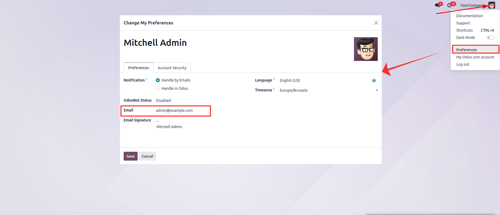
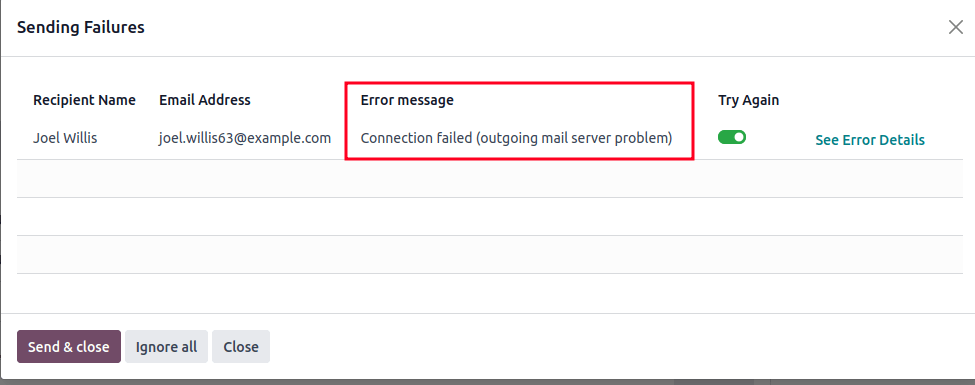

.. _email_issues:

============
Email issues
============

This document contains an explanation of the most recurring emailing issues in Odoo.

Is my Odoo database an email provider?
======================================
A common misconception is that Odoo functions like a normal email inbox, comparable to dedicated
providers such as GMail, Yahoo, Outlook etc.
While Odoo uses the email medium as a way to notify and communicate with users/customers,
it is by design not a replacement for a dedicated email server.
It might not behave in an expected way when you compare it to a traditional email inbox.

Here is a non-exhaustive list of differences:

- By default, once a notification or transactional email (quotes, invoice, direct messages to a contact)
  is sent out successfully, the email object is deleted. The email message's content lives in the chatter
  of the related record. This is to prevent cluttering your database with the content of multiple copies of
  the same email (when sent to multiple recipients), if the content is already present in the chatter.

- There is no concept of (blind) carbon copy ([B]CC). Odoo uses the concept of Followers added to a chatter to automatically decide when and how :ref:`a contact is notified <email_servers_outbound/notification_system>` or receives a copy of an email.

- Incoming email is handled by checking if the *TO* email address is a valid email address in the Odoo database or, in case of a reply email, if there is a reference in the email headers that matches a message
  sent from the Odoo database.This means that any other emails will be bounced and **not** temporarily parked in a spam or quarantine folder. In other words, any email that reaches an Odoo database but is unrelated to Odoo is lost.

Outgoing emails
===============

Check the email address of the admin user account
-------------------------------------------------

When a new Odoo database is created, the main admin account will have a placeholder email address.
It is recommended **to replace the admin email address** with a valid email address to prevent certain
outgoing email issues.

      for the admin email address.

Please login with the admin account and click on the user icon on the top right corner. Then click on
:guilabel:`Preferences/My Profile` which will open a popup window.

Update the :guilabel:`Email` field. Two main options exist:

- Update the *email* field with the email address used by the administrator in other professional
  contexts
- Update it with the respective Odoo subdomain used to access your database. Example: if your Odoo
  database uses `mycompany.odoo.com`` as subdomain, replace the administrator email address with
  `admin@mycompany.odoo.com` as a placeholder.

.. _email_issues/_red_envelop:

Email is not sent
-----------------

The first indicator showing that an email has not been sent is the presence of a red :guilabel:`✉️
(envelope)` icon, next to the date and time of the message, located in the chatter.

.. image:: faq/red-envelop.png
   :align: center
   :alt: Red envelope icon displayed in chatter.

This icon suggests that  the email failed for at least one recipient. A left mouse click opens up a window
showing the failed emails. It contains information about the recipients and if possible the relevant error
message. See the chapter on common error messages **[LINK ANCHOR]** to help troubleshoot common issues.

The :guilabel:`See Error Details` link opens a new page and gives extra details for the fail reason
**if** Odoo was able to correctly process the original error or bounce email.

Under the :guilabel:`Try Again` column a toggle button allows users to select the recipients to retry
sending the email again. Click on :guilabel:`Send & close` to retry all toggled lines.
Pressing :guilabel:`Ignore all` will ignore all currently failing emails and turn the envelope icon from
red to
white.

.. warning::
   **All untoggled** recipients under *Try again* will be ignored subsequently when clicking on
   *Send & close*.

Unsent emails also appear in the Odoo email queue. In :ref:`developer mode <developer-mode>`, the
email queue can be accessed by going to :menuselection:`Settings app --> Technical menu --> Email --> Emails`.

.. image:: faq/technical_menu_emails_delivery_failed.png
   :align: center
   :alt: Example of the technical email queue view, with examples of failed emails marked with red tags.

Failed emails will show the :guilabel:`Delivery Failed` status in red.

Pressing :guilabel:`Retry` puts a failed email in the email queue again. It will appear with
an *Outgoing* status in turquoise.

It will be tried again the next time the scheduled action for the email queue runs [LINK ANCHOR QUEUE].
Optionally, queued emails can be sent immediately by pressing the :guilabel:`Send Now` or pressing
the :guilabel:`Cancel Email` to remove it from the email queue.

Canceled emails will have a grey *Canceled* status.

.. note::
   Sent emails are periodically cleaned from the queue view. This is controlled by the *Auto-Vacuum*
   scheduled action that cleans redundant data on your Odoo instance.

~~~~~~~~~~~~~~~~~~~~~

.. _email_issues/daily_limit_mail:

Daily limit reached
*******************

.. image:: faq/email-limit.png
   :align: center
   :alt: Warning in Odoo upon email limit reached.

We enforce a limit on the number of emails that can be sent from an Odoo Online database.

This is for security reasons: if an email service provider like Google or Yahoo detects that our email
server is sending emails to addresses that do not exist or are no longer valid, they may blacklist our
IP. This also applies to unsolicited spam emails sent through an Odoo database.
Other Odoo clients will then be unable to email their contacts using addresses provided by these email
operators.

The default daily email limits will vary between **5-200 emails** per day. The exact limit is modulated
by the following factors (subject to change):

- Type of database subscription (one app Free, trial databases, paying subscription for Odoo Online or
  Odoo.sh)
- Installed apps (Email Marketing, Marketing Automation)
- During database migrations the email daily limit might be reduced

If the daily limit is reached:

- Contact the :ref:`Odoo support <faq_support_help>` team. Your quota can be increased in increments based on the following factors:

  #. How many users are in the database?
  #. Which apps are installed?
  #. The bounce rate: the percentage of email addresses that did not receive emails because they
     were returned by a mail server on its way to the final recipient.
  #. :ref:`Your company email aliases are correctly set up and use appropriate custom domains <email_servers_outbound/alias_domain>`. When using a custom domain, verify that :ref:`SPF <email_domain/spf_compliant>`, :ref:`DKIM <email_domain/DKIM_compliant>` and :ref:`DMARC <email_domain/DMARC_policy>` are correctly configured so that :ref:`Odoo's email servers are allowed to send emails on your custom domain's behalf <email_servers_outbound/_custom_domain_w_Odoo_MS>`.

- Use an external outgoing email server to be independent of Odoo's mail limit (refer to the
  corresponding :doc:`email documentation
  </applications/general/email_communication/email_servers>`).
- The limit is reset daily, so wait until the next day, and retry sending the email. In
  :ref:`developer mode <developer-mode>`, go to :menuselection:`Settings app --> Technical menu -->
  Email --> Emails`, then click the :guilabel:`Retry` button next to an unsent email.

.. warning::
   The daily email limit counts every email leaving your Odoo database, triggered either manually or
   automatically. By default, any internal message, notification, logged note, etc. counts as an email if
   it notifies someone via email. This can be mitigated by receiving :ref:`notifications in Odoo
   <discuss_app/notification_preferences>`, instead of emails.

SMTP error
**********
.. _smtp-wikipedia: https://en.wikipedia.org/wiki/Simple_Mail_Transfer_Protocol
.. _smtp-error-codes: https://en.wikipedia.org/wiki/List_of_SMTP_server_return_codes#Common_status_codes

Simple Mail Transport Protocol (`SMTP <smtp-wikipedia_>`_)is a standard used to transmit email between
email servers and/or mail clients.

When using an outgoing email server configuration **[EMBR DOC LINK]**, you will be using SMTP.
There is a standard set of `SMTP error codes <smtp-error-codes_>`_.

While the error code numbers are standard and not specific to Odoo, the exact content of the error
message might vary from email server to email server.

.. example::
   This is an example of a 550 SMTP permanent delivery error from sendgrid.com:

   .. code-block:: text

      Mail Delivery Failed
      Mail delivery failed via SMTP server 'None'.
      SMTPDataError: 550
      The from address does not match a verified Sender Identity. Mail cannot be sent until this
      error is resolved. Visit https://sendgrid.com/docs/for-developers/sending-email/sender-identity/
      to see the Sender Identity requirements

   In the example above, the error message indicates that you tried sending an email from an unverified
   email address. Investigating the outgoing email server configuration or the default
   *FROM* address of your database would be a good starting point to troubleshoot and verify that you
   whitelisted the email address on the side of sendgrid.com

**Usually inputting the error message content in a Google search can yield information on what the root
cause might be and how to correct the issue.**

If the issue can't be resolved and keeps re-occuring, please contact the official Odoo support following
the :ref:`guidelines <faq_support_help>`.

No error populated
^^^^^^^^^^^^^^^^^^

Odoo is not always capable of providing information for the reason it failed. The different email
providers implement a personalized policy of bounced emails, and it is not always possible for Odoo
to interpret it correctly.

If this is a recurring problem with the same client, or the same domain, do not hesitate to contact
:ref:`Odoo support <faq_support_help>` for help in finding a reason.

.. note::
   One of the most common reasons for an email failing to send with no error message is related to
   :ref:`SPF <email_domain/spf_compliant>` and/or :ref:`DKIM
   <email_domain/DKIM_compliant>` configuration. Also verify that that the implemented email
   notification setup is adapted to the business needs. See also our :ref:`introduction <emails_servers>`.

.. _email_issues/execution_time_email:

General email queue vs notifications vs mass mailing queue
----------------------------------------------------------

The exact time of sending an email is handled by a system utility cron (scheduled action) that
can be used to schedule programs to run automatically at predetermined intervals. Odoo uses this
approach to send emails that are considered “not urgent” (newsletter formats, such as: mass mailing,
marketing automation, and events).

This also avoids cluttering the mail servers and, instead, prioritizes individual communication.
These crons can be accessed in :ref:`developer-mode` by going to :menuselection:`Settings
app --> Technical menu --> Automation --> Scheduled Actions`.

.. tip::
   What is a cron?
   A cron is an action that Odoo runs in the background to execute particular code to complete a task.
   Odoo also creates cron triggers in certain workflows that will trigger a scheduled action earlier
   than its scheduled date. So it is not recommended to run a scheduled action manually or change its
   frequency unless an experienced user has a valid reason, as it might create errors or break certain
   workflows.

By default, for the normal email queue, the :guilabel:`Mail: Email Queue Manager` cron runs every 60 minutes.
The lowest running interval for a cron is 5 minutes. Odoo recommends an interval of 15 minutes to ensure
proper operation.
An interval too short to allow all emails to be processed may cause the cron to timeout.

Emails that are considered urgent (communication from one person to another, such as sales orders, invoices,
purchase orders, etc.) are sent immediately. They will not show up in the :menuselection:`Settings -->
Technical --> Email`, unless they fail delivery.

.. image:: faq/mail_marketing_soon_as_possible_notice.png
   :align: center
   :alt: example of sending information header when a mailing campaign is queued.

Email campaigns are sent as soon as possible (:guilabel:`Send` button) or at a scheduled time
(:guilabel:`Schedule` button).

For the email marketing queue, the :guilabel:`Mail Marketing: Process queue` cron runs once a day,
but will be **automatically triggered early** if a campaign is scheduled outside of this default frequency.
If your mailing list contains a large amount of recipients, triggering the cron manually multiple times
is **strongly advised against**, as it will not accelerate the processing time (it happens in a sequential
order) and might create errors.

You can edit the crons by going to :menuselection:`Settings --> Technical --> Scheduled Actions` (in :ref:`developer mode <developer-mode>`).

For more information when about crons when using Odoo.sh, you can read :doc:`../../../administration/odoo_sh/advanced/frequent_technical_questions`

Email Marketing campaigns are stuck in the queue
------------------------------------------------

In the case of Email Marketing campaigns, if multiple campaigns are put in the queue, they are
processed in chronological order based on the creation date.

.. example::
   If there are 3 campaigns: Campaign_1 (created 1st of January), Campaign_2 (created 2nd of January)
   and Campaign_3 (created 3rd of January). They are put in the queue by clicking :guilabel:`Send`
   on all three of them.

   .. image:: faq/mail_marketing_example_order_queue.png
      :align: center
      :alt: Example of three email marketing campaigns in the list view with arrow showing their
         expected processing order.

   The cron will try to process Campaign_1 --> Campaign_2 --> Campaign_3.

   It will not start processing Campaign_2 until it finishes processing Campaign_1.
   If for some reason your email campaigns never leave the queue, there might be an issue with the
   campaign at the top of the queue.

   To troubleshoot, you can for example remove Campaign_1 from the queue, by pressing the
   :guilabel:`Cancel` button, and see if the two others are sent. You can then try to fix
   Campaign_1 or contact :ref:`Odoo support <faq_support_help>` if needed.

Incoming emails
===============

When there is an issue with incoming emails, there might not be an indication, per se, in Odoo. It
is the sending email client, who tries to contact a database, that will get a bounce-back message
(most of the time a :guilabel:`550: mailbox unavailable` error message).

Email is not received
---------------------

The steps that should be taken depend on the Odoo platform where the database is hosted.

.. tabs::
   .. tab:: Odoo Online

      Users won't have access to the logs. However :ref:`Odoo support <faq_support_help>`
      can be contacted if there is a recurring issue with the same client or domain.

   .. tab:: Odoo.sh

      Users can find their live logs on the folder :file:`~/logs/`.

      Logs are a stored collection of all the tasks completed in a database. They are a text-only
      representation, complete with timestamps of every action taken on the Odoo database. This can be
      helpful to track emails leaving the database. Failure to send can also be seen by logs that indicate
      that the message tried to send repeatedly. Logs will show every action to the email servers from the
      database.

      The folder :file:`~/logs/` (accessed by the command line or on the Odoo.sh dashboard) of an Odoo.sh
      database contains a list of files containing the logs of the database. The log files are created
      everyday at 5:00 AM (UTC).

      .. tip::
         The two most recent days (today and yesterday) are not compressed, while the older ones are, in
         order to save space. The naming of the files for today and yesterday are respectively:
         :file:`odoo.log` and :file:`odoo.log.1`.

         For the following days, they are named with their dates, and then compressed. Use the command
         :command:`grep` and :command:`zgrep` (for the compressed ones) to search through the files.

      .. seealso::
         For more information on logs and how to access them via the Odoo.sh dashboard, see :ref:`this
         administration documentation <odoosh/logs>`.

         For more information on accessing logs via the command line visit :ref:`this developer
         documentation <reference/cmdline/server/logging>`.

.. _faq_support_help:

Get help from Odoo support
==========================

In order to get helped efficiently, please provide as much information as possible. Here is a list
of what can be helpful when reaching out to the `Odoo Support <https://www.odoo.com/help>`_
team about an issue:

#. Export the full email from the email inbox. These are usually in `.EML` or `.MSG` file formats
   containing technical information required for an investigation. The exact process to
   download the `EML/MSG` file will depend on the third party email provider.

   .. tip::
      Examples of EML download procedure in popular online email providers

      - `Gmail documentation on headers <https://support.google.com/mail/answer/29436>`_

      - `Outlook documentation on headers
        <https://support.microsoft.com/en-us/office/view-internet-message-headers-in-outlook-cd039382-dc6e-4264-ac74-c048563d212c#tab=Web>`_

   When using a local email software (like Thunderbird, Apple Mail, Outlook, …) to synchronize
   emails, it is usually possible to export the local copies of your emails as `EML/MSG` files.
   Please refer to the documentation of the software used for more information.

   Once the full email information is obtained, adding it into the Odoo support ticket is the most
   efficient way for the Odoo support team to investigate.

   .. tip::
      If possible, the EML/MSG file should be based on the original email that was sent and is
      failing or is causing issues.

      **If it is an incoming email:** If possible contact the original email sender and request an
      `EML/MSG` copy of the original email. Sending the `EML/MSG` of a copy of the original email (forwarded)
      only contains partial information related to the troubleshooting.

      **If it is an outgoing email (leaving your Odoo database):** either provide the `EML/MSG` of
      the email or specify what record in the database is affected (e.g. sales order number, contact
      name, invoice number) and the date/time when the email was sent (e.g. email sent on the 10th
      January 2024 11:45 AM Central European Time)

#. Explain the exact flow that is being followed to normally receive those emails in Odoo. Here are
   examples of questions whose answers can be useful:

   - Is this a notification message from a reply being received in Odoo?
   - Is this a message being sent from the Odoo database?
   - Is there an incoming email server being used, or is the email being redirected/forward
     through a custom email server or provider?
   - Is there an example of an email that has been correctly forwarded?
   - Have you changed any email related settings recently? Did it stop working after those changes?

#. Provide answers to the following questions:

   - Is it a generic issue, or is it specific to a use case? If specific to a use case, which one
     exactly?
   - Is it working as expected? In case the email is sent using Odoo, the bounce email should reach
     the Odoo database, and display the :ref:`red envelope <email_issues/_red_envelop>`.

