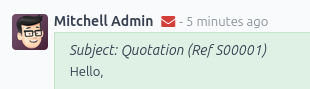
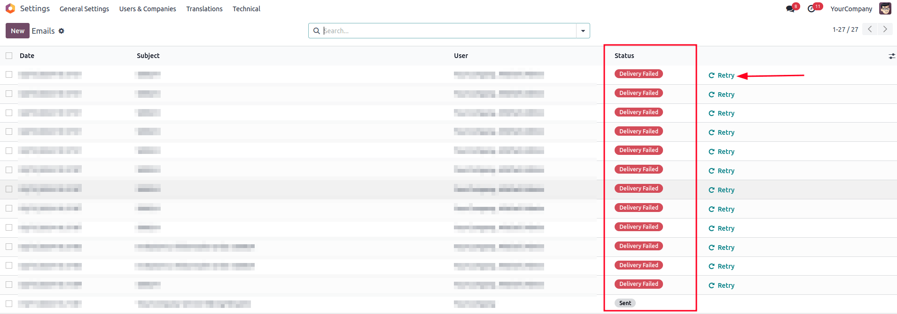

====================================
Common emailing issues and solutions
====================================

This page lists the most common emailing issues and their solutions.

.. _email-issues-provider:

Odoo is not an email provider
=============================

Odoo does not function like a classic email inbox, such as Gmail, Outlook, Yahoo, etc.

While Odoo uses emails as a way to notify and communicate with users/customers, it is, by design,
not a replacement for a dedicated email server. Therefore, it might not behave in the expected way
when compared to a traditional email inbox.

The main differences are the following:

- By default, once a notification or transactional email (quote, invoice, direct message to a
  contact) is sent out successfully, the email object is deleted. The email message's content lives
  in the chatter of the related record. It prevents cluttering the database with multiple copies of
  the content of the same email (when sent to multiple recipients) if the content is already present
  in the chatter.
- There is no concept of (blind) carbon copy ([B]CC). Odoo uses the concept of *followers* added to
  a chatter to automatically decide when and how :ref:`a contact is notified
  <email-outbound-notifications>` or receives a copy of an email.
- Incoming emails are handled by checking if the *TO* email address is a valid email address in the
  Odoo database or, in case of a reply email, if there is a reference in the email header that
  matches a message sent from the Odoo database. All other emails will be bounced and **not**
  temporarily parked in a spam or quarantine folder. In other words, any email unrelated to an Odoo
  database is lost.

.. _email-issues-outgoing:

Outgoing emails
===============

.. _email-issues-outgoing-admin-address:

Changing the email address of the admin user account
----------------------------------------------------

When an Odoo database is created, the main admin account is assigned a placeholder email address. It
is recommended to **replace the admin email address** with a valid email address to prevent outgoing
email issues.

To do so, on the admin account, click the user icon, click :guilabel:`My Profile` (or
:guilabel:`Preferences`), and update the :guilabel:`Email` field found under the
:guilabel:`Preferences` tab. Either use any other email address or use your Odoo subdomain (e.g.,
`company-name.odoo.com`) and `admin` for the local-part (e.g., `admin@company-name.odoo.com`).

.. _email-issues-outgoing-delivery-failure:

Delivery failure
----------------

When a message is sent, an :icon:`fa-envelope-o` :guilabel:`(envelope)` icon is displayed in the
chatter. The icon turns red when delivery has failed for at least one recipient.

Left-click the envelope to display information about the delivery, and, if possible, the relevant
:ref:`error messages <email-issues-outgoing-delivery-failure-messages>`.

.. image:: faq/sending-failures.png
   :alt: Example of a sending failure.

Click :guilabel:`See Error Details` to get extra information for the fail reason, **if** Odoo was
able to process the original error or bounce email.

Click :guilabel:`Send & close` to retry sending the email to all **toggled-on**
(:icon:`fa-toggle-on`) recipients under the :guilabel:`Try Again` column. All **toggled-off**
(:icon:`fa-toggle-off`) recipients will be ignored.

Click :guilabel:`Ignore all` to ignore all currently failing emails and turn the envelope icon from
red to white.

Unsent emails also appear in the Odoo email queue. To access it, activate the :ref:`developer mode
<developer-mode>` and go to :menuselection:`Settings --> Technical --> Email: Emails`.

Failed emails display the :guilabel:`Delivery Failed` status. Click :guilabel:`Retry` to put a
failed email in the email queue again. It will then appear with the :guilabel:`Outgoing` status. The
email will be sent again the next time the scheduled action for the email queue runs.

Optionally, queued emails can be sent immediately by clicking :guilabel:`Send Now`. Click
:guilabel:`Cancel Email` to remove it from the email queue.

.. note::
   Sent emails are periodically cleaned from the queue. This is controlled by the *Auto-Vacuum*
   scheduled action that cleans redundant data on your Odoo database.

.. _email-issues-outgoing-delivery-failure-messages:

Common error messages
~~~~~~~~~~~~~~~~~~~~~

.. _email-issues-outgoing-delivery-failure-messages-limit:

Daily limit reached
*******************

.. image:: faq/email-limit.png
   :alt: Email limit reached warning.

Odoo limits the number of emails that can be sent from an Odoo Online database. Most email service
providers (e.g., Google, Yahoo, etc.) will blacklist Odoo's server IP if Odoo's email server is
sending too many emails to addresses that do not exist or are no longer valid. It also applies to
unsolicited spam emails sent through an Odoo database.

The default daily email limit varies between **5 and 200 emails**. The exact limit is depends on
several factors (subject to change):

- Type of database subscription (one app free, trial, paying subscription)
- Apps installed (i.e., Email Marketing, Marketing Automation)
- If a database migration is ongoing

If the daily limit is reached, you can:

- Contact :ref:`Odoo Support <email-issues-support>` to increase your email quota. The following factors
  will be taken into account:

  #. Numbers of users on the database
  #. Apps installed
  #. Bounce rate (the percentage of email addresses that did not receive emails because they were
     returned by an email server on their way to the final recipient).
  #. Whether your :ref:`email aliases are correctly set up and use the appropriate custom domains
     <email-outbound-alias-domain>`.

     .. tip::
        When using a custom domain, verify that :ref:`SPF <email-domain-spf>`, :ref:`DKIM
        <email-domain-dkim>`, and :ref:`DMARC <email-domain-dmarc>` are correctly configured so that
        :ref:`Odoo's email servers are allowed to send emails on your custom domain's behalf
        <email-outbound-custom-domain-odoo-server>`.

- :doc:`Use an external outgoing email server <../email_communication>` to be independent of Odoo's
  email limit.
- Wait until the next day, and retry sending the email. To do so, activate the :ref:`developer mode
  <developer-mode>`, go to :menuselection:`Settings --> Technical --> Email: Emails`, and click
  :guilabel:`Retry` next to the unsent email.

.. important::
   The daily email limit counts every email leaving your Odoo database, triggered either manually
   or automatically. By default, any internal message, notification, logged note, etc., counts as an
   email if it notifies someone via email. This can be mitigated by receiving :ref:`notifications in
   Odoo <discuss_app/notification_preferences>` instead of by email.

.. _email-issues-outgoing-delivery-failure-messages-smtp:

SMTP error
**********

`Simple Mail Transport Protocol (SMTP)
<https://en.wikipedia.org/wiki/Simple_Mail_Transfer_Protocol>`_ is a standard used to transmit
emails between email servers and/or email clients.

If you use :ref:`an external STMP server to send emails <email-outbound-custom-domain-smtp-server>`,
a standard set of `SMTP error codes exists
<https://en.wikipedia.org/wiki/List_of_SMTP_server_return_codes#Common_status_codes>`_. While the
code numbers are not specific to Odoo, the exact content of the error message might vary from email
server to email server.

.. example::
   A 550 SMTP permanent delivery error from sendgrid.com:

   .. code-block:: text

      Mail Delivery Failed
      Mail delivery failed via SMTP server 'None'.
      SMTPDataError: 550
      The from address does not match a verified Sender Identity. Mail cannot be sent until this
      error is resolved. Visit https://sendgrid.com/docs/for-developers/sending-email/sender-identity/
      to see the Sender Identity requirements

   The error message indicates that you tried sending an email from an unverified email address.
   Investigating the outgoing email server configuration or the default *FROM* address of your
   database is a good starting point to troubleshoot the issue, and verify that you whitelisted the
   email address on the side of sendgrid.com.

Usually, inputting the error message content in a Google search can yield information on what the
root cause might be and how to correct the issue.

If the issue cannot be resolved and keeps occurring, contact :ref:`Odoo Support
<email-issues-support>`.

.. _email-issues-outgoing-delivery-failure-messages-no-error:

No error populated
******************

Odoo is not always capable of providing information on the reason a delivery failed. The different
email providers implement their own policy on bounced emails, and it is not always possible for Odoo
to interpret it correctly.

If there is a recurring problem with the same customer or the same domain, contact :ref:`Odoo
Support <email-issues-support>`.

.. note::
   One of the most common reasons for an email failing to be sent with no error message is related
   to the :ref:`SPF <email-domain-spf>` or :ref:`DKIM <email-domain-dkim>` configuration. Also,
   verify that the implemented email notification setup is adapted to your business needs. See the
   :doc:`Communication in Odoo by email documentation <../email_communication>` for more
   information.

.. _email-issues-outgoing-execution-time:

Execution time
--------------

The exact time of an email is sent is handled by a system utility *cron* (scheduled action) that can
be used to schedule tasks to run automatically at predetermined intervals. Odoo uses this approach
to send emails that are considered "not urgent" (i.e., newsletters formats such as mass mailing,
marketing automation, and events). This avoids cluttering the mail servers and, instead, prioritizes
individual communication.

.. spoiler:: What is a cron?

   A cron is an action that Odoo runs in the background to execute particular code to complete a
   task. Odoo also creates cron triggers in certain workflows that can trigger a scheduled action
   earlier than its scheduled date. Running a scheduled action manually or changing its frequency
   is generally not recommended, as it might create errors or break specific workflows.

By default, for the normal email queue, the :guilabel:`Mail: Email Queue Manager` cron runs every 60
minutes. The lowest running interval for a cron is 5 minutes. Odoo recommends an interval of 15
minutes to ensure proper operation. If the interval is too short, not all emails may be processed,
which may cause the cron to timeout.

Emails that are considered urgent (from one person to another, such as sales orders, invoices,
purchase orders, etc.) are sent immediately. They do not show up under :menuselection:`Settings -->
Technical --> Email: Emails`, unless their delivery fails.

Email campaigns are sent as soon as possible (after clicking the :guilabel:`Send` button) or at a
scheduled time (after clicking the :guilabel:`Schedule` button).

For the email marketing queue, the :guilabel:`Mail Marketing: Process queue` cron runs once a day,
but will be **automatically triggered early** if a campaign is scheduled outside of this default
frequency. If a mailing list contains a large number of recipients, triggering the cron manually
multiple times is **not recommended**, as it will not accelerate the processing time and might
create errors.

.. tip::
   To edit crons, enable the :ref:`developer mode <developer-mode>` and go to
   :menuselection:`Settings --> Technical --> Automation: Scheduled Actions`.

.. seealso::
   For more information about crons when using Odoo.sh, check out :doc:`Odoo.sh frequent technical
   questions <../../../administration/odoo_sh/advanced/frequent_technical_questions>`.

.. _email-issues-outgoing-execution-time-campaigns:

Email Marketing campaigns stuck in the queue
~~~~~~~~~~~~~~~~~~~~~~~~~~~~~~~~~~~~~~~~~~~~

If multiple Email Marketing campaigns are put in the queue, they are processed in chronological
order based on their creation date.

.. example::
   If there are three campaigns: Campaign_1 (created 1st of January), Campaign_2 (created 2nd of
   January), and Campaign_3 (created 3rd of January), they are put in the queue by clicking
   :guilabel:`Send` on all three of them.

   .. image:: faq/email-marketing-order-queue-example.png
      :alt: Example of three email marketing campaigns.

   The cron will try to process Campaign_1, then Campaign_2, and finally Campaign_3. It will not
   start processing Campaign_2 until it finishes processing Campaign_1.

   If an email campaign never leaves the queue, there might be an issue with the campaign at the top
   of the queue. To troubleshoot, we could remove Campaign_1 from the queue by clicking the
   :guilabel:`Cancel` button, and see if the two other campaigns are sent. Then we could try to fix
   Campaign_1 or contact :ref:`Odoo Support <email-issues-support>`.

.. _email-issues-incoming:

Incoming emails
===============

When there is an issue with incoming emails, there might not be an indication, per se, in Odoo. It
is the sending email client, who tries to contact a database, that will get a bounce message (most
of the time a :guilabel:`550: mailbox unavailable` error message).

.. _email-issues-incoming-not-received:

Email is not received
---------------------

.. tabs::

   .. tab:: Odoo Online

      Contact :ref:`Odoo Support <email-issues-support>` if there is a recurring issue with the same
      client or domain.

   .. tab:: Odoo.sh

      You can use database logs to understand and fix issues. Logs are a stored collection of all
      the tasks completed in a database. They are a text-only representation, complete with
      timestamps of every action taken on the Odoo database. This can be helpful to track emails
      leaving the database. Sending failures can also be seen by logs when they indicate that the
      message tried to send repeatedly. Logs show every action to the email servers from the
      database.

      Live logs are located in the :file:`~/logs/` folder (accessed by the command line or on the
      Odoo.sh dashboard). Log files are created everyday at 5:00 AM (UTC).

      .. tip::
         The two most recent files, for the current day and the previous one, are named
         :file:`odoo.log` and :file:`odoo.log.1`.

         Log files for older dates are named using their dates and are compressed. Use the commands
         :command:`grep` and :command:`zgrep` (for the compressed ones) to search through the files.

      .. seealso::
         For more information on logs and how to access them via the Odoo.sh dashboard, refer to the
         :ref:`Odoo.sh logs documentation <odoosh/logs>`.

         For more information on accessing logs via the command line, refer to the :ref:`developer
         logging documentation <reference/cmdline/server/logging>`.

.. _email-issues-support:

Information for Odoo Support
============================

Here is a list of helpful information to include when reaching out to `Odoo Support
<https://www.odoo.com/help>`_:

#. An export of the full email from the inbox. These are usually in `.eml` or `.msg` file formats
   containing technical information required for an investigation. The exact process to download the
   file depends on your third-party email provider.

   .. seealso::
      - `Gmail Help Center: Trace an email with its full header
        <https://support.google.com/mail/answer/29436>`_
      - `Microsoft Support: View internet message headers in Outlook <https://support.microsoft.com/en-us/office/view-internet-message-headers-in-outlook-cd039382-dc6e-4264-ac74-c048563d212c#tab=Web>`_

   When using a local email software (e.g., Thunderbird, Apple Mail, Outlook, etc.) to synchronize
   emails, it is usually possible to export the local copies of emails as EML/MSG files. Refer to
   the documentation of the software used for more information.

   .. tip::
      If possible, the EML/MSG file should be based on the original email that was sent and is
      failing or is causing issues.

      For **incoming emails**: if possible contact the original email sender and request an EML/MSG
      copy of the original email. Sending a copy of the original email (forwarded) only contains
      partial information related to the troubleshooting.

      For **outgoing emails**: either provide the EML/MSG of the email or specify what record in the
      database is affected (e.g., sales order number, contact name, invoice number) and the
      date/time when the email was sent (e.g., email sent on the 10th January 2024 11:45 AM Central
      European Time).

#. An explanation of the exact flow that is being followed to normally receive those emails in Odoo.
   Try to answer the following questions:

   - Is this a notification message from a reply being received in Odoo?
   - Is this a message being sent from the Odoo database?
   - Is there an incoming email server being used, or is the email being redirected/forwarded
     through a custom email server or provider?
   - Is there an example of an email that has been correctly forwarded?
   - Have you changed any email-related settings recently? Did it stop working after those changes?

#. An answer to the following questions:

   - Is it a generic issue or is it specific to a use case? If specific to a use case, which one?
   - Is it working as expected? In case the email is sent using Odoo, the bounce email should reach
     the Odoo database and display the :ref:`red envelope <email-issues-outgoing-delivery-failure>`.
