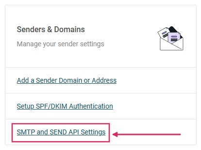
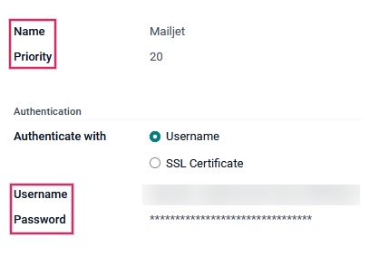

===========
Mailjet API
===========

Odoo is compatible with Mailjet's :abbr:`API (Application Programming Interface)` for mass mailing.
Set up a dedicated mass mailing server through Mailjet by configuring settings in the Mailjet
account and the Odoo database. In some circumstances, settings need to be configured on the custom
domain's :abbr:`DNS (Domain Name System)` settings as well.

Set up in Mailjet
=================

Create API credentials
----------------------

To get started, sign in to the `Mailjet Account Information <https://app.mailjet.com/account>`_
page. Next, navigate to the :guilabel:`Senders & Domains` section and click on :guilabel:`SMTP and
SEND API Settings`.

Then, copy the :abbr:`SMTP (Simple Mail Transfer Protocol)` configuration settings onto a notepad.
They can be found under the :guilabel:`Configuration (SMTP only)` section. The :abbr:`SMTP (Simple
Mail Transfer Protocol)` configuration settings include the server address, the security option
needed (Use :abbr:`SSL (Secure Sockets Layer)`/:abbr:`TLS (Transport Layer Security)`), and the
port number. The settings are needed to configure Mailjet in Odoo, which is covered in the
:ref:`last section <maintain/mailjet-api/odoo-setup>`.

.. seealso::
   `Mailjet: How can I configure my SMTP parameters?
   <https://documentation.mailjet.com/hc/articles/360043229473>`_

.. important::
   Odoo blocks `port 25` on Odoo Online and Odoo.sh databases. :ref:`See reference here <email_servers_outbound/port_restriction>`.

.. image:: mailjet_api/smtp-config.png
   :align: center
   :alt: SMTP configuration from Mailjet.

Next, click on the button labeled :guilabel:`Retrieve your API credentials` to retrieve the Mailjet
API credentials.

Then, click on the eye icon to reveal the :guilabel:`API key`. Copy this key to a notepad, as this
serves as the :guilabel:`Username` in the Odoo configuration. Next, click on the
:guilabel:`Generate Secret Key` button to generate the :guilabel:`Secret Key`. Copy this key to a
notepad, as this serves as the :guilabel:`Password` in the Odoo configuration.

Add verified sender address(es)
-------------------------------

The next step is to add a sender address or a domain to the Mailjet account settings so that the
email address or domain is approved to send emails using Mailjet's servers. First, navigate to the
`Mailjet Account Information <https://app.mailjet.com/account>`_ page. Next, click on the
:guilabel:`Add a Sender Domain or Address` link under the :guilabel:`Senders & Domains` section.

.. image:: mailjet_api/add-domain-email.png
   :align: center
   :alt: Add a sender domain or address in the Mailjet interface.

Determine if a sender's email address or the entire domain needs to be added to the Mailjet
settings. It may be easier to configure the domain as a whole if :abbr:`DNS (Domain Name System)`
access is available. Jump to the :ref:`Add a domain <maintain/mailjet-api/add-domain>` section for
steps on adding the domain.

.. note::
   Either all email addresses of the Odoo database users who are sending emails using Mailjet's
   servers need to be configured or the domain(s) of the users' email addresses can be configured.

By default, the email address originally set up in the Mailjet account is added as a trusted
sender. To add another email address, click on the button labeled :guilabel:`Add a sender address`.
Then, add the email address that is configured to send from the custom domain.

At minimum the following email addresses should be set up in the provider and verified in Mailjet:

- notifications\@yourdomain.com
- bounce\@yourdomain.com
- catchall\@yourdomain.com

.. note::
   Replace `yourdomain` with the custom domain for the Odoo database. If there isn't one, then use
   the :guilabel:`mail.catchall.domain` system parameter.

After that, fill out the :guilabel:`Email Information` form, making sure to select the appropriate
email type: transactional email or mass emails. After completing the form, an activation email is
sent to the email address and the trusted sender can be activated.

It is recommended to set up the :abbr:`SPF (Sender Policy Framework)`/:abbr:`DKIM (DomainKeys
Identified Mail)`/:abbr:`DMARC (Domain-based Message Authentication, Reporting, and
Conformance)` settings on the domain of the sender.

.. seealso::
   `Mailjet's SPF/DKIM/DMARC documentation <https://documentation.mailjet.com/hc/articles/
   360042412734-Authenticating-Domains-with-SPF-DKIM>`_

.. important::
   If the database is not using a custom domain, then in order to verify the sender's address, a
   temporary alias (of the three email addresses mentioned above) should be set up in Odoo CRM to
   create a lead. Then, the database is able to receive the verification email and verify the
   accounts.

.. _maintain/mailjet-api/add-domain:

Add a domain
------------

By adding an entire domain to the Mailjet account, all the sender addresses related to that domain
are automatically validated for sending emails using Mailjet servers. First, navigate to the
`Mailjet Account Information <https://app.mailjet.com/account>`_ page. Next, click on
:guilabel:`Add a Sender Domain or Address` link under the :guilabel:`Senders & Domains` section.
Then, click on :guilabel:`Add domain` to add the custom domain.

.. note::
   The domain needs to be added to the Mailjet account and then validated through the :abbr:`DNS
   (Domain Name System)`.

After that, fill out the :guilabel:`Add a new Domain` page on Mailjet and click
:guilabel:`Continue`.

After adding the domain, a validation page will populate. Unless the Odoo database is on-premise
(in which case, choose :guilabel:`Option 1`), choose :guilabel:`Option 2: Create a DNS Record`.
Copy the TXT record information to a notepad and then navigate to the domain's :abbr:`DNS (Domain
Name System)` provider to complete validation.

.. image:: mailjet_api/host-value-dns.png
   :align: center
   :alt: The TXT record information to input on the domain's DNS.

Setup in the domain's DNS
~~~~~~~~~~~~~~~~~~~~~~~~~

After getting the TXT record information from the Mailjet account, add a TXT record to the domain's
:abbr:`DNS (Domain Name System)`. This process varies depending on the :abbr:`DNS (Domain Name
System)` provider. Consult the provider for specific configuration processes. The TXT record
information consists of the :guilabel:`Host` and :guilabel:`Value`. Paste these into
the corresponding fields in the TXT record.

Return to Mailjet account information
~~~~~~~~~~~~~~~~~~~~~~~~~~~~~~~~~~~~~

After adding the TXT record to the domain's :abbr:`DNS (Domain Name System)`, navigate back to the
Mailjet account. Then, navigate to :menuselection:`Account Information --> Add a Sender Domain or
Address`, click the gear icon next to :guilabel:`Domain`, and select :guilabel:`Validate`.

This action can also be done by going to the `Sender domains & addresses <https://app.mailjet.com/
account/sender>`_ page on the Mailjet account information and clicking on :guilabel:`Manage`.

Next, click :guilabel:`Check Now` to validate the TXT record that was added on the domain. A
success screen will appear if the domain is configured correctly.

.. image:: mailjet_api/check-dns.png
   :align: center
   :alt: Check DNS record in Mailjet.

After successfully setting up the domain, there is an option to :guilabel:`Authenticate this domain
(SPF/DKIM)`. This button populates :abbr:`SPF (Sender Policy Framework)` & :abbr:`DKIM (DomainKeys
Identified Mail) records to input into the :abbr:`DNS (Domain Name System)` provider.

.. seealso::
   `Mailjet's SPF/DKIM/DMARC documentation <https://documentation.mailjet.com/hc/articles/
   360042412734-Authenticating-Domains-with-SPF-DKIM>`_

.. image:: mailjet_api/authenticate.png
   :align: center
   :alt: Authenticate the domain with SPF/DKIM records in Mailjet.

.. _maintain/mailjet-api/odoo-setup:

Set up in Odoo
==============

To complete the setup, navigate to the Odoo database and go to the :guilabel:`Settings`. With
:ref:`developer-mode` turned on, go to the :menuselection:`Technical Menu --> Email --> Outgoing
Mail Servers`. Then, create a new outgoing server configuration by clicking on the
:guilabel:`Create` button.

Next, input the `SMTP server` (in-v3.mailjet.com), `port number` (587 or 465), and `Security
(SSL/TLS)` that was copied earlier from the Mailjet account. They can also be found `here
<https://app.mailjet.com/account/setup>`_. It is recommended to use :abbr:`SSL (Secure Sockets
Layer)`/:abbr:`TLS (Transport Layer Security)` even though Mailjet may not require it.

For the :guilabel:`Username`, input the :guilabel:`API KEY`. For the :guilabel:`Password`, input
the :guilabel:`SECRET KEY` that was copied from the Mailjet account to the notepad earlier. These
settings can be found on :menuselection:`Mailjet -->  Account Settings --> SMTP and SEND API
Settings`.

Then, if the Mailjet server is used for mass emailing, set the :guilabel:`Priority` value higher
than that of any transactional email server(s). Finally, save the settings and :guilabel:`Test the Connection`.

.. important::
   In order for the notifications feature to work using Mailjet, there are three settings that need
   to be set in Odoo.

   #. The :guilabel:`From Filter` needs to be set on the server configuration. It is recommended
      to set it as a domain and not a full email address. It should match the domain in the two
      proceeding steps. More information can be referenced :ref:`here
      <email_servers_outbound/from_filtering>`.
   #. The :guilabel:`mail.default.from` system parameter must have the value
      `notifications\@yourdomain.com`.
   #. The :guilabel:`mail.default.from_filter` system parameter must have the value
      `yourdomain.com`. Replace `yourdomain` with the custom domain for the Odoo database. If there
      isn't one, then use the :guilabel:`mail.catchall.domain` system parameter.

   For more information see :ref:`Using a default email address <email_servers_outbound/unique_outgoing_address>`.

   The :guilabel:`System Parameters` can be accessed by activating the :ref:`developer-mode`.

Once the setup is complete, the Odoo database is ready to use the Mailjet email server for mass
mailing or transactional emails!
