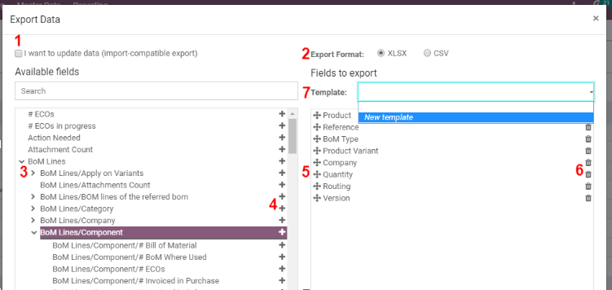
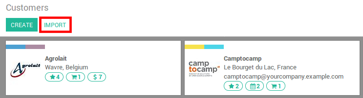

======================
Export and import data
======================

.. _export-data:

Export data from Odoo
=====================

When working with a database, it sometimes is necessary to export your data in a distinct file.
Doing so can help to do reporting over your activities (even if Odoo offers a precise and easy
reporting tool with each available application).

With Odoo, you can export the values from any field in any record. To do so,
activate the list view on the items that need to be exported, click on *Action*, and, then,
on *Export*.

Pretty simple, this action still comes with some specificities. In fact,
when clicking on *Export*, a pop-up window appears with several
options for the data to export:

#. With the *I want to update data* option ticked, the system only
   shows the fields which can be imported. This is very helpful in
   case you want to update existing records. Basically, this works
   like a filter. Leaving the box unticked gives way more field
   options because it shows all the fields, not just the ones which
   can be imported.
#. When exporting, you can choose between two formats: .csv and .xls.
   With .csv, items are separated with a comma, while .xls holds information about all the
   worksheets in a file, including both content and formatting.
#. Those are the items you may want to export. Use the arrows to display
   more sub-field options. Of course, you can use the search bar to
   find specific fields more easily. To use the search option more
   efficiently, display all the fields by clicking on all the
   arrows!
#. The + button is there to add fields to the "to export" list.
#. The "handles" next to the selected fields allow you to move the fields up and down to
   change the order in which they must be displayed in the exported
   file.
#. The trashcan is there if you need to remove fields.
#. For recurring reports, it might be interesting to save export presets.
   Select all the needed ones and click on the template bar.
   There, click on *New template* and give a name to yours. The
   next time you need to export the same list, simply select the
   related template.

.. tip::
   It’s good to keep the field’s external identifier in mind. For example,
   *Related Company* is equal to *parent_id*. Doing so helps export
   only what you would like to import next.

.. _import-data:

Import data into Odoo
=====================

How to start
------------

You can import data on any Odoo's business object using either Excel
(.xlsx) or CSV (.csv) formats:
contacts, products, bank statements, journal entries and even orders!

Open the view of the object you want to populate and click on :menuselection:`Favorites --> Import
records`.

There you are provided with templates you can easily populate
with your own data. Such templates can be imported in one click;
The data mapping is already done.

How to adapt the template
-------------------------

* Add, remove and sort columns to fit at best your data structure.
* We advise to not remove the **ID** one (see why in the next section).
* Set a unique ID to every single record by dragging down the ID sequencing.

.. image:: export_import_data/dragdown.gif
   :align: center

* When you add a new column, Odoo might not be able to map it automatically if its
  label doesn't fit any field in Odoo. Don't worry! You can map
  new columns manually when you test the import. Search the list for the
  corresponding field.

    .. image:: export_import_data/field_list.png
       :align: center

  Then, use this field's label in your file in order to make it work
  straight on the very next time.

How to import from another application
--------------------------------------

In order to re-create relationships between different records,
you should use the unique identifier from the original application
and map it to the **ID** (External ID) column in Odoo.
When you import another record that links to the first one,
use **XXX/ID** (XXX/External ID) to the original unique identifier.
You can also find this record using its name but you will be stuck
if at least 2 records have the same name.

The **ID** will also be used to update the original import
if you need to re-import modified data later,
it's thus good practice to specify it whenever possible.

I cannot find the field I want to map my column to
--------------------------------------------------

Odoo tries to find with some heuristic, based on the first ten lines of
the files, the type of field for each column inside your file.
For example if you have a column only containing numbers,
only the fields that are of type *Integer* will be displayed for you
to choose from.
While this behavior might be good and easy for most cases,
it is also possible that it goes wrong or that you want to
map your column to a field that is not proposed by default.

If that happens, you just have to check the
** Show fields of relation fields (advanced)** option,
you will then be able to choose from the complete list of fields for each column.

.. image:: export_import_data/field_list.png
   :align: center

Where can I change the date import format?
------------------------------------------

Odoo can automatically detect if a column is a date, and it will try to guess the date format from a
set of most commonly used date formats. While this process can work for many date formats, some date
formats will not be recognized. This can cause confusion due to day-month inversions; it is
difficult to guess which part of a date format is the day and which part is the month in a date such
as '01-03-2016'.

To view which date format Odoo has found from your file you can check the **Date Format** that is
shown when clicking on **Options** under the file selector. If this format is incorrect you can
change it to your liking using the *ISO 8601* to define the format.

.. note::
   If you are importing an excel (.xls, .xlsx) file, you can use date cells to store dates as the
   display of dates in excel is different from the way it is stored. That way you will be sure that
   the date format is correct in Odoo whatever your locale date format is.

Can I import numbers with currency sign (e.g.: $32.00)?
-------------------------------------------------------

Yes, we fully support numbers with parenthesis to represent negative sign as well as numbers with
currency sign attached to them. Odoo also automatically detect which thousand/decimal separator you
use (you can change those under **options**). If you use a currency symbol that is not known to
Odoo, it might not be recognized as a number though and it will crash.

Examples of supported numbers (using thirty-two thousands as an example):

- 32.000,00
- 32000,00
- 32,000.00
- -32000.00
- (32000.00)
- $ 32.000,00
- (32000.00 €)

Example that will not work:

- ABC 32.000,00
- $ (32.000,00)

What can I do when the Import preview table isn't displayed correctly?
----------------------------------------------------------------------

By default the Import preview is set on commas as field separators and quotation marks as text
delimiters. If your csv file does not have these settings, you can modify the File Format Options
(displayed under the Browse CSV file bar after you select your file).

Note that if your CSV file has a tabulation as separator, Odoo will not detect the separations. You
will need to change the file format options in your spreadsheet application. See the following
question.

How can I change the CSV file format options when saving in my spreadsheet application?
---------------------------------------------------------------------------------------

If you edit and save CSV files in spreadsheet applications, your computer's regional settings will
be applied for the separator and delimiter. We suggest you use OpenOffice or LibreOffice Calc as
they will allow you to modify all three options (in :menuselection:`'Save As' dialog box --> Check the
box 'Edit filter settings' --> Save`).

Microsoft Excel will allow you to modify only the encoding when saving (in :menuselection:`'Save As'
dialog box --> click 'Tools' dropdown list --> Encoding tab`).

What's the difference between Database ID and External ID?
----------------------------------------------------------

Some fields define a relationship with another object. For example, the country of a contact is a
link to a record of the 'Country' object. When you want to import such fields, Odoo will have to
recreate links between the different records. To help you import such fields, Odoo provides three
mechanisms. You must use one and only one mechanism per field you want to import.

For example, to reference the country of a contact, Odoo proposes you 3 different fields to import:

- Country: the name or code of the country
- Country/Database ID: the unique Odoo ID for a record, defined by the ID postgresql column
- Country/External ID: the ID of this record referenced in another application (or the .XML file
  that imported it)

For the country Belgium, you can use one of these 3 ways to import:

- Country: Belgium
- Country/Database ID: 21
- Country/External ID: base.be

According to your need, you should use one of these 3 ways to reference records in relations. Here
is when you should use one or the other, according to your need:

- Use Country: This is the easiest way when your data come from CSV files that have been created
  manually.
- Use Country/Database ID: You should rarely use this notation. It's mostly used by developers as
  it's main advantage is to never have conflicts (you may have several records with the same name,
  but they always have a unique Database ID)
- Use Country/External ID: Use External ID when you import data from a third party application.

When you use External IDs, you can import CSV files with the "External ID" column to define the
External ID of each record you import. Then, you will be able to make a reference to that record
with columns like "Field/External ID". The following two CSV files give you an example for Products
and their Categories.

:download:`CSV file for categories
<export_import_data/External_id_3rd_party_application_product_categories.csv>`.

:download:`CSV file for Products
<export_import_data/External_id_3rd_party_application_products.csv>`.

What can I do if I have multiple matches for a field?
-----------------------------------------------------

If for example you have two product categories with the child name "Sellable" (ie. "Misc.
Products/Sellable" & "Other Products/Sellable"), your validation is halted but you may still import
your data. However, we recommend you do not import the data because they will all be linked to the
first 'Sellable' category found in the Product Category list ("Misc. Products/Sellable"). We
recommend you modify one of the duplicates' values or your product category hierarchy.

However if you do not wish to change your configuration of product categories, we recommend you use
make use of the external ID for this field 'Category'.

How can I import a many2many relationship field (e.g. a customer that has multiple tags)?
-----------------------------------------------------------------------------------------

The tags should be separated by a comma without any spacing. For example, if you want your customer
to be linked to both tags 'Manufacturer' and 'Retailer' then you will encode "Manufacturer,Retailer"
in the same column of your CSV file.

:download:`CSV file for Manufacturer, Retailer <export_import_data/m2m_customers_tags.csv>`

How can I import a one2many relationship (e.g. several Order Lines of a Sales Order)?
-------------------------------------------------------------------------------------

If you want to import sales order having several order lines; for each order line, you need to
reserve a specific row in the CSV file. The first order line will be imported on the same row as the
information relative to order. Any additional lines will need an additional row that does not have
any information in the fields relative to the order. As an example, here is
``purchase.order_functional_error_line_cant_adpat.CSV`` file of some quotations you can import,
based on demo data.

:download:`File for some Quotations <export_import_data/purchase.order_functional_error_line_cant_adpat.csv>`.

The following CSV file shows how to import purchase orders with their respective purchase order
lines:

:download:`Purchase orders with their respective purchase order lines <export_import_data/o2m_purchase_order_lines.csv>`.

The following CSV file shows how to import customers and their respective contacts:

:download:`Customers and their respective contacts <export_import_data/o2m_customers_contacts.csv>`.

Can I import several times the same record?
-------------------------------------------

If you import a file that contains one of the column "External ID" or "Database ID", records that
have already been imported will be modified instead of being created. This is very useful as it
allows you to import several times the same CSV file while having made some changes in between two
imports. Odoo will take care of creating or modifying each record depending if it's new or not.

This feature allows you to use the Import/Export tool of Odoo to modify a batch of records in your
favorite spreadsheet application.

What happens if I do not provide a value for a specific field?
--------------------------------------------------------------

If you do not set all fields in your CSV file, Odoo will assign the default value for every non
defined fields. But if you set fields with empty values in your CSV file, Odoo will set the EMPTY
value in the field, instead of assigning the default value.

How to export/import different tables from an SQL application to Odoo?
----------------------------------------------------------------------

If you need to import data from different tables, you will have to recreate relations between
records belonging to different tables. (e.g. if you import companies and persons, you will have to
recreate the link between each person and the company they work for).

To manage relations between tables, you can use the "External ID" facilities of Odoo. The "External
ID" of a record is the unique identifier of this record in another application. This "External ID"
must be unique across all the records of all objects, so it's a good practice to prefix this
"External ID" with the name of the application or table. (like 'company_1', 'person_1' instead of
'1')

As an example, suppose you have a SQL database with two tables you want to import: companies and
persons. Each person belong to one company, so you will have to recreate the link between a person
and the company he work for. (If you want to test this example, here is a :download:`dump of such a
PostgreSQL database <export_import_data/database_import_test.sql>`)

We will first export all companies and their "External ID". In PSQL, write the following command:

.. code-block:: sh

   > copy (select 'company_'||id as "External ID",company_name as "Name",'True' as "Is a Company" from companies) TO '/tmp/company.csv' with CSV HEADER;

This SQL command will create the following CSV file:

.. code-block:: text

   External ID,Name,Is a Company
   company_1,Bigees,True
   company_2,Organi,True
   company_3,Boum,True

To create the CSV file for persons, linked to companies, we will use the following SQL command in PSQL:

.. code-block:: sh

    > copy (select 'person_'||id as "External ID",person_name as "Name",'False' as "Is a Company",'company_'||company_id as "Related Company/External ID" from persons) TO '/tmp/person.csv' with CSV

It will produce the following CSV file:

.. code-block:: text

   External ID,Name,Is a Company,Related Company/External ID
   person_1,Fabien,False,company_1
   person_2,Laurence,False,company_1
   person_3,Eric,False,company_2
   person_4,Ramsy,False,company_3

As you can see in this file, Fabien and Laurence are working for the Bigees company (company_1) and
Eric is working for the Organi company. The relation between persons and companies is done using the
External ID of the companies. We had to prefix the "External ID" by the name of the table to avoid a
conflict of ID between persons and companies (person_1 and company_1 who shared the same ID 1 in the
original database).

The two files produced are ready to be imported in Odoo without any modifications. After having
imported these two CSV files, you will have 4 contacts and 3 companies. (the firsts two contacts are
linked to the first company). You must first import the companies and then the persons.

How to adapt an import template
===============================

Import templates are provided in the import tool of the most common data to
import (contacts, products, bank statements, etc.).
You can open them with any spreadsheets software (Microsoft Office,
OpenOffice, Google Drive, etc.).

How to customize the file
=========================

* Remove columns you don't need. We advise to not remove the *ID* one (see
  why here below).
* Set a unique ID to every single record by dragging down the ID sequencing.

  .. image:: export_import_data/dragdown.gif
     :align: center

* When you add a new column, Odoo might not be able to map it automatically if its
  label doesn't fit any field of the system.
  If so, find the corresponding field using the search.

    .. image:: export_import_data/field_list.png
       :align: center

  Then, use the label you found in your import template in order to make it work
  straight away the very next time you try to import.

Why an “ID” column
==================

The **ID** (External ID) is an unique identifier for the line item.
Feel free to use the one of your previous software to ease the transition to Odoo.

Setting an ID is not mandatory when importing but it helps in many cases:

* Update imports: you can import the same file several times without creating duplicates;
* Import relation fields (see here below).

How to import relation fields
=============================

An Odoo object is always related to many other objects (e.g. a product is linked
to product categories, attributes, vendors, etc.). To import those relations you need to
import the records of the related object first from their own list menu.

You can do it using either the name of the related record or its ID. The ID is expected when
two records have the same name. In such a case add " / ID" at the end of the column title
(e.g. for product attributes: Product Attributes / Attribute / ID).
