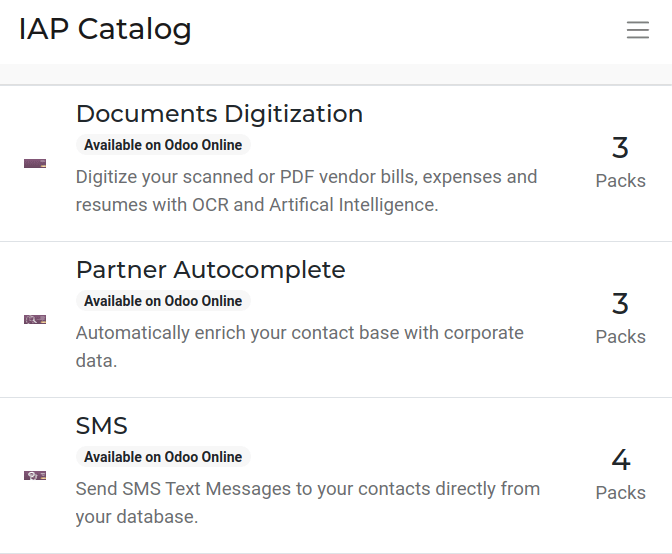
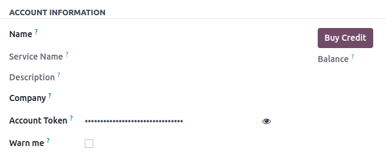
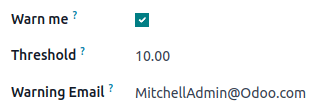

=====================
In-App Purchase (IAP)
=====================

In-App Purchases (IAP) are optional services that enhance Odoo databases. For example, the **SMS**
service sends text messages to contacts directly from the database, and the **Documents
Digitization** service digitizes scanned or PDF vendor bills, expenses, and resumes with optical
character recognition (OCR) and Artificial Intelligence.

IAP services do not need to be configured or set up, but each service requires its own prepaid
credits. Odoo users receive free credits to test out each IAP service, but need to :ref:`buy more
<Buy credits>` to keep using them. Each service has its own pricing and pack options listed on the
`Odoo IAP website <https://iap.odoo.com/iap/all-in-app-services>`_.

.. _in_app_purchase/portal:

IAP services
============

The `Odoo IAP website <https://iap.odoo.com/iap/all-in-app-services>`_ lists all IAP services
currently available, which include the following:

- :guilabel:`AI generated call summary and transcript service`: call recording transcript service
  for the Asterisk Plus application.
- :guilabel:`Amazon Odoo Connector`: establishes seamless integration between an Amazon Seller
  Central Account and Odoo, allowing users to effectively manage their products and orders.
- :guilabel:`Documents Digitization`: digitizes scanned or PDF vendor bills, expenses and resumes
  with OCR and Artifical Intelligence.
- :guilabel:`Lead Generation`: generates leads based on a set of criteria and enriches the company
  data of opportunities. Converts web visitors into quality leads and opportunities.
- :guilabel:`PLE Reports`: PLE report generator in .txt and .xls file formats.
- :guilabel:`Partner Autocomplete`: automatically enriches contact base with corporate data.
- :guilabel:`Pleo`: pulls expenses from Pleo.
- :guilabel:`SMS`: sends SMS Text Messages to contacts directly from the database.
- :guilabel:`Signer identification with itsme®️`: adds an identification step in Odoo Sign's
  signature flows and asks signatories to provide their identity through the itsme®️ identity
  platform and their mobile device.
- :guilabel:`Snailmail`: sends customer invoices and follow-up reports by post, worldwide.
- :guilabel:`eInvoice Service`: submits invoices to Invoice Registration Portal (IRP).

Using services
--------------

IAP services are automatically integrated with Odoo, and do not require users to configure any
settings. To use a service, simply interact with it wherever it appears in the database.

.. example::
   The SMS service can be used on any contact that contains a phone number.

   #. Go to the contact's record.
   #. Hover the mouse over the space to the right of the phone number until a :guilabel:`SMS 📱
      (phone)` icon appears.
   #. Click the :guilabel:`SMS 📱 (phone)` icon.
   #. In the :guilabel:`Send SMS Text Message` pop-up that appears, type a message and click
      :guilabel:`Send SMS`. Odoo will send the message via SMS and log what was sent in the chatter.

   The prepaid credits for the SMS service are automatically deducted from the existing pool. If
   there are not enough credits to send the message, Odoo will prompt the purchase of additional
   credits.

For more information on how to use each service, review the documentation below:

.. seealso::
   - :doc:`Lead mining </applications/sales/crm/acquire_leads/lead_mining>`
   - :doc:`Enrich your contacts base with Partner Autocomplete
     </applications/sales/crm/optimize/partner_autocomplete>`
   - :doc:`SMS essentials </applications/marketing/sms_marketing/essentials/sms_essentials>`

.. _in_app_purchase/credits:

IAP credits
===========

Every time an IAP service is used, the prepaid credits for that service are spent. Odoo prompts the
purchase of more credits when there are not enough credits to continue using the service. Email
alerts can also be set up for when :ref:`credits are low <in_app_purchase/low-credits>`.

Credits are purchased in "packs" from the `Odoo IAP website
<https://iap.odoo.com/iap/all-in-app-services>`_, and pricing is specific to each service.

.. example::
   The `SMS service <https://iap.odoo.com/iap/in-app-services/1>`_ has four packs available for
   purchase, in denominations of:

   - **10** credits
   - **100** credits
   - **500** credits
   - **1,000** credits

   The number of credits consumed depends on the length of the SMS and the country of destination.
   For more information on SMS pricing, click :doc:`here
   </applications/marketing/sms_marketing/pricing/pricing_and_faq>`.

.. _Buy credits:

Buy credits
-----------

To manually buy credits:

#. Open the :guilabel:`Settings app`.
#. In the search bar, type :guilabel:`IAP`.
#. Click :guilabel:`View My Services`.
#. On the :guilabel:`IAP Account Settings` page, click on the service that needs more credits.
#. On the :guilabel:`Account Information` page, click the :guilabel:`Buy Credit` button.

   - The balance of credits is displayed below the :guilabel:`Buy Credit` button.
#. Click :guilabel:`Buy` on the desired pack of credits, and follow the prompts to enter payment
   details.
#. Once the transaction is complete, the credits will be available for use.

.. tip::
   Users who have the Enterprise version of Odoo Online get free credits to test IAP features.

.. _in_app_purchase/low-credits:

Low-credit notification
-----------------------

To be notified when a service's credits are low:

#. Open the :guilabel:`Settings app`.
#. In the search bar, type :guilabel:`IAP`.
#. Click :guilabel:`View My Services`.
#. On the :guilabel:`IAP Account Settings` page, click on the service that needs an alert.
#. On the :guilabel:`Account Information` page, click the :guilabel:`Warn Me` box. This causes two
   more fields to appear.
#. In the :guilabel:`Threshold` field, type an amount. Odoo will send a notification email when the
   balance falls below this amount.
#. In the :guilabel:`Email` field, type the email address that should receive the notification.
#. Click the :guilabel:`Save Manually (cloud)` icon on the top-left of the page.

