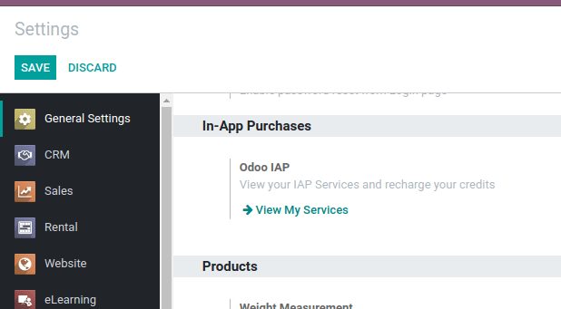
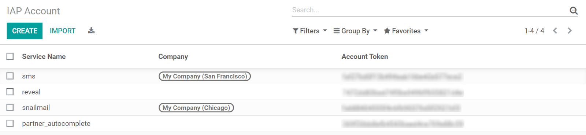
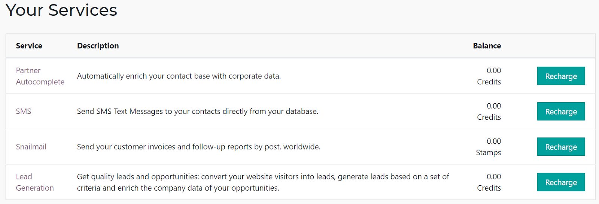
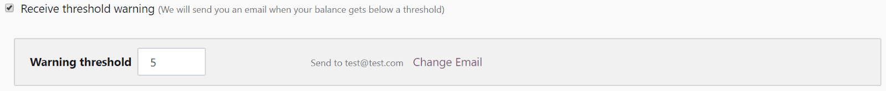

=====================
In-App Purchase (IAP)
=====================

In-App Purchases (IAP) gives access to additional services through Odoo. For instance, it allows you
to send SMS Text Messages or to send Invoices by post directly from my database.

Buying Credits
==============

Each IAP Service relies on prepaid credits to work and has its own pricing. To consult my current
balance or to recharge my account, go to :menuselection:`Settings --> Odoo IAP --> View my
Services`.

.. tip::
   If I am on Odoo Online (SAAS) and have the Enterprise version, I benefit from free credits to
   test our IAP features.

IAP accounts
============

Credits to use IAP services are stored on IAP accounts, which are specific to each service and
database. By default, IAP accounts are common to all companies, but can be restricted to specific
ones. Activate the :ref:`developer mode <developer-mode>`, then go to :menuselection:`Technical
Settings --> IAP Account`.

   
IAP Portal
==========

The IAP Portal is a platform regrouping my IAP Services. It is accessible from
:menuselection:`Settings app --> Odoo IAP --> View my Services`. From there, I can view my current
balance, recharge my credits, review my consumption and set a reminder to when credits are low.

Get notified when credits are low
=================================

To be notified when it’s time to recharge my credits, I’ll go to my IAP Portal through
:menuselection:`Settings app --> Odoo IAP --> View my Services`, unfold a service and mark the
Receive threshold warning option. Then, I’ll provide a minimum amount of credits and email
addresses. Now, every time that the limit is reached, an automatic reminder will be sent to by
email!

IAP services available
======================

Different services are available depending on the hosting type of your Database:

- *Odoo Online (SAAS)*: only the IAP services provided by Odoo can be used (i.e. the SMS, Snailmail,
  Reveal and Partner Autocomplete features);
- *Odoo.sh and Odoo Enterprise (on-premise)*: both the services provided by Odoo and by third-party
  apps can be used.

Offering my own services 
========================

I am more than welcome to offer my own IAP services through Odoo Apps! It is the perfect opportunity
to get recurring revenue for an ongoing service use rather than — and possibly instead of — a sole
initial purchase. Please, find more information at: :doc:`In-App Purchase
</developer/api/iap>`.
