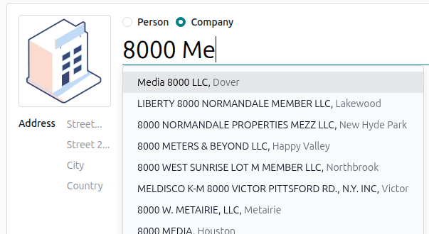

====================
Address autocomplete
====================

Odoo integrates with the Google Places API to allow the autocompletion of addresses. As you begin
typing an address, the system provides a list of suggested locations, reducing manual errors and
saving time.

.. important::
   Using the Google Places API could require `payment to Google
   <https://mapsplatform.google.com/pricing/>`_.

.. seealso::
   - `Google Maps Platform <https://mapsplatform.google.com/maps-products>`_
   - `Google developer documentation: Google Places API
     <https://developers.google.com/maps/documentation/places/web-service>`_

.. _address_autocomplete/places-api-configuration:

Google Places API configuration
===============================

To use Google for address autocompletion, you must first :ref:`enable the API
<address_autocomplete/enable-api>` and :ref:`create the required credentials
<address_autocomplete/generate_api_key>`.

.. _address_autocomplete/enable-api:

Enable the Google Places API
----------------------------

To enable the Google Places API, follow these steps:

#. Go to the `Google Cloud console <https://console.cloud.google.com/getting-started>`_.
#. `Create <https://dash.cloudflare.com/sign-up>`_ or `sign in <https://dash.cloudflare.com/login>`_
   to a Google account.
#. In the upper-left corner, click :guilabel:`Select a project`. Then, in the :guilabel:`Select a
   resource` pop-up, create a :guilabel:`New Project`.

   .. tip::
      If you have already created a project, but want to switch to a different one, click the
      selected project's name in the upper-left corner. Then, in the :guilabel:`Select a resource`
      pop-up, manually select a project. If the desired project is already selected by default,
      proceed to the next step.

#. Open the :icon:`fa-bars` :guilabel:`(Navigation menu)` side panel, then go to
   :menuselection:`APIs and services --> Enabled APIs and services`.
#. Click :icon:`fa-plus` :guilabel:`Enable APIs and services`.
#. Search for :guilabel:`Places API` and select it.

   .. important::
      Do not enable :guilabel:`Places API (New)`, as it is not yet supported by Odoo.

#. Click :guilabel:`Enable`.
#. Complete the verification process.

.. _address_autocomplete/generate_api_key:

Create API credentials
----------------------

Once the :ref:`project is created and the Places API is enabled <address_autocomplete/enable-api>`,
create API credentials. To do so, follow these steps:

#. Open the :icon:`fa-bars` :guilabel:`(Navigation menu)` side panel of the project, then go to
   :menuselection:`APIs and services --> Credentials`.
#. Click :icon:`fa-plus` :guilabel:`Create credentials` :icon:`fa-caret-down`, then select
   :guilabel:`API key`.
#. In the :guilabel:`Create API key` panel, enter a :guilabel:`Name`.
#. In the :guilabel:`Select API restrictions` dropdown, specify which APIs the key can access if
   there are several APIs configured in your project. Ensure :guilabel:`Places API` is selected,
   then click :guilabel:`OK`.
#. Click :guilabel:`Create`.

.. note::
   Under :guilabel:`Application restrictions`, the API key can be restricted to allow requests only
   from specific websites, IP addresses, or apps.

.. important::
   Save your API key securely and never share it publicly.

Odoo configuration
==================

Once the API key is generated, connect the Odoo database to the Google Places API. To do so:

#. Go to the **Settings app**.
#. Navigate to the :guilabel:`Integrations` section.
#. Enable :guilabel:`Google Address Autocomplete`, then click :guilabel:`Save`.
#. Return to the :guilabel:`Integrations` section, then paste your :ref:`Google Places API key
   <address_autocomplete/generate_api_key>` in the dedicated field.
#. Click :guilabel:`Save`.

.. seealso::
   - :ref:`Address validation with Google Places API <ecommerce/checkout/address-validation>`
   - :ref:`Geolocalization with Google Places API <geolocation/google-places-api>`
