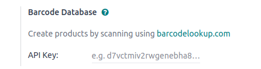

:show-content:

=============
Barcodelookup
=============

.. toctree::
   :titlesonly:

   barcodelookup/pos_barcodelookup
   barcodelookup/ecom_barcodelookup
   barcodelookup/stock_barcodelookup

The Barcode Lookup feature allows users to quickly retrieve product information by scanning or entering barcode numbers.
This includes details like product names, descriptions, images, categories and much more for UPC, EAN, or ISBN codes.

This feature reduces manual data entry, improves accuracy, and enhances efficiency in retail, e-commerce, and point-of-sale
systems by automatically populating product details in databases.

Configuration
=============

.. _barcodelookup/credentials:

Locate your Barcodelookup API
-----------------------------

- Visit the `Barcodelookup website <https://www.barcodelookup.com/api>`_.
- Click on the :guilabel:`Sign Up for the API` button, choose appropriate plan and continue.
- Fill in the required details and complete the registration process.
- Copy the API key provided and :ref:`configure it in odoo <barcodelookup/configure>`.

You will need this API key to set up the Barcodelookup feature in Odoo.

Configuration on Odoo
---------------------

To use barcodelookup on odoo modules:

.. _barcodelookup/configure:

#. Access the :menuselection:`Settings --> Integrations --> Barcode Database`.
#. Fill in the field with your :ref:`copied Barcodelookup API key <barcodelookup/credentials>` to activate :guilabel:`Barcodelookup` feature.

Once the setup is completed, you can use barcodelookup features for modules like POS, Barcode & E-commerce.

.. tip::
   For saas users we already have the API key configured, so you can directly use the feature in saas.

   - To create general product from backend, you can simply go to the product form and fill in the barcode field.
   - By filling the barcode field, the product details will be automatically fetched from the barcode lookup API.

   .. image:: generic_barcodelookup/product_creation.gif
      :alt: product creation from backend

   - This will save you time and effort in manually entering product details and help to maintain accurate data.
