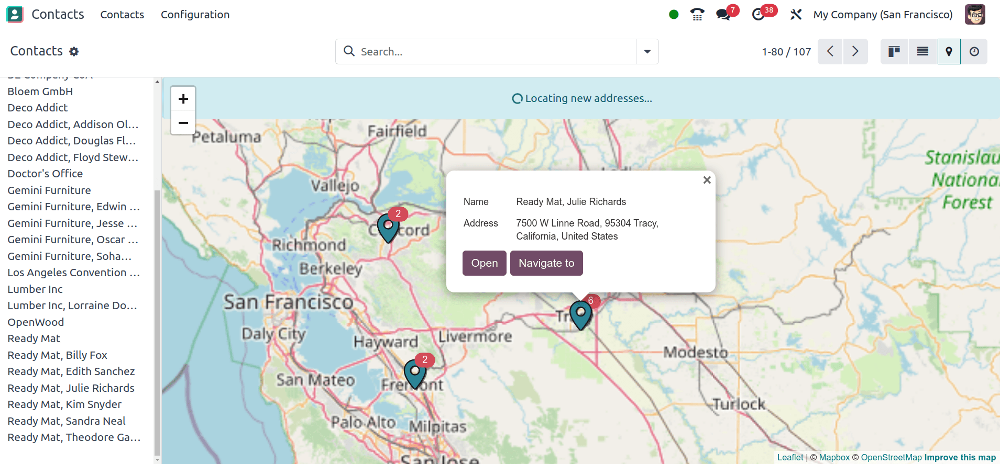
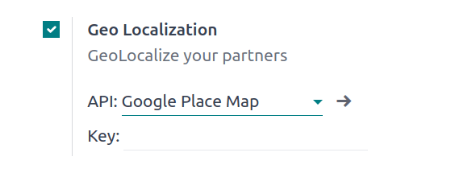

===========
Geolocation
===========

You can locate contacts or places and generate routes on a map in Odoo.

To use the feature, open the :guilabel:`Settings` app, and, under the :guilabel:`Integrations`,
section, activate :guilabel:`Geo Localization`. Then, choose between using the OpenStreetMap or
Google Places API.

**OpenStreetMap**

OpenStreetMap is a free, open geographic database updated and maintained by volunteers. To use it,
select :guilabel:`Open Street Map`.

  .. important::
     OpenStreetMap might not always be accurate. You can `join the OpenStreetMap community
     <https://www.openstreetmap.org/fixthemap>`_ to fix any issues encountered.

**Google Places API map**

The Google Places API map provides detailed info on places, businesses, and points of interest. It
supports location-based features like search, navigation, and recommendations.

.. important::
   Using the Google Places API could require `payment to Google
   <https://mapsplatform.google.com/pricing/>`_.

To use it, select :guilabel:`Google Place Map` and enter your :ref:`API Key
<address_autocomplete/generate_api_key>`.

.. seealso::
   :doc:`/applications/websites/website/configuration/address_autocomplete`
