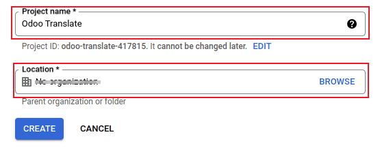
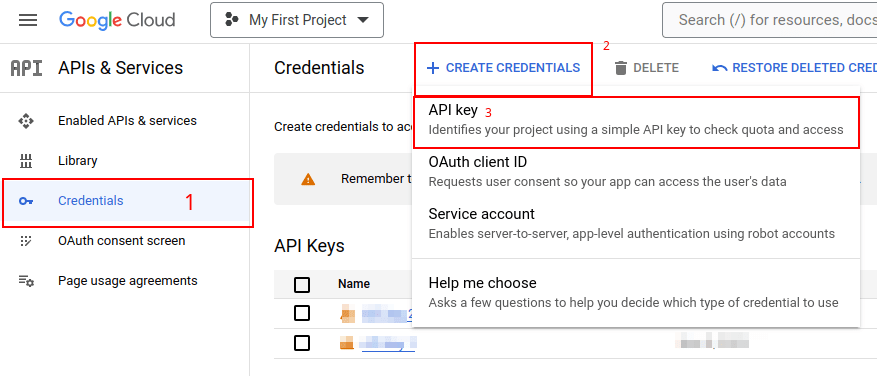
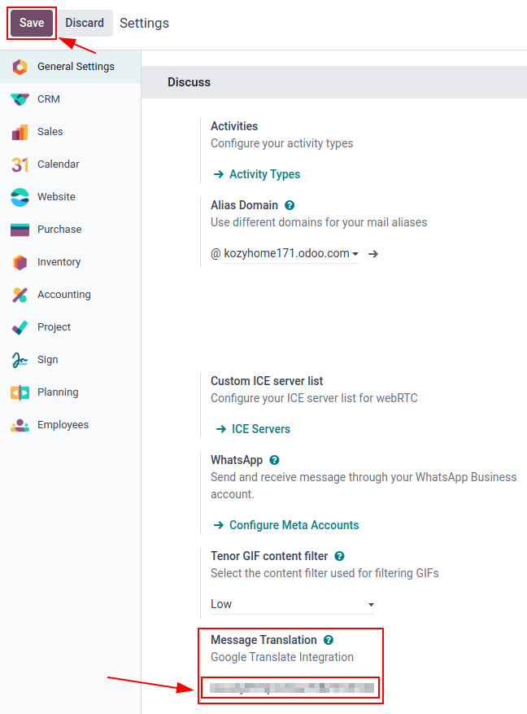
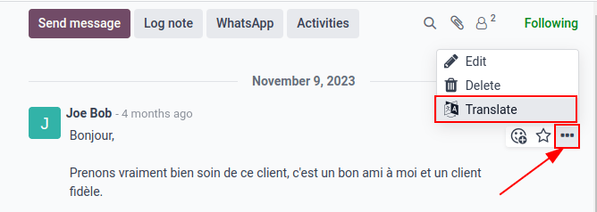

================
Google Translate
================

*Google Translate* can be used to translate user generated text in the Odoo chatter.

Google API console
==================

A majority of the setup for integrating *Google Translate* into Odoo is done with the *Google API
console*. Once the following processes are complete, an *API key* is created to input in Odoo.

.. seealso::
   `Google Translate setup on Google <https://cloud.google.com/translate/docs/setup>`_

Create a new project
--------------------

To get started, go to the `Google API Console <https://console.developers.google.com>`_. Then, log
in with a *Google Workspace* account, if there is one. If not, log in with a personal Gmail account
(this should match the email address that has billing attached to it).

Next, click :guilabel:`Create Project` on the far-right of the :guilabel:`OAuth consent screen`.

.. tip::
   If the *Google API Console* has existing projects, click the drop-down menu next to the
   :guilabel:`Google Cloud` icon, and a pop-over window appears. Next, click :guilabel:`New Project`
   top-right of the pop-over window.

On the :guilabel:`New Project` screen, rename the :guilabel:`Project name` to `Odoo Translate`, and
browse for the :guilabel:`Location`. Set the :guilabel:`Location` as the *Google Workspace
organization*. If a personal Gmail account is being used, leave the :guilabel:`Location` as
:guilabel:`No Organization`.

Click on :guilabel:`Create` to finish this step.

API library
-----------

Next, the *Cloud Translation API* needs to be installed on this newly-created project. To do that,
click :menuselection:`Library` in the left menu. Then, search the term `Cloud Translation API`, and
click into the result. This should be a *Google Enterprise API* labeled :guilabel:`Cloud Translation
API`.

Click :guilabel:`Enable` to install the library on this project.

.. important::
   Using the *Google Translate* API **requires** a current billing account with `Google
   <https://myaccount.google.com/>`_.

Once a billing account is setup with *Google* and the library is enabled, click :guilabel:`Manage`
to finish configuration on the API.

Create credentials
------------------

Now that the project is set up, and the *Cloud Translation API* is enabled, credentials **must** be
created. This includes the *API key*.

To begin this process, click :menuselection:`Credentials` in the left sidebar menu.

Then, click :guilabel:`Create Credentials` in the top menu, and select :guilabel:`API key` from the
drop-down menu.

Copy the :guilabel:`API key` for use in the next section.

.. important::
   For security purposes, the usage of the *API key* can be restricted.

   To do that, go to the *API restrictions* by clicking on :guilabel:`Edit API key` in the pop-over
   window, or by clicking on the listed API key on the :guilabel:`Credentials` page. From here, key
   restrictions can be set. This includes setting an application to restrict the use of the API key,
   and whether this API key can call any API.

   It is recommended that the Odoo *Translate API* be restricted to **only** allow requests from the
   configured Odoo database and to the *Cloud Translation API*.

   To add the website restriction, click :guilabel:`Websites`, under the :guilabel:`Set an
   application restriction`. Then, enter the address of the database *Google Translate* is being
   used in, by clicking on :guilabel:`Add`. Lastly, add the :abbr:`URL (Uniform Resource Locator)`,
   and click :guilabel:`Done`.

   To restrict use of the key to a selected API, first, select :guilabel:`Restrict key`, under the
   :guilabel:`API restrictions` section. Then use the drop-down menu to choose the API being
   configured (*Cloud Translation API*).

.. tip::
   - Save the API key: copy the API key and store it somewhere secure.
   - Do **not** share the API key publicly or expose it in client-side code.

Odoo configuration
==================

To access the integration in Odoo, navigate to the :menuselection:`Settings app --> Discuss
section`. Enter the API key into the field labeled :guilabel:`Message Translation`. Then,
:guilabel:`Save` the settings, and *Google Translate* can be used in any chatter throughout the
database.

Translate chatter
=================

To translate a user's text from another language, click the :guilabel:`... (three dot)` icon menu to
the right of the chatter. Then, select :guilabel:`Translate`. The content translates to the
*language* set on the user's preferences.

.. seealso::
   :ref:`language/install`
