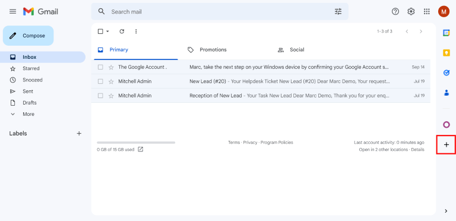
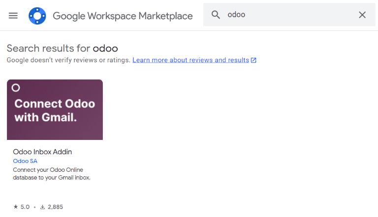

============
Gmail Plugin
============

The Gmail plugin connects an Odoo database to a Gmail inbox, which enables users to create Odoo
records (such as opportunities, tasks, and tickets) directly in Gmail.

.. seealso::
   Learn how Odoo handles your data by reading Odoo's `Privacy Policy
   <https://www.odoo.com/privacy>`_ and :doc:`Terms and Conditions <../../../../legal>`.

.. _mail-plugin/gmail/install-online-plugin:

Install the Gmail Plugin
========================

.. important::
   Make sure to check the database version in the :menuselection:`Settings app --> General
   Settings`, at the bottom of the page.

   For database versions earlier than 19.2, see the `19.0 documentation
   <https://www.odoo.com/documentation/19.0/applications/general/integrations/mail_plugins/gmail.html>`_
   for installation instructions.

From the Google Workspace Marketplace
-------------------------------------

To install the Odoo Gmail plugin, sign in to the Gmail account to be connected to Odoo, then go to
the `Odoo Inbox Addin <https://workspace.google.com/marketplace/app/odoo_inbox_addin/546131068990>`_
page in the Google Workspace Marketplace. Click :guilabel:`Install` and a pop-up window appears.
Click :guilabel:`Continue` and select the checkbox next to :guilabel:`Select all` to grant the
necessary permissions, then click :guilabel:`Continue` one more time to confirm the installation of
the plugin.

From the Gmail inbox
--------------------

Alternatively, the plugin can be installed directly from the Gmail inbox. To do so, click the
:icon:`fa-plus` :guilabel:`(Get Add-ons)` icon on the right-hand side panel. If the side panel is
not visible, click the :icon:`fa-chevron-left` :guilabel:`(Show side panel)` icon in the
bottom-right corner of the inbox to expand it.

Click :guilabel:`Search apps`, then type `Odoo` and press Enter.

Click :guilabel:`Odoo Inbox Addin`, then click :guilabel:`Install`, and a pop-up window appears.
Click :guilabel:`Continue` and select the checkbox next to :guilabel:`Select all` to grant the
necessary permissions, then click :guilabel:`Continue` one more time to confirm the installation of
the plugin.

.. note::
   If the plugin does not appear in the side panel after installation, refresh the page.

Connect an Odoo database
========================

To open the plugin, click on the Odoo icon in the right-hand side panel. The plugin panel opens
between the inbox and the right-hand side panel. Click :guilabel:`Login`. Enter the Odoo database
URL and click :guilabel:`Login`, or click :guilabel:`Sign Up` to create an Odoo account, and a
pop-up window opens. Click :guilabel:`Allow` in the pop-up window to let the Gmail plugin connect to
the database.

.. note::
   Use the general URL for the database, not the URL of a specific page in the database. For
   example, use `https://mycompany.odoo.com`, not
   `https://mycompany.odoo.com/web#cids=1&action=menu`.
