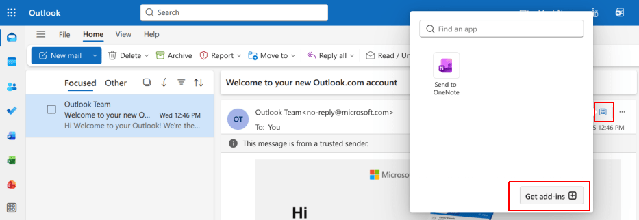
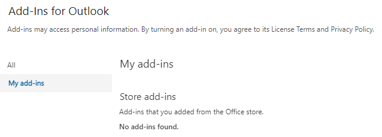
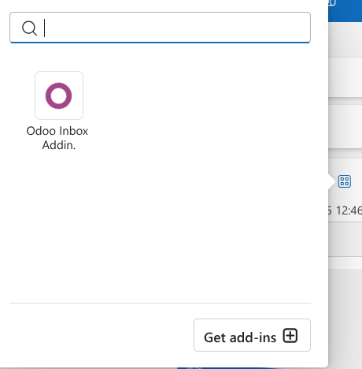
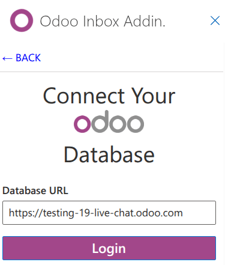
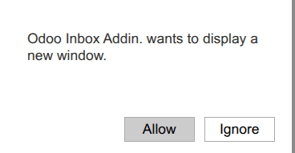
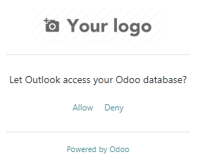
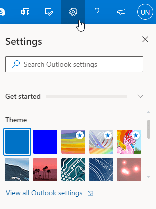
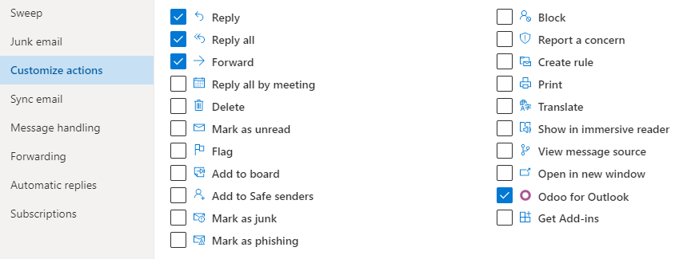
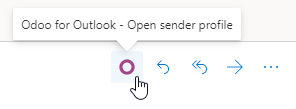

==============
Outlook Plugin
==============

Outlook allows for third-party applications to connect in order to execute database actions from
emails. Odoo has a plugin for Outlook that allows for the creation of an opportunity from the email
panel.

Configuration
=============

The Outlook :doc:`Mail Plugin <../mail_plugins>` needs to be configured both on Odoo and Outlook.

.. _mail-plugin/outlook/enable-mail-plugin:

Enable Mail Plugin
------------------

First, enable the *Mail Plugin* feature in the database. Go to :menuselection:`Settings --> General
Settings --> Integrations`, enable :guilabel:`Mail Plugin`, and :guilabel:`Save` the configuration.

.. _mail-plugin/outlook/install-plugin:

Install the Outlook Plugin
--------------------------

Download (:menuselection:`Save Page As --> Web Page XML only`) the following XML file to upload
later: `https://download.odoocdn.com/plugins/outlook/manifest.xml
<https://download.odoocdn.com/plugins/outlook/manifest.xml>`_.

Next, open the Outlook mailbox, and select any email. After completing this, click on the
:guilabel:`More actions` button in the upper right-side and select :guilabel:`Get Add-ins`.

Following this step, select the :guilabel:`My add-ins` tab on the left-side.

Under :guilabel:`Custom add-ins` towards the bottom, click on :guilabel:`+ Add a custom add-in`, and
then on :guilabel:`Add from file...`

.. image:: outlook/custom-add-ins.png
   :align: center
   :alt: Custom add-ins in Outlook

For the next step, attach the `manifest.xml` file downloaded above, and press :guilabel:`OK`. Next,
read the warning and click on :guilabel:`Install`.

.. image:: outlook/add-in-warning.png
   :align: center
   :alt: Custom add-in installation warning in Outlook

.. _mail-plugin/outlook/connect-database:

Connect the database
--------------------

Now, Outlook will be connected to the Odoo database. First, open any email in the Outlook mailbox,
click on the :guilabel:`More actions` button in the upper right-side, and select :guilabel:`Odoo for
Outlook`.

The right-side panel can now display **Company Insights**. At the bottom, click on
:guilabel:`Login`.

.. image:: outlook/panel-login.png
   :align: center
   :alt: Logging in the Odoo database

.. note::
   Only a limited amount of **Company Insights** (*Lead Enrichment*) requests are available as a
   trial database. This feature requires :ref:`prepaid credits <mail_plugins/pricing>`.

.. tip::
   If, after a short while, the panel is still empty, it is possible that the browser cookie
   settings prevented it from loading. Note that these settings also change if the browser is in
   "Incognito" mode.

   To fix this issue, configure the browser to always allow cookies on Odoo's plugin page.

   For Google Chrome, change the browser cookie settings by following the guide at:
   `https://support.google.com/chrome/answer/95647
   <https://support.google.com/chrome/answer/95647>`_
   and adding `download.odoo.com` to the list of :guilabel:`Sites that can always use cookies`.

   Once this is complete, the Outlook panel needs to be opened again.

Now, enter the Odoo database URL and click on :guilabel:`Login`.

Next, click on :guilabel:`Allow` to open the pop-up window.

If the user isn't logged into the database, enter the credentials. Click on :guilabel:`Allow` to let
the Outlook Plugin connect to the database.

.. _mail-plugin/outlook/add-shortcut:

Add a shortcut to the plugin
----------------------------

By default, the Outlook Plugin can be opened from the *More actions* menu. However, to save time,
it's possible to add it next to the other default actions.

In the Outlook mailbox, click on :guilabel:`Settings`, then on :guilabel:`View all Outlook
settings`.

Now, select :guilabel:`Customize actions` under :guilabel:`Mail`, click on :guilabel:`Odoo for
Outlook`, and then :guilabel:`Save`.

Following this step, open any email; the shortcut should be displayed.

Using the plugin
----------------

Now that the plug-in is installed and operational, all that needs to be done to create a lead is to
click on the `O` [Odoo icon] or navigate to :guilabel:`More actions` and click on :guilabel:`Odoo
for Outlook`. The side panel will appear on the right-side, and under :guilabel:`Opportunities`
click on :guilabel:`New`. A new window with the created opportunity in the Odoo database will
populate.
