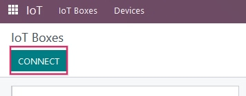
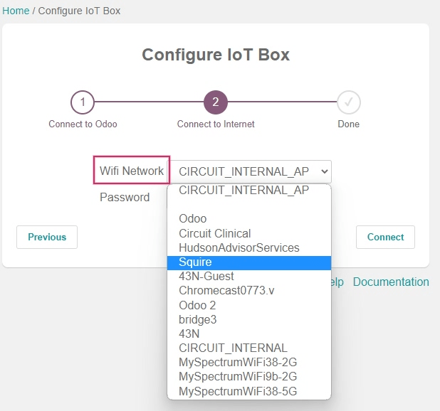
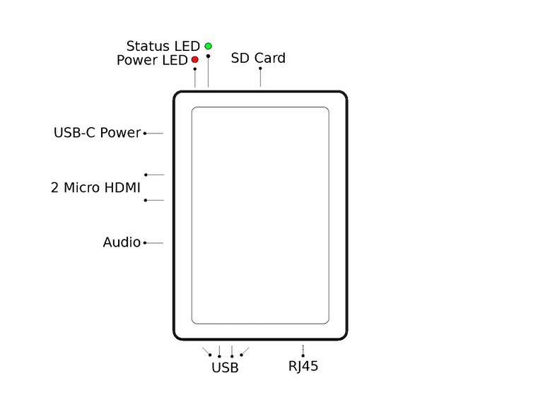

==========================
Connect an IoT box to Odoo
==========================

An Internet of Things (IoT) box is a micro-computer device that allows for the connection of input
and output devices to an Odoo database. An :abbr:`IoT (Internet of Things)` box subscription is
required in order to use the :abbr:`IoT (Internet of Things)` box with a secured connection. A
computer is also required to set up the :abbr:`IoT (Internet of Things)` box.

.. seealso::
   `IoT Box FAQ <https://www.odoo.com/app/iot-faq>`_

Begin the :abbr:`IoT (Internet of Things)` configuration process by :ref:`installing the IoT app
<general/install>` on the Odoo database through the :menuselection:`Apps` application.

.. image:: connect/install-iot-app.png
   :align: center
   :alt: The Internet of Things (IoT) app on the Odoo database.

Next, after the *IoT app* is installed, navigate to :menuselection:`IoT app --> IoT Boxes`, and then
click on the :guilabel:`Connect` button located in the upper-left corner of the :menuselection:`IoT
Boxes` dashboard.

There are two recommended ways to connect the :abbr:`IoT (Internet of Things)` box to the database
once the *IoT app* is installed. Follow the steps in either of the next two sections to connect the
:abbr:`IoT (Internet of Things)` box via :ref:`wired ethernet connection <iot_connect/ethernet>` or
via :ref:`WiFi <iot_connect/wifi>`.

.. image:: connect/connect-iot-box.png
   :align: center
   :alt: Connection steps for a wired connection or WiFi connection.

.. important::
   The disk image that the :abbr:`IoT (Internet of Things)` box SD card is formatted with is unique
   to the version of the Odoo database that the :abbr:`IoT (Internet of Things)` box is running on.
   Ensure that the :abbr:`IoT (Internet of Things)` box is :doc:`flashed <flash_sdcard>` with the
   most up-to-date disk image.

.. _iot_connect/ethernet:

Ethernet connection
===================

The following is the process to connect the :abbr:`IoT (Internet of Things)` box via an ethernet
cable to the Odoo database (by way of the ethernet port; RJ-45).

First, connect all wired devices to the :abbr:`IoT (Internet of Things)` box (ethernet, :abbr:`USB
(Universal Serial Bus)` devices, etc.). At minimum, an HDMI screen should be connected. Then, plug
the :abbr:`IoT (Internet of Things)` box into a power source.

Immediately after the unit powers on and boots up, read the *pairing code* from the screen or from
the printout of a receipt printer connected to the :abbr:`IoT (Internet of Things)` box.

.. warning::
   By default, the :abbr:`IoT (Internet of Things)` box will display the *pairing code* for a
   maximum of 5 minutes after the unit boots up. After 5 minutes, the *pairing code* will disappear
   for security purposes and the :abbr:`IoT (Internet of Things)` box will need to be rebooted
   manually by unplugging the unit from the power source for ten seconds and re-plugging it back in.

.. note::
   If no screen is attached to the :abbr:`IoT (Internet of Things)` box, then the *pairing code* can
   be accessed from the :abbr:`IoT (Internet of Things)` box homepage by clicking on the
   :guilabel:`POS Display` button. For instructions on how to access the :abbr:`IoT (Internet of
   Things)` box homepage visit :ref:`iot_connect/token`.

On the computer, navigate to :menuselection:`IoT app --> IoT Boxes`, and then click on the
:guilabel:`Connect` button located in the upper-left corner of the the :menuselection:`IoT Boxes`
dashboard. Input the *pairing code* in the :guilabel:`Pairing Code` field and click on the
:guilabel:`Pair` button. The database will now link to the :abbr:`IoT (Internet of Things)` box and
it will appear on the :menuselection:`IoT Boxes` page.

.. _iot_connect/wifi:

WiFi connection
===============

The following is the process to connect the :abbr:`IoT (Internet of Things)` box via a WiFi
connection to the Odoo database.

First, ensure there is no ethernet cable plugged into the :abbr:`IoT (Internet of Things)` box.
Then, connect all wired devices to the :abbr:`IoT (Internet of Things)` box (:abbr:`USB (Universal
Serial Bus)` devices, etc.).

After connecting the devices, plug the :abbr:`IoT (Internet of Things)` box into to a power source.
On the computer, navigate to :menuselection:`IoT app --> IoT Boxes`, and then click on the
:guilabel:`Connect` button located in the upper-left corner of the the :menuselection:`IoT Boxes`
dashboard. Then copy the :guilabel:`Token` from the :guilabel:`WiFi connection` section as this will
later be used to link the Odoo database to the :abbr:`IoT (Internet of Things)` box.

Back on the computer, navigate to the available WiFi networks and connect to the :abbr:`IoT
(Internet of Things)` box WiFi network. The WiFi network dispersed by the :abbr:`IoT (Internet of
Things)` box  will start with `IoTBox-xxxxxxxxxx`.

.. image:: connect/connect-iot-wifi.png
   :align: center
   :alt: WiFi networks available on the computer.

Upon connecting to the :abbr:`IoT (Internet of Things)` box WiFi, a browser will automatically
redirect to the :menuselection:`Configure Iot Box` wizard. Name the :abbr:`IoT (Internet of Things)`
box, then paste the previously copied *token* into the :guilabel:`Server Token` field, and then
click on :guilabel:`Next`.

.. image:: connect/server-token.png
   :align: center
   :alt: Enter the server token into the IoT box.

.. note::
   If the :abbr:`IoT (Internet of Things)` box WiFi connection wizard doesn't start, then see the
   documentation on :ref:`connecting with a token <iot_connect/token>`.

Now, choose the WiFi network that the :abbr:`IoT (Internet of Things)` box will connect with (enter
the password if there is one) and click on :guilabel:`Connect`. Wait a few seconds and the browser
will redirect to the :abbr:`IoT (Internet of Things)` box homepage. The computer may need to be
manually re-connected back to the original WiFi connection, if this does not happen automatically.

After completing each step, the :abbr:`IoT (Internet of Things)` box should appear when navigating
to :menuselection:`IoT app --> IoT Boxes` on the Odoo database.

.. image:: connect/iot-box-connected.png
   :align: center
   :alt: The IoT box has been successfully configured on the Odoo database.

.. important::
   The :abbr:`IoT (Internet of Things)` box may need to be manually rebooted upon successfully
   connecting via WiFi for the box to appear in the *IoT app* on the Odoo database. To do so, simply
   unplug the device and plug it back into the power source after ten seconds.

.. _iot_connect/token:

Manually connecting the IoT box using the token
===============================================

A manual connection of the :abbr:`IoT (Internet of Things)` box to the :abbr:`IoT (Internet of
Things)` app can be made using the *token*, from a computer. The *token* can be found by navigating
to :menuselection:`IoT app --> IoT Boxes` and clicking on :guilabel:`Connect`.

Under the :guilabel:`WiFi Connection` section of the :guilabel:`Connect an IoT Box` page that
appears, click :guilabel:`Copy` to the right of the :guilabel:`Token`. This token will be entered
into the :abbr:`IoT (Internet of Things)` box homepage.

Access the :abbr:`IoT (Internet of Things)` box homepage by entering the :abbr:`IP (Internet
Protocol)` address of the :abbr:`IoT (Internet of Things)` box into a browser window from a computer
on the same network as the :abbr:`IoT (Internet of Things)` box (preferably by ethernet connection).

.. note::
   The :abbr:`IP (Internet Protocol)` address can be accessed by the router admin console that the
   :abbr:`IoT (Internet of Things)` box is connected to, or by connecting a receipt printer to the
   :abbr:`IoT (Internet of Things)` box. A receipt will print out with the :abbr:`IoT (Internet of
   Things)` box's :abbr:`IP (Internet Protocol)` address on it.

On the :abbr:`IoT (Internet of Things)` box homepage, enter the *token* under the :guilabel:`Server`
section by clicking on :guilabel:`Configure`. Then, paste the *token* into the :guilabel:`Server
Token` field and click :guilabel:`Connect`. The :abbr:`IoT (Internet of Things)` box will then link
to the Odoo database.

.. _iot/connect_schema:

IoT box schema
==============

Raspberry Pi 4
--------------

   The Odoo IoT box (Raspberry Pi 4) schema with labels.

Raspberry Pi 3
--------------

.. figure:: connect/iox-box-schema-3.png

   The Odoo IoT box (Raspberry Pi 3) schema with labels.
