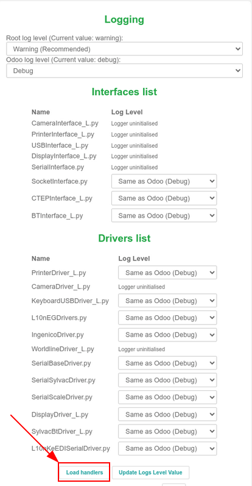

==============
Updating (IoT)
==============

Due to the complexity of the :abbr:`IoT (Internet of Things)` box, and virtual Windows :abbr:`IoT
(Internet of Things)` box, the term 'updating' can mean several different things.

The actual drivers can be updated, the core code on the :abbr:`IoT (Internet of Things)` box can be
updated, or a new image can be flashed (using a physical :abbr:`IoT (Internet of Things)` box).

This document explores the various ways to update :abbr:`IoT (Internet of Things)` boxes to ensure
smooth operation of :abbr:`IoT (Internet of Things)` box processes and devices.

.. _iot/config/flash:

Flashing the SD card on IoT box
===============================

.. important::
   This update does **not** apply to the Windows :abbr:`IoT (Internet of Things)` box (Odoo 16 and
   higher).

   To update the Windows :abbr:`IoT (Internet of Things)`, first, uninstall the previous version of
   the Odoo Windows program, and then reinstall it using the most up-to-date installation package.

   To begin the installation, navigate to the Odoo 16 (or higher) installation package for
   Enterprise or Community - Windows edition, at `Odoo's download page
   <https://odoo.com/download>`_.

In some circumstances, the :abbr:`IoT (Internet of Things)` box's micro SD Card may need to be
re-flashed with *Etcher* software to benefit from Odoo's latest :abbr:`IoT (Internet of Things)`
image update. This means the Odoo :abbr:`IoT (Internet of Things)` box software may need to be
updated in instances of a new :abbr:`IoT (Internet of Things)` box, or when a handler's update, or
an update from the :abbr:`IoT (Internet of Things)` box home page, does not resolve issues.

.. note::
   - It is often necessary to re-flash the :abbr:`IoT (Internet of Things)` box's image after
     upgrading the Odoo database to a new version.
   - A computer with a micro SD card reader/adapter is **required** to re-flash the micro SD card.

First, begin by downloading `Etcher <https://www.balena.io/etcher#download-etcher>`_. It is a free,
open-source utility, used for burning image files onto drives. After the download completes, install
and launch the program on the computer.

Then, download the latest :abbr:`IoT (Internet of Things)` image from `nightly
<http://nightly.odoo.com/master/iotbox>`_, which will be labeled as `iotbox-latest.zip`. This
particular image is compatible with *all* supported versions of Odoo.

After this step is complete, insert the :abbr:`IoT (Internet of Things)` box's micro SD card into
the computer or reader. Open *Etcher*, and select :guilabel:`Flash from file`, then find and select
the `iotbox-latest.zip` image and extract it. Next, select the drive the image should be burned to.

Lastly, click :guilabel:`Flash`, and wait for the process to finish.

.. image:: updating_iot/etcher-app.png
   :align: center
   :alt: Balena's Etcher software dashboard.

.. tip::
   Balena's *Etcher* software also allows for the administrator to flash the :abbr:`SD (Secure
   Digital)` card from a :abbr:`URL (Uniform Resource Locator)`. To flash from a :abbr:`URL (Uniform
   Resource Locator)`, simply click :guilabel:`Flash from URL`, instead of :guilabel:`Flash from
   file`.

   Then, enter the following: `http://nightly.odoo.com/master/iotbox/iotbox-latest.zip`.

   .. image:: updating_iot/url-flash.png
      :align: center
      :alt:  A view of Balena's Etcher software, with the flash from URL option highlighted.

.. note::
   An alternative software for flashing the micro SD card is `Raspberry Pi Imager
   <https://www.raspberrypi.com/software/>`_.

Windows IoT update
==================

Windows virtual :abbr:`IoT (Internet of Things)` box may occasionally need an update to work
properly.

The following processes cover the :ref:`uninstallation <iot/config/uninstall-windows-iot>` and
:ref:`re-installation <iot/config/re-install-windows-iot>` of the Windows virtual :abbr:`IoT
(Internet of Things)` box.

.. _iot/config/uninstall-windows-iot:

Uninstalling Windows IoT
------------------------

Prior to upgrading the Windows virtual :abbr:`IoT (Internet of Things)` box, the previous version
should be uninstalled first.

.. important::
   Before uninstalling a previous version of the Windows virtual :abbr:`IoT (Internet of Things)`
   box, ensure that there is a newer version of Windows virtual :abbr:`IoT (Internet of Things)` box
   available, compared to the version currently installed. To do so, navigate to the `Odoo Nightly
   builds <https://nightly.odoo.com/>`_ page.

   On the :guilabel:`Odoo Nightly builds` page, navigate to :menuselection:`Builds (stable version)
   --> windows/` to view the date next to the :file:`odoo_(version).latest.exe` file; where
   *(version)* is equal to the version of Odoo (e.g. 16.0, 17.0). The latest version of the Windows
   virtual :abbr:`IoT (Internet of Things)` box can be downloaded by selecting this file, or it is
   always available at the `Odoo Download <https://odoo.com/download/>`_ page.

Uninstalling the Windows virtual :abbr:`IoT (Internet of Things)` box is done through the Windows
program manager.

On any version of Windows, search for `program` to open the :menuselection:`Programs --> Programs
and Features` section of the :guilabel:`Control Panel`. Then, select :guilabel:`Uninstall or change
a program`. Next, search for `Odoo`, and click the :guilabel:`... (three dot)` menu on the
:guilabel:`Odoo.exe` program to uninstall.

Confirm the uninstallation, and follow the steps to uninstall through the Odoo uninstall wizard.

.. _iot/config/re-install-windows-iot:

Download and re-install
-----------------------

The latest version of the Windows virtual :abbr:`IoT (Internet of Things)` box can be downloaded
from the `Odoo Nightly builds <https://nightly.odoo.com/>`_ page or it is always available at the
`Odoo Download <https://odoo.com/download/>`_ page.

To download from the :guilabel:`Odoo Nightly builds` page, navigate to :menuselection:`Builds
(stable version) --> windows/` to and select the :file:`odoo_(version).latest.exe` file; where
*(version)* is equal to the version of Odoo (e.g. 16.0, 17.0).

To download from the :guilabel:`Odoo Download` page, find the section for the version of Odoo (e.g.
16.0, 17.0), and select the :guilabel:`Download` button for :guilabel:`Windows`.

Next, install and setup the downloaded Odoo :file:`.exe` file. After the instructions screen, click
:guilabel:`Next` to start the installation, and agree to the :abbr:`TOS (Terms of Service)`.

During the next step of the re-installation, select :guilabel:`Odoo IoT` from the :guilabel:`Select
the type of install` drop-down menu.

.. example::
   For reference, the following should be installed:

   - :guilabel:`Odoo server`
   - :guilabel:`Odoo IoT`
   - :guilabel:`Nginx WebServer`
   - :guilabel:`Ghostscript interpreter`

Ensure there is enough space on the computer for the installation, then click :guilabel:`Next`.

Set the destination and complete the installation
-------------------------------------------------

To complete the re-installation, select the :guilabel:`Destination Folder`, and click
:guilabel:`Install`.

.. warning::
   Choosing `C:\\odoo` as the install location allows for the *Nginx* server to start. Odoo's
   Windows virtual :abbr:`IoT (Internet of Things)` box software should **not** be installed inside
   any of the Windows user's directories. Doing so does **not** allow for *Nginx* to initialize.

The installation may take a few minutes. When complete, click :guilabel:`Next` to continue.

Then, ensure that the :guilabel:`Start Odoo` box is checked, and click :guilabel:`Finish`. After
installation, the Odoo server runs, and automatically opens `http://localhost:8069` on a web
browser. The webpage should display the :abbr:`IoT (Internet of Things)` box homepage.

.. tip::
   A :ref:`restart <iot/restart_windows_iot>` of the Windows IoT program may be necessary if the web
   browser does not display anything.

.. _iot/config/homepage-upgrade:

Update from the IoT box home page
=================================

In the background, the :abbr:`IoT (Internet of Things)` box uses a version of Odoo code to run and
connect to the Odoo database. This code may need to be updated in order for the :abbr:`IoT (Internet
of Things)` box to operate effectively. This operation should be completed on a routine basis, to
ensure the :abbr:`IoT (Internet of Things)` system, and its processes, stay up-to-date.

Go to the :abbr:`IoT (Internet of Things)` box home page by navigating to :menuselection:`IoT app
--> IoT Boxes`, and clicking on the :guilabel:`IP address` of the :abbr:`IoT (Internet of Things)`
box. Then, click on :guilabel:`Update` (next to the version number).

If a new version of the :abbr:`IoT (Internet of Things)` box image is available, an
:guilabel:`Upgrade to _xx.xx_` button appears at the bottom of the page. Click this button to
upgrade the unit, at which point the :abbr:`IoT (Internet of Things)` box flashes itself to the
newer version. All of the previous configurations are then saved.

.. important::
   This process can take more than 30 minutes. Do **not** turn off, or unplug, the :abbr:`IoT
   (Internet of Things)` box, as it would leave it in an inconsistent state. This means the
   :abbr:`IoT (Internet of Things)` box needs to be :ref:`re-flashed <iot/config/flash>` with a new
   image.

.. image:: updating_iot/flash-upgrade.png
   :align: center
   :alt: IoT box software upgrade in the IoT Box Home Page.

Handler (driver) update
=======================

There may be some instances where drivers or interfaces need to be updated for individual devices
(e.g. scales, measurement tools, etc.). The IoT handler's (drivers and interfaces) code can be
modified by syncing them with the configured server handler's code.

This can be helpful in instances where :abbr:`IoT (Internet of Things)` devices (e.g. scales,
measurement tools, etc.) are not working properly with the :abbr:`IoT (Internet of Things)` box.

For both the Windows :abbr:`IoT (Internet of Things)` (Odoo 16 and higher) and physical :abbr:`IoT
(Internet of Things)` box, this process can be performed manually from the :abbr:`IoT (Internet of
Things)` box home page. Go to the :abbr:`IoT (Internet of Things)` box home page by navigating to
:menuselection:`IoT app --> IoT Boxes`, and clicking on the :guilabel:`IP address` of the :abbr:`IoT
(Internet of Things)` box.

Next, click :guilabel:`Handlers list`, and then select :guilabel:`Load Handlers` at the bottom of
the page.

.. important::
   Handler's code is fetched from the configured server, and it needs to be up-to-date to have the
   latest fixes and patches.

.. note::
   A handler update is also performed automatically each time the :abbr:`IoT (Internet of Things)`
   box is restarted. The only exception to this process is if the *Automatic drivers update* is
   unchecked in the form view of the :abbr:`IoT (Internet of Things)` box on the Odoo server. This
   setting can be reached by going to :menuselection:`IoT App --> Select the IoT box --> Automatic
   drivers update`.
