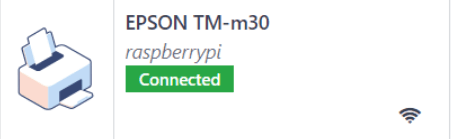
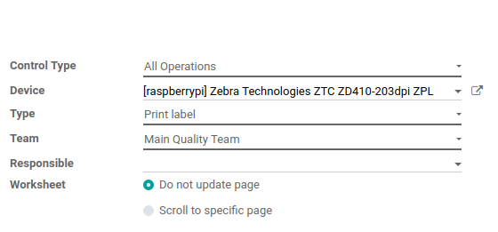
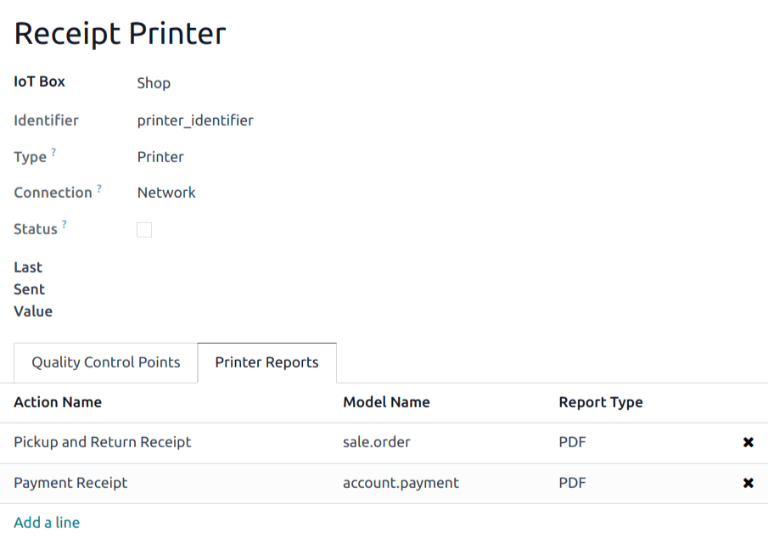
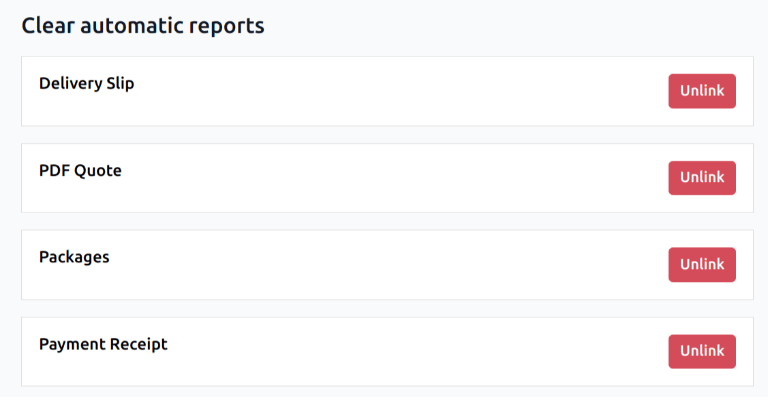

=================
Connect a printer
=================

.. |iot| replace:: :abbr:`IoT (Internet of Things)`
.. |usb| replace:: :abbr:`USB (Universal Serial Bus)`

Printer installation can be done in a few easy steps. The printer can be used to print receipts,
labels, orders, or even reports from the different Odoo apps. In addition, printer actions can be
assigned as an *action on a trigger* during the manufacturing process, or added onto a quality
control point or a quality check.

.. warning::
   The **only** way to connect a printer directly to an Odoo database is through the use of an |iot|
   box.

   Without an |iot| box, printing can still occur, but it is managed through the printer itself,
   which is not the recommended process.

Connection
==========

The |iot| box supports printers connected through |usb|, network connection, or Bluetooth.
`Supported printers <https://www.odoo.com/page/iot-hardware>`__ are detected automatically, and
appear in the :guilabel:`Devices` list of the *IoT* app.

.. note::
   Printers can take up to two minutes to appear in the *IoT* app :guilabel:`Devices` list.

Link printer
============

Link printer to work orders
---------------------------

*Work Orders* can be linked to printers, via a quality control point, to print labels for
manufactured products.

In the *Quality app*, a device can be set up on a quality control point. To do that, go to the
:menuselection:`Quality app --> Quality Control --> Control Points`, and open the desired control
point to which the printer will be linked.

.. important::
   A *Manufacturing Operation* and *Work Order Operation* need to be attached to a quality control
   point before the :guilabel:`Type` field allows for the :guilabel:`Print Label` option to be
   selected.

From here, edit the control point, by selecting the :guilabel:`Type` field, and selecting
:guilabel:`Print Label` from the drop-down menu of options. Doing so reveals a field called
:guilabel:`Device`, where the attached *device* can be selected. :guilabel:`Save` the changes, if
required.

The printer can now be used with the selected quality control point. When the quality control point
is reached during the manufacturing process, the database presents the option to print labels for a
specific product.

.. image:: printer/printer-prompt.png
   :align: center

.. tip::
   Quality control points can also be accessed by navigating to :menuselection:`IoT App -->
   Devices`, then select the device. There is a :guilabel:`Quality Control Points` tab, where they
   can be added with the device.

.. note::
   On a quality check detail form, the :guilabel:`Type` of check can also be specified to
   :guilabel:`Print Label`. To create :doc:`new quality checks
   <../../../inventory_and_mrp/quality/quality_management/quality_checks>`, navigate to
   :menuselection:`Quality app --> Quality Control --> Quality Checks --> New`.

.. seealso::
   - :doc:`../../../inventory_and_mrp/quality/quality_management/quality_control_points`
   - :doc:`../../../inventory_and_mrp/quality/quality_management/quality_alerts`

.. _iot/link-printer:

Link printer to reports
-----------------------

It is possible to link report types to a specific printer. In the *IoT* app, go to the
:guilabel:`Devices` menu, and select the desired printer to be configured.

From here, go to the :guilabel:`Printer Reports` tab, and click :guilabel:`Add a line`. In the
window that appears, check all the types of :guilabel:`Reports` that should be linked to this
printer.

.. tip::
   Reports can also be configured in the *Technical* menu of the *Settings* app, while in
   :ref:`debug mode <developer-mode>`. To do that, navigate to :menuselection:`Settings App -->
   Technical --> Actions: Reports`. From here, select the desired report from the list. Then, an
   :guilabel:`IoT Device` can be set on the report.

The first time a linked report is selected to print, a :guilabel:`Select Printers` pop-up window
appears. Tick the checkbox next to the correct printer for the report, and click :guilabel:`Print`.
At that point, the report is linked to the printer.

Clear device printer cache
~~~~~~~~~~~~~~~~~~~~~~~~~~

After a printer is linked to print a report, the setting is saved in a browser's cache. This means
a user can have different devices saved in their cache for different reports, based on the device
they use to access Odoo. It also means different users can have a report automatically printed from
different printers, based on their preferences.

To unlink a report from a printer, navigate to :menuselection:`IoT app --> Clear Selected Devices`.
This generates a list of reports that are linked to a printer on the current device. Click the
:guilabel:`Unlink` button next to each report to remove the link.

.. important::
   This step **only** prevents the report from automatically printing to the listed printer from
   the current browser. The report is still :ref:`linked <iot/link-printer>` on the device, under
   the :guilabel:`Printer Reports` tab.

.. seealso::
   :doc:`POS Order Printing <../../../sales/point_of_sale/restaurant/kitchen_printing>`
