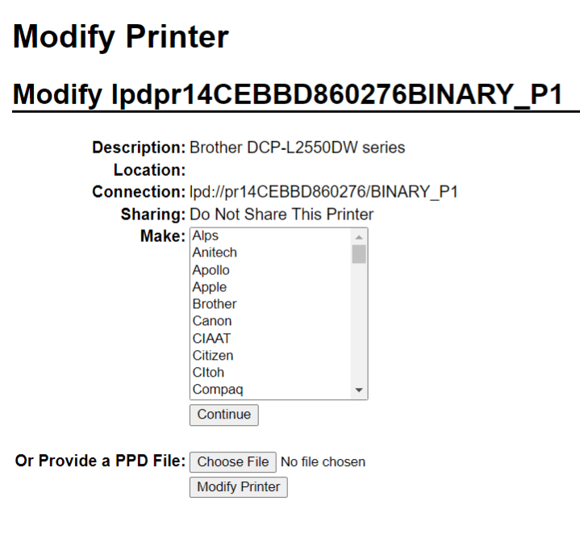

=================
Connect a printer
=================

Printer installation can be done in a few easy steps. The printer can be used to print receipts,
labels, orders, or even reports from the different Odoo apps. In addition, printer actions can be
assigned as an *action on a trigger* during the manufacturing process, or added onto a quality
control point or a quality check.

.. warning::
   The **only** way to connect a printer directly to an Odoo database is through the use of an IoT
   system. Without an IoT system, printing can still occur, but it is managed through the printer
   itself, which is not the recommended process.

Connection
==========

IoT systems support printers connected through USB, network connection, or Bluetooth.
`Supported printers <https://www.odoo.com/page/iot-hardware>`__ are detected automatically, and
appear in the :guilabel:`Devices` list of the IoT app.

.. image:: printer/printer-detected.png
   :alt: The printer as it would appear in the IoT app devices list.

.. note::
   Printers can take up to two minutes to appear in the IoT app :guilabel:`Devices` list.

Link a printer
==============

Link work orders to a printer
-----------------------------

Work orders can be linked to printers, via a quality control point, to print labels for
manufactured products.

In the :doc:`Quality app </applications/inventory_and_mrp/quality>`, a device can be set up on a
quality control point. To do so, go to the :menuselection:`Quality --> Quality Control --> Control
Points`, and open the desired control point.

.. important::
   A manufacturing operation and work order operation need to be attached to a quality control
   point before the :guilabel:`Type` field allows for the :guilabel:`Print Label` option to be
   selected.

From here, edit the control point by selecting the :guilabel:`Type` field, and selecting
:guilabel:`Print Label` from the dropdown menu of options. Doing so reveals the :guilabel:`Device`
field, where the attached device can be selected.

The printer can now be used with the selected quality control point. When the quality control point
is reached during the manufacturing process, the database presents the option to print labels for a
specific product.

.. tip::
   Quality control points can also be accessed by navigating to :menuselection:`IoT -->
   Devices`, then selecting the device. Go to the :guilabel:`Quality Control Points` tab to add them
   to the device.

.. note::
   On a :doc:`quality check form
   </applications/inventory_and_mrp/quality/quality_management/quality_checks>`, the
   :guilabel:`Type` of check can also be set to :guilabel:`Print Label`.

.. seealso::
   - :doc:`/applications/inventory_and_mrp/quality/quality_management/quality_control_points`
   - :doc:`/applications/inventory_and_mrp/quality/quality_management/quality_alerts`

.. _iot/link-printer:

Link reports to a printer
-------------------------

It is possible to link report types to a specific printer. To do so:

#. Go to :menuselection:`IoT --> Devices` and select the desired printer.
#. Go to the :guilabel:`Printer Reports` tab and click :guilabel:`Add a line`.
#. In the pop-up that opens, select the types of reports to be linked to the printer and click
   :guilabel:`Select`.

.. image:: printer/printer-reports.png
   :alt: The list of reports assigned to a printer in the IoT app.

.. tip::
   Reports can also be configured by :ref:`enabling the developer mode <developer-mode>` and going
   to :menuselection:`Settings --> Technical --> Reports`. Select the desired report from the list
   and set an :guilabel:`IoT Device`.

The first time a linked report is selected to print, a :guilabel:`Select Printers` pop-up window
appears. Tick the checkbox next to the correct printer for the report, and click :guilabel:`Print`.
At that point, the report is linked to the printer.

Clear device printer cache
~~~~~~~~~~~~~~~~~~~~~~~~~~

After a printer is linked to print a report, the setting is saved in a browser's cache. This means
a user can have different devices saved in their cache for different reports, based on the device
they use to access Odoo. It also means different users can have a report automatically printed from
different printers, based on their preferences.

To unlink a report from a printer, navigate to :menuselection:`IoT --> Configuration --> Reset
Linked Printers`. This generates a list of reports that are linked to a printer on the current
device. Click the :guilabel:`Unlink` button next to each report to remove the link.

.. important::
   This step **only** prevents the report from automatically printing to the listed printer from
   the current browser. The report is still :ref:`linked <iot/link-printer>` on the device, under
   the :guilabel:`Printer Reports` tab.

.. image:: printer/clear-reports.png
   :alt: A list of reports currently linked to a printer in the IoT app.

.. seealso::
   :doc:`POS Order Printing <../../../sales/point_of_sale/restaurant/kitchen_printing>`

Potential issues
================

The printer is not detected
---------------------------

If a printer does not appear in the devices list, go to the :ref:`IoT box's <iot/iot-box/homepage>`
or :ref:`Windows virtual IoT's <iot/windows-iot/homepage>` homepage, click :guilabel:`Show` in
the :guilabel:`Devices` section, and make sure the printer is listed.

If the printer does not appear on the IoT system's homepage, click :guilabel:`Printer Server`, then
:guilabel:`Administration`, and :guilabel:`Add Printer`. If the printer is not in the list, it is
likely not connected properly.

The printer outputs random text
-------------------------------

For most printers, the correct driver should be automatically detected and selected. However, in
some cases, the automatic detection mechanism might not be enough, and if no driver is found, the
printer might print random characters.

The solution is to manually select the corresponding driver. On the IoT system's homepage, click
:guilabel:`Printer Server`, then :guilabel:`Printers`, and select the printer in the list.
In the :guilabel:`Administration` dropdown menu, click :guilabel:`Modify Printer`. Follow the steps
and select the printer's *make* and *model*.

.. note::
   Epson receipt printers and Zebra label printers do not need a driver to work. Make sure that no
   driver is selected for those printers.

The printer is detected but is not recognized correctly
-------------------------------------------------------

If Odoo and the IoT system do not recognize the printer correctly, go to :menuselection:`IoT
--> Devices`, click the device's card to access its form, and set the :guilabel:`Subtype` field to
the appropriate option: :guilabel:`Receipt Printer`, :guilabel:`Label Printer`, or :guilabel:`Office
Printer`.

Epson configuration special case
~~~~~~~~~~~~~~~~~~~~~~~~~~~~~~~~

Most Epson printers support printing receipts in Odoo Point of Sale using the `GS v 0` command.
However, the following Epson printer models do not support this command:

- TM-U220
- TM-U230
- TM-P60
- TMP-P60II

To bypass this issue, you can configure the printer to use the `ESC *` command.

First, review Epson's website for compatibility for both the `GS v 0
<https://download4.epson.biz/sec_pubs/pos/reference_en/escpos/gs_lv_0.html>`_ and `ESC *
<https://download4.epson.biz/sec_pubs/pos/reference_en/escpos/esc_asterisk.html>`_ commands.

If the printer is incompatible with `GS v 0` but supports `ESC *`, configure the IoT system to use
the `ESC *` command as follows:

#. Access the :ref:`IoT box's <iot/iot-box/homepage>` or :ref:`Windows virtual IoT's
   <iot/windows-iot/homepage>` homepage.
#. Click the :guilabel:`Printer server` button, then click :guilabel:`Administration` on the CUPS
   page.
#. Click :guilabel:`Add Printer` in the :guilabel:`Printers` section, select the printer, and click
   :guilabel:`Continue`.

   .. tip::
      If the printer's name is still uncertain, take the following steps:

      #. Take note of the listed printers on the CUPS page.
      #. Turn the printer off and refresh the page.
      #. Compare the difference with the first list to see which printer disappeared.
      #. Turn the printer back on and refresh the page again.
      #. Double-check the list again to see if the printer re-appears.
      #. The printer that disappeared and reappears again on the listed printers is the name of the
         printer in question. It can be :guilabel:`Unknown` under :guilabel:`Local printers`.

#. On the :guilabel:`Add Printer` page, specify the printer's :guilabel:`Name` using the following
   convention: `<printer_name>__IMC_<param_1>_<param_2>_..._<param_n>__`, where:

   - `printer_name` is the printer's name. It can contain any character except `_`, `/`, `#`, or ` `
     (space character).
   - `IMC`: This stands for *Image Mode Column* (the simplified name for `ESC *`).
   - `param_1`: This stands for the specific parameter:

     - `SCALE<X>`: Scale of the picture (with the same aspect ratio). `X` should be an integer
       describing the scale percentage that should be used. For example, `100` is the original size,
       `50` is half the size, and `200` is twice the size.
     - `LDV`: *Low Density Vertical* (will be set to *High Density Vertical* if not specified).
     - `LDH`: *Low Density Horizontal* (will be set to *High Density Horizontal* if not specified).

     .. note::
        - *Density* parameters might need to be configured in a particular way, depending on the
          printer model.
        - Refer to `Epson's ESC * documentation <https://download4.epson.biz/sec_pubs/pos/reference_en/escpos/esc_asterisk.html>`_
          to determine if the printer requires these parameters to be set.

    .. example::
       The following are examples of proper and improper name formatting:

       Proper name formatting:

       - `EPSONTMm30II__IMC__`
       - `EPSON_TM_U220__IMC_LDV_LDH_SCALE80__`

       Improper name formatting (this will not prevent printing, but the result might not have the
       expected printed output):

       - `EPSON TMm 30II`: The name cannot contain spaces.
       - `EPSONTMm30II`: The name itself is correct, but it will not use `ESC *`.
       - `EPSONTMm30II__IMC`: This name is missing the end `__`.
       - `EPSONTMm30II__IMC_XDV__`: The parameter `XDV` does not match any existing parameters.
       - `EPSONTMm30II__IMC_SCALE__`: The parameter `SCALE` is missing the scale value.

#. Once the printer's name has been defined using the appropriate naming convention, click
   :guilabel:`Continue`.
#. Set the :guilabel:`Make` value to :guilabel:`Raw` and the :guilabel:`Model` value to
   :guilabel:`Raw Queue (en)`.
#. Click :guilabel:`Add Printer`. If everything was done correctly, the page should redirect to the
   :guilabel:`Banners` page.
#. Wait a few minutes for the IoT system to detect the printer and sync to Odoo's server.
#. :ref:`Access the POS settings <configuration/settings>` and select your POS, or click the
   vertical ellipsis button (:guilabel:`⋮`) on a POS card and click :guilabel:`Edit`. Scroll down
   to the :guilabel:`Connected Devices` section, enable :guilabel:`IoT Box`, and select the printer
   in the :guilabel:`Receipt Printer` field. Click :guilabel:`Save`.

.. note::
   If the printer was set up incorrectly (e.g., it continues to print random text, or the printed
   receipt is too large or too small), it cannot be modified via the printer's name in CUPS.
   Instead, configure a new printer from scratch with modified parameters, following the steps
   above.

.. spoiler::
   Example

   The following is an example of the troubleshooting process for a TM-U220B printer model using the
   `ESC *` command. The receipt pictured below is an example of a receipt that is printing correctly
   due to proper formatting (in theory):

   .. image:: printer/receipt-example.png
      :scale: 60%
      :alt: Properly formatted receipt picture from a demo database.

   Printing this receipt immediately without proper formatting will not work, as the TM-U220B
   printer model does not support the `GS v 0` command. Instead, random characters will be printed:

   .. image:: printer/receipt-print-random-letters.png
      :scale: 60%
      :alt: Printer paper with seemingly random characters.

   To properly configure formatting for the Epson TM-U220B printer model, follow these steps:

   #. After checking Epson's website for compatibility with both the `GS v 0
      <https://download4.epson.biz/sec_pubs/pos/reference_en/escpos/gs_lv_0.html>`_ and `ESC *
      <https://download4.epson.biz/sec_pubs/pos/reference_en/escpos/esc_asterisk.html>`_ commands,
      the TM-U220B printer is indeed incompatible with `GS v 0` but supports `ESC *`.

      .. image:: printer/epson-compatibility-compare.png
         :alt: Epson compatibility evaluation from Epson website.

   #. When adding the printer, CUPS displays the list of available printers:

      .. image:: printer/add-printer.png
         :scale: 75%
         :alt: Administration menu, add printer selection.

      In this case, the printer is connected via USB, so it is not part of the
      :guilabel:`Discovered Network Printers`. Instead, it is likely part of the :guilabel:`Unknown`
      selection under :guilabel:`Local Printers`. By unplugging the printer's USB cable from the IoT
      system and refreshing the page, the :guilabel:`Unknown` printer disappears. By plugging it
      back in, the printer reappears.

   #. For the naming convention, since the printer must print using the `ESC *` command, it is
      imperative to add `__IMC`.

      .. image:: printer/epson-tm-u220-specification.png
         :alt: Epson TM-U220 specifications on manufacturer's website.

      For this particular model (TM-U220) `m` should be equal to 0 or 1. While referencing the
      :guilabel:`Description` table on `Epson's ESC * website
      <https://download4.epson.biz/sec_pubs/pos/reference_en/escpos/esc_asterisk.html>`_, the `m`
      values could be 0, 1, 32, or 33. So, in this case, the `m` value **cannot** be 32 or 33
      (otherwise, random characters will be printed).

      The table includes the numeric values 32 and 33; they both occur if the :guilabel:`Number of
      bits for vertical data` is set to 24, i.e. it has a *High Vertical Density*. In the case of
      configuring the Epson TM-U220, the *Low Vertical Density* will need to be forced, as
      this printer model does not support *High Vertical Density* for this command `ESC *`.

      To add a *Low Vertical Density*, add the `LDV` parameter to the naming convention.

      .. image:: printer/add-printer-filled.png
         :alt: Add a *Low Vertical Density* (the `LDV` parameter) to the naming convention.

   #. Click :guilabel:`Continue` to proceed. Next, set the :guilabel:`Make` value to :guilabel:`Raw`
      and the :guilabel:`Model` value to :guilabel:`Raw Queue (en)`.

      .. image:: printer/add-printer-add.png
         :alt: Epson TM-U220 specifications on manufacturers website.

      However, when trying to print with the naming convention `EpsonTMU220B__IMC_LDV__`, the
      receipt is printed, but it is too large and outside the margin. To resolve this, add a new
      printer (and naming convention) with the `SCALE<X>` parameter to adapt to the receipt's size.

      Here are some examples:

      .. list-table::
         :header-rows: 1

         * - Printer Naming Convention
           - `EpsonTMU220B__IMC_LDV__`
           - `EpsonTMU220B__IMC_LDV_SCALE75__`
           - `EpsonTMU220B__IMC_LDV_LDH__`
           - `EpsonTMU220B__IMC_LDV_LDH_SCALE35__`
         * - .. image:: printer/receipt-example.png
                :alt: Receipt example format.
           - .. image:: printer/tm-u220-ldv.png
                :alt: Receipt format using naming convention: EpsonTMU220B__IMC_LDV__.
           - .. image:: printer/tm-u220-ldv-scale75.png
                :alt: Receipt format using naming convention: EpsonTMU220B__IMC_LDV_SCALE75__.
           - .. image:: printer/tm-u220-ldv-hdv.png
                :alt: Receipt format using naming convention: EpsonTMU220B__IMC_LDV_LDH__.
           - .. image:: printer/tm-u220-ldv-hdv-scale35.png
                :alt: Receipt format using naming convention: EpsonTMU220B__IMC_LDV_LDH_SCALE35__.

DYMO LabelWriter print issue
----------------------------

The DYMO LabelWriter has a known issue in printing with IoT systems. The OpenPrinting CUPS server
installs the printer using :guilabel:`Local RAW Printer` drivers. In order to print anything, the
correct :guilabel:`Make and Model` needs to be set to reference the correct driver when using the
device.

Additionally, a new printer needs to be added to reduce the print delay that occurs after updating
the driver.

.. important::
   The DYMO LabelWriter 450 DUO printer is the recommended DYMO printer for use with Odoo and IoT
   systems. This device combines two printers: a label printer and a tape printer. When configuring
   the following processes, it is essential to select the correct model (either DYMO LabelWriter 450
   DUO Label (en) or DYMO LabelWriter 450 DUO Tape (en)). For consistency, the following processes
   outline configuration steps for the DYMO LabelWriter 450 DUO Label (en) model. Adjust the model
   selections as needed.

.. _printer/dymo/update_drivers:

DYMO LabelWriter not printing
~~~~~~~~~~~~~~~~~~~~~~~~~~~~~

If the DYMO LabelWriter fails to print, install a new driver:

#. Access the IoT system's homepage and click :menuselection:`Printer server` to open the
   OpenPrinting CUPS console.
#. Click :menuselection:`Printers` in the top menu, then click the printer in the list.
#. Select :guilabel:`Maintenance` in the first dropdown menu.
#. Select :guilabel:`Modify Printer` in the second dropdown menu.

   .. image:: printer/main-modify.png
      :alt: Modify the make and model of the DYMO LabelWriter. Maintenance and Modify dropdown
            menus highlighted.

#. Select the specific network connection/printer on which the modification should be made and
   click :guilabel:`Continue`.
#. On the next page, click :guilabel:`Continue`, then select :guilabel:`DYMO` from the
   :guilabel:`Make` dropdown list.
#. Click on :guilabel:`Continue` and set the :guilabel:`Model` to :guilabel:`DYMO LabelWriter 450
   DUO Label (en)` (or whichever DYMO printer model is being used).
#. Click :guilabel:`Modify Printer` to set the new driver; a confirmation page appears.
#. Click :menuselection:`Printers` in the top menu; all printers installed on the OpenPrinting CUPS
   server appear, including the newly updated :guilabel:`DYMO LabelWriter 450 DUO Label` (or
   whichever DYMO printer model is being used).
#. Click the newly updated printer, then click the :guilabel:`Maintenance` dropdown menu and
   select :guilabel:`Print Test Page` to print a test label. The test label is printed after a few
   seconds if the driver update was successful.

To reduce this delay, add a new printer using the steps below.

DYMO LabelWriter print delay
~~~~~~~~~~~~~~~~~~~~~~~~~~~~

.. tip::
   If the DYMO LabelWriter 450 DUO printer is not printing at all, or is not recognized (i.e., it
   has a :guilabel:`RAW` driver type), then :ref:`update the drivers on the device
   <printer/dymo/update_drivers>`.

To resolve the delay issue after modifying the driver, reinstall the printer:

#. Access the IoT system's homepage and click :menuselection:`Printer server` to open the
   OpenPrinting CUPS console.
#. Click :menuselection:`Administration` in the top menu, then click :guilabel:`Add a Printer`.
#. On the next page, in the :guilabel:`Local Printers` section, select :guilabel:`DYMO
   LabelWriter 450 DUO Label (DYMO LabelWriter 450 DUO Label)` (or whichever DYMO printer model is
   being used) pre-installed printer. Click :guilabel:`Continue`.

   .. image:: printer/local-printer.png
      :alt: Add a printer screen on OpenPrinting CUPS with DYMO LabelWriter 450 DUO Label
            highlighted.

#. On the following screen, update the :guilabel:`Name` to something easily identifiable, as the
   original printer will remain in the list. Then, click :guilabel:`Continue`.

   .. image:: printer/rename-printer.png
      :alt: Rename printer page in the 'Add a Printer' flow, with the name field highlighted.

#. Set the :guilabel:`Model` field to :guilabel:`DYMO LabelWriter 450 DUO Label (en)` (or
   whichever DYMO printer model is being used), then click :guilabel:`Add Printer` to complete
   the installation.

   .. image:: printer/choose-printer.png
      :alt: Choose model screen on the OpenPrinting CUPS console with model and add a printer
            highlighted.

#. Click :menuselection:`Printers` in the top menu and click the newly installed printer
   :guilabel:`DYMO LabelWriter 450 DUO Label` (or whichever DYMO printer model is being used) from
   in the list.

   .. image:: printer/printer-page.png
      :alt: Printer page with newly installed printer highlighted.

#. Click the :guilabel:`Maintenance` dropdown list and select :guilabel:`Print Test Page` to print
   a test label. The test label should print out immediately, or after one or two seconds.

The Zebra printer does not print anything
-----------------------------------------

Zebra printers are quite sensitive to the format of the printed Zebra Programming Language (ZPL)
code. If nothing comes out of the printer or blank labels are printed, try changing the format
of the report sent to the printer. To do so, activate the :ref:`developer mode <developer-mode>`, go
to :menuselection:`Settings --> Technical --> User Interface --> Views`, and search for the
corresponding template.

.. seealso::
   `Zebra's instructions on printing ZPL files
   <https://supportcommunity.zebra.com/s/article/Print-a-zpl-file-using-the-Generic-Text-Printer>`_

Barcode scanner issues
======================

The characters read by the barcode scanner do not match the barcode
-------------------------------------------------------------------

By default, most barcode scanners are configured in the US QWERTY format. If the barcode scanner
uses a different layout, go to :menuselection:`IoT --> Devices` and click the barcode device's card.
Then, select the correct language in the :guilabel:`Keyboard Layout` field.

.. note::
   The :guilabel:`Keyboard Layout` is language-specific, with available options varying based on
   the device and the language of the database (e.g., :guilabel:`English (UK)`, :guilabel:`English
   (US)`, etc.).

Nothing happens when a barcode is scanned
-----------------------------------------

Make sure the correct device is selected in the :doc:`Point of Sale settings
</applications/sales/point_of_sale/configuration/pos_iot>` (when applicable) and the barcode is
configured to send an `ENTER` character (keycode 28) at the end of every barcode.

The barcode scanner is detected as a keyboard
---------------------------------------------

.. important::
   Some barcode scanners are identified as USB keyboards rather than barcode scanners and are not
   recognized by IoT systems.

To change the device type manually, go to :menuselection:`IoT --> Devices` and click the barcode
device's card. Then, enable :guilabel:`Is scanner`.

The barcode scanner processes barcode characters individually
-------------------------------------------------------------

When accessing the mobile version of Odoo from a mobile device or tablet paired with a barcode
scanner via the IoT system, the scanner might interpret each character in a barcode as a separate
scan. To resolve this, go to :menuselection:`IoT --> Devices` and click the barcode device's
card. Then, select the correct language in the :guilabel:`Keyboard Layout` field.

.. note::
   The :guilabel:`Keyboard Layout` is language-specific, with available options varying based on
   the device and the language of the database (e.g., :guilabel:`English (UK)`, :guilabel:`English
   (US)`, etc.).
