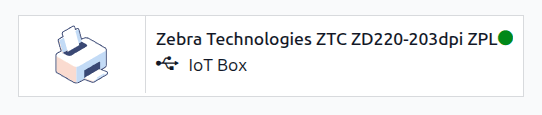
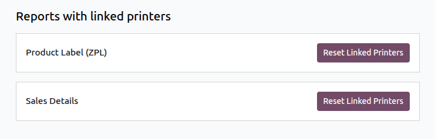
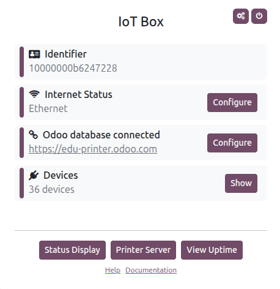
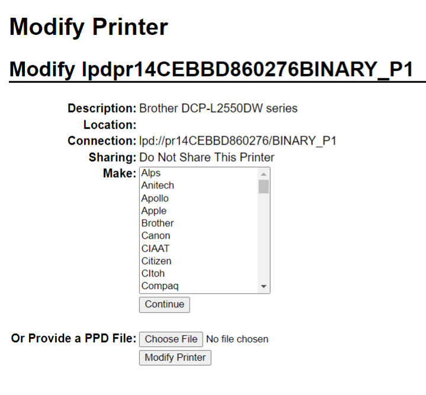

=================
Connect a printer
=================

Connect a printer to the IoT system to automatically print receipts, product labels, orders, and
other reports directly from Odoo applications.

.. _iot/printer/connection:

Connection
==========

IoT systems support both USB and network printers. Office printers, receipt printers, and `supported
label printers <https://www.odoo.com/page/iot-hardware>`_ are automatically detected and appear in
:menuselection:`IoT --> Devices`.

To connect a printer to an IoT system, follow these steps:

#. :doc:`Connect the IoT system to Odoo. <../connect>`
#. :ref:`Grant Google Chrome local network access. <pos/lna/browser-permission>`
#. Link the printer using one of these methods:

   - **USB printer:** Plug the printer directly into the IoT system with a USB cable.
   - **Network printer:** Connect the printer to the **same** local network as the IoT system
     through Ethernet or Wi-Fi.

After establishing a connection to the IoT system, the printer automatically prints a connection
status report.

.. tip::
   To ensure a USB printer is detected during the IoT system's boot process, plug the printer into
   the IoT system *before* powering on the IoT system.

To print a test page and confirm a printer is set up correctly, follow these steps:

#. Go to the :guilabel:`IoT` app.
#. Select the relevant IoT system.
#. Select the printer in the :guilabel:`Devices` tab.
#. Click :guilabel:`Test`.

.. note::
   - It is possible to use supported :doc:`point of sale receipt printers
     <../../../sales/point_of_sale/hardware_network/receipt_printers>` without an IoT system.
   - Printers might take up to five minutes to appear in the IoT app's :guilabel:`Devices` list.

Use cases
=========

.. _iot/printer/automatic-printing:

Automatic printing
------------------

To automatically print reports (invoices, quotations, product labels, etc.) on a specific printer,
follow these steps:

#. Go to :menuselection:`IoT --> Devices` and select the printer.
#. Go to the :guilabel:`Reports to Auto-Print` tab and click :guilabel:`Add a line`.
#. In the pop-up, select the reports to assign to the printer, then click :guilabel:`Select`.

The first time a linked report is selected for printing, a :guilabel:`Select Printers` pop-up
appears. In the :guilabel:`Printers` field, select the desired printer. If needed, select
:guilabel:`Do not ask me again` to automatically print the report from the current browser on the
selected printer for future printings, then click :guilabel:`Print`.

.. tip::
   Alternatively, to assign a report to a printer, :ref:`activate developer mode <developer-mode>`,
   go to :menuselection:`Settings --> Technical --> Reports`, select the report, and select the
   printer in the :guilabel:`IoT Devices` field.

To prevent printing errors, ensure the assigned report format matches the printer type:

- Office printers can only print :doc:`QWeb (PDF) reports
  <../../../../developer/reference/backend/reports>`.
- `Supported label printers <https://www.odoo.com/page/iot-hardware>`_ can only print :doc:`Zebra
  Programming Language (ZPL)
  <../../../inventory_and_mrp/inventory/shipping_receiving/setup_configuration/zebra>` reports.
- Receipt printers *cannot* be used to automatically print reports, as they are :doc:`only used
  directly by the point of sale <../../../sales/point_of_sale/hardware_network/receipt_printers>`.

To customize a report, create a :ref:`new inherited view <reference/view_records/inheritance>`.

.. _iot/printer/reset-saved-printer-preferences:

Reset saved printer preferences
~~~~~~~~~~~~~~~~~~~~~~~~~~~~~~~

The user's printer selections remain stored in the browser cache. Accessing a database with
different accounts, browsers, or devices creates separate printer preferences that automatically
target different printers.

To unlink a report from all linked printers on the current browser, navigate to :menuselection:`IoT
--> Configuration --> Reset Linked Printers`, then click :guilabel:`Reset Linked Printers` next to
the report.

.. important::
   This action only prevents the current browser from automatically printing the report on the
   selected printers. The report is still :ref:`linked <iot/printer/automatic-printing>` to the
   selected printers, and the :guilabel:`Select Printers` pop-up will appear the next time a report
   is printed.

Manufacturing quality check printing
------------------------------------

To print a label during a manufacturing :doc:`quality check
<../../../inventory_and_mrp/quality/quality_management/quality_checks>`, assign a printer to a
:doc:`quality control point
<../../../inventory_and_mrp/quality/quality_management/quality_control_points>` as follows:

#. Go to :menuselection:`Quality --> Quality Control --> Control Points` and select the control
   point.
#. Select :guilabel:`Operations` configured with :guilabel:`Manufacturing` as the :guilabel:`Type of
   Operation`.
#. Select the :guilabel:`Work Order Operation`.
#. Select :guilabel:`Print Label` as the :guilabel:`Type`.
#. Select the printer in the :guilabel:`Device` field.
#. Select the required format in :guilabel:`Report Type`.

When the quality check, created by the quality control point, is reached during manufacturing, a
:guilabel:`Select Printers` pop-up appears. In the :guilabel:`Printers` field, select the desired
printer. If needed, select :guilabel:`Do not ask me again` to automatically print the labels from
the current browser on the selected printer for future printings, then click :guilabel:`Print`.

The user's printer selections remain stored in the browser cache. Refer to the instructions for
:ref:`resetting saved printer preferences <iot/printer/reset-saved-printer-preferences>` to restore
the selections.

.. tip::
   Alternatively, to link a printer with a quality control point, go to :menuselection:`IoT -->
   Devices` and select the printer. In the :guilabel:`Quality Control Points` tab, add the quality
   control point. Only quality control points with the correct :guilabel:`Operations`,
   :guilabel:`Work Order Operation`, and :guilabel:`Type` values appear.

.. seealso::
   :doc:`/applications/inventory_and_mrp/quality`

Troubleshooting
===============

General guidelines
------------------

Perform these checks to resolve common printer problems:

- Verify power to all devices and check physical connections (power, USB, Ethernet).
- Connect the printer to the IoT system before powering on the IoT system.
- Turn every device off, then back on.
- Restart the :ref:`IoT box <iot/iot-box/restart>` or the :ref:`Windows virtual IoT
  <iot/windows_iot/restart>`.
- Ensure the paper is loaded correctly in the printer.
- Confirm that the printer and the IoT system are on the same local network, and check Wi-Fi signal
  strength for network printers.
- Install available printer firmware updates.

The following sections provide solutions to specific issues:

Printer not detected
--------------------

If a connected printer does not appear in :menuselection:`IoT --> Devices`, add the printer manually
through the printer server interface:

#. Go to the :ref:`IoT box homepage <iot/iot-box/homepage>` or the :ref:`Windows virtual IoT
   homepage <iot/windows-iot/homepage>`.
#. Navigate to :menuselection:`Printer Server --> Administration --> Add Printer`.
#. Select the printer and click :guilabel:`Continue`.

   .. note::
      If the printer is not in the list, it is likely :ref:`not connected correctly
      <iot/printer/connection>`.

#. Change the printer :guilabel:`Name`, if desired, then click :guilabel:`Continue`.
#. Select the printer :guilabel:`Model`, then click :guilabel:`Add Printer`.

Printer detected but not functioning as expected
------------------------------------------------

If a printer appears in :menuselection:`IoT --> Devices` but is not functioning as expected, select
the printer in :menuselection:`IoT --> Devices`, and set the printer :guilabel:`Subtype` to
:guilabel:`Receipt Printer`, :guilabel:`Label Printer`, or :guilabel:`Office Printer`.

The printer prints random characters
------------------------------------

For most printers, the IoT system automatically detects and selects the correct driver. However, if
no driver or the wrong driver is selected, the printer might print random characters.

To manually select the correct driver for a printer, follow these steps:

#. Go to the :ref:`IoT box homepage <iot/iot-box/homepage>` or the :ref:`Windows virtual IoT
   homepage <iot/windows-iot/homepage>`.
#. Navigate to :menuselection:`Printer Server --> Printers` and select the printer.
#. Click the :guilabel:`Administration` drop-down menu and select :guilabel:`Modify Printer`.
#. Confirm printer selection, then click :guilabel:`Continue`.
#. Change the printer :guilabel:`Description`, if desired, then click :guilabel:`Continue`.
#. Select the printer :guilabel:`Make`, then click :guilabel:`Continue`.
#. Select the printer :guilabel:`Model`, then click :guilabel:`Modify Printer`.

.. note::
   Epson receipt printers (ESC/POS) and Zebra label printers (ZPL) parse raw command streams
   directly from Odoo. To select a generic driver in the :guilabel:`Printer Server`, choose
   :guilabel:`Generic` as the :guilabel:`Make` and :guilabel:`Generic Text-Only Printer (en)` as the
   :guilabel:`Model`.

Epson configuration special case
--------------------------------

Most Epson printers support printing receipts in Odoo Point of Sale using the `GS v 0` command.
However, the following Epson printer models do not support this command:

- TM-U220
- TM-U230
- TM-P60
- TMP-P60II

To bypass this issue, you can configure the printer to use the `ESC *` command.

First, review Epson's website for compatibility for both the `GS v 0
<https://download4.epson.biz/sec_pubs/pos/reference_en/escpos/gs_lv_0.html>`_ and `ESC *
<https://download4.epson.biz/sec_pubs/pos/reference_en/escpos/esc_asterisk.html>`_ commands.

If the printer is incompatible with `GS v 0` but supports `ESC *`, configure the IoT system to use
the `ESC *` command as follows:

#. Access the :ref:`IoT box's <iot/iot-box/homepage>` or :ref:`Windows virtual IoT's
   <iot/windows-iot/homepage>` homepage.
#. Click the :guilabel:`Printer server` button, then click :guilabel:`Administration` on the CUPS
   page.
#. Click :guilabel:`Add Printer` in the :guilabel:`Printers` section, select the printer, and click
   :guilabel:`Continue`.

   .. tip::
      If the printer's name is still uncertain, take the following steps:

      #. Take note of the listed printers on the CUPS page.
      #. Turn the printer off and refresh the page.
      #. Compare the difference with the first list to see which printer disappeared.
      #. Turn the printer back on and refresh the page again.
      #. Double-check the list again to see if the printer re-appears.
      #. The printer that disappeared and reappears again on the listed printers is the name of the
         printer in question. It can be :guilabel:`Unknown` under :guilabel:`Local printers`.

#. On the :guilabel:`Add Printer` page, specify the printer's :guilabel:`Name` using the following
   convention: `<printer_name>__IMC_<param_1>_<param_2>_..._<param_n>__`, where:

   - `printer_name` is the printer's name. It can contain any character except `_`, `/`, `#`, or ` `
     (space character).
   - `IMC`: This stands for *Image Mode Column* (the simplified name for `ESC *`).
   - `param_1`: This stands for the specific parameter:

     - `SCALE<X>`: Scale of the picture (with the same aspect ratio). `X` should be an integer
       describing the scale percentage that should be used. For example, `100` is the original size,
       `50` is half the size, and `200` is twice the size.
     - `LDV`: *Low Density Vertical* (will be set to *High Density Vertical* if not specified).
     - `LDH`: *Low Density Horizontal* (will be set to *High Density Horizontal* if not specified).

     .. note::
        - *Density* parameters might need to be configured in a particular way, depending on the
          printer model.
        - Refer to `Epson's ESC * documentation <https://download4.epson.biz/sec_pubs/pos/reference_en/escpos/esc_asterisk.html>`_
          to determine if the printer requires these parameters to be set.

    .. example::
       The following are examples of proper and improper name formatting:

       Proper name formatting:

       - `EPSONTMm30II__IMC__`
       - `EPSON_TM_U220__IMC_LDV_LDH_SCALE80__`

       Improper name formatting (this will not prevent printing, but the result might not have the
       expected printed output):

       - `EPSON TMm 30II`: The name cannot contain spaces.
       - `EPSONTMm30II`: The name itself is correct, but it will not use `ESC *`.
       - `EPSONTMm30II__IMC`: This name is missing the end `__`.
       - `EPSONTMm30II__IMC_XDV__`: The parameter `XDV` does not match any existing parameters.
       - `EPSONTMm30II__IMC_SCALE__`: The parameter `SCALE` is missing the scale value.

#. Once the printer's name has been defined using the appropriate naming convention, click
   :guilabel:`Continue`.
#. Set the :guilabel:`Make` value to :guilabel:`Raw` and the :guilabel:`Model` value to
   :guilabel:`Raw Queue (en)`.
#. Click :guilabel:`Add Printer`. If everything was done correctly, the page should redirect to the
   :guilabel:`Banners` page.
#. Wait a few minutes for the IoT system to detect the printer and sync to Odoo's server.
#. :ref:`Access the POS settings <pos/use/settings>` and select your POS, or click the vertical
   ellipsis button (:guilabel:`⋮`) on a POS card and click :guilabel:`Edit`. Scroll down to the
   :guilabel:`Connected Devices` section, enable :guilabel:`IoT Box`, and select the printer in the
   :guilabel:`Receipt Printer` field. Click :guilabel:`Save`.

.. note::
   If the printer was set up incorrectly (e.g., it continues to print random text, or the printed
   receipt is too large or too small), it cannot be modified via the printer's name in CUPS.
   Instead, configure a new printer from scratch with modified parameters, following the steps
   above.

.. spoiler::
   Example

   The following is an example of the troubleshooting process for a TM-U220B printer model using the
   `ESC *` command. The receipt pictured below is an example of a receipt that is printing correctly
   due to proper formatting (in theory):

   .. image:: printer/receipt-example.png
      :scale: 60%
      :alt: Properly formatted receipt picture from a demo database.

   Printing this receipt immediately without proper formatting will not work, as the TM-U220B
   printer model does not support the `GS v 0` command. Instead, random characters will be printed:

   .. image:: printer/receipt-print-random-letters.png
      :scale: 60%
      :alt: Printer paper with seemingly random characters.

   To properly configure formatting for the Epson TM-U220B printer model, follow these steps:

   #. After checking Epson's website for compatibility with both the `GS v 0
      <https://download4.epson.biz/sec_pubs/pos/reference_en/escpos/gs_lv_0.html>`_ and `ESC *
      <https://download4.epson.biz/sec_pubs/pos/reference_en/escpos/esc_asterisk.html>`_ commands,
      the TM-U220B printer is indeed incompatible with `GS v 0` but supports `ESC *`.

      .. image:: printer/epson-compatibility-compare.png
         :alt: Epson compatibility evaluation from Epson website.

   #. When adding the printer, CUPS displays the list of available printers:

      .. image:: printer/add-printer.png
         :scale: 75%
         :alt: Administration menu, add printer selection.

      In this case, the printer is connected via USB, so it is not part of the
      :guilabel:`Discovered Network Printers`. Instead, it is likely part of the :guilabel:`Unknown`
      selection under :guilabel:`Local Printers`. By unplugging the printer's USB cable from the IoT
      system and refreshing the page, the :guilabel:`Unknown` printer disappears. By plugging it
      back in, the printer reappears.

   #. For the naming convention, since the printer must print using the `ESC *` command, it is
      imperative to add `__IMC`.

      .. image:: printer/epson-tm-u220-specification.png
         :alt: Epson TM-U220 specifications on manufacturer's website.

      For this particular model (TM-U220) `m` should be equal to 0 or 1. While referencing the
      :guilabel:`Description` table on `Epson's ESC * website
      <https://download4.epson.biz/sec_pubs/pos/reference_en/escpos/esc_asterisk.html>`_, the `m`
      values could be 0, 1, 32, or 33. So, in this case, the `m` value **cannot** be 32 or 33
      (otherwise, random characters will be printed).

      The table includes the numeric values 32 and 33; they both occur if the :guilabel:`Number of
      bits for vertical data` is set to 24, i.e. it has a *High Vertical Density*. In the case of
      configuring the Epson TM-U220, the *Low Vertical Density* will need to be forced, as
      this printer model does not support *High Vertical Density* for this command `ESC *`.

      To add a *Low Vertical Density*, add the `LDV` parameter to the naming convention.

      .. image:: printer/add-printer-filled.png
         :alt: Add a *Low Vertical Density* (the `LDV` parameter) to the naming convention.

   #. Click :guilabel:`Continue` to proceed. Next, set the :guilabel:`Make` value to :guilabel:`Raw`
      and the :guilabel:`Model` value to :guilabel:`Raw Queue (en)`.

      .. image:: printer/add-printer-add.png
         :alt: Epson TM-U220 specifications on manufacturers website.

      However, when trying to print with the naming convention `EpsonTMU220B__IMC_LDV__`, the
      receipt is printed, but it is too large and outside the margin. To resolve this, add a new
      printer (and naming convention) with the `SCALE<X>` parameter to adapt to the receipt's size.

      Here are some examples:

      .. list-table::
         :header-rows: 1

         * - Printer Naming Convention
           - `EpsonTMU220B__IMC_LDV__`
           - `EpsonTMU220B__IMC_LDV_SCALE75__`
           - `EpsonTMU220B__IMC_LDV_LDH__`
           - `EpsonTMU220B__IMC_LDV_LDH_SCALE35__`
         * - .. image:: printer/receipt-example.png
                :alt: Receipt example format.
           - .. image:: printer/tm-u220-ldv.png
                :alt: Receipt format using naming convention: EpsonTMU220B__IMC_LDV__.
           - .. image:: printer/tm-u220-ldv-scale75.png
                :alt: Receipt format using naming convention: EpsonTMU220B__IMC_LDV_SCALE75__.
           - .. image:: printer/tm-u220-ldv-hdv.png
                :alt: Receipt format using naming convention: EpsonTMU220B__IMC_LDV_LDH__.
           - .. image:: printer/tm-u220-ldv-hdv-scale35.png
                :alt: Receipt format using naming convention: EpsonTMU220B__IMC_LDV_LDH_SCALE35__.

DYMO LabelWriter print issue
----------------------------

The DYMO LabelWriter has a known issue in printing with IoT systems. The OpenPrinting CUPS server
installs the printer using :guilabel:`Local RAW Printer` drivers. In order to print anything, the
correct :guilabel:`Make and Model` needs to be set to reference the correct driver when using the
device.

Additionally, a new printer needs to be added to reduce the print delay that occurs after updating
the driver.

.. important::
   - The DYMO LabelWriter 450 DUO printer is the recommended DYMO printer for use with Odoo and IoT
     systems. This device combines two printers: a label printer and a tape printer. When
     configuring the following processes, it is essential to select the correct model (either DYMO
     LabelWriter 450 DUO Label (en) or DYMO LabelWriter 450 DUO Tape (en)). For consistency, the
     following processes outline configuration steps for the DYMO LabelWriter 450 DUO Label (en)
     model. Adjust the model selections as needed.
   - DYMO Series 5 printers are not compatible with the :doc:`IoT box <../iot_box>` and
     require pairing with a :doc:`Windows virtual IoT <../windows_iot>`.

.. _printer/dymo/update_drivers:

DYMO LabelWriter not printing
~~~~~~~~~~~~~~~~~~~~~~~~~~~~~

If the DYMO LabelWriter fails to print, install a new driver:

#. Access the IoT system's homepage and click :menuselection:`Printer server` to open the
   OpenPrinting CUPS console.
#. Click :menuselection:`Printers` in the top menu, then click the printer in the list.
#. Select :guilabel:`Maintenance` in the first dropdown menu.
#. Select :guilabel:`Modify Printer` in the second dropdown menu.

   .. image:: printer/main-modify.png
      :alt: Modify the make and model of the DYMO LabelWriter. Maintenance and Modify dropdown
            menus highlighted.

#. Select the specific network connection/printer on which the modification should be made and
   click :guilabel:`Continue`.
#. On the next page, click :guilabel:`Continue`, then select :guilabel:`DYMO` from the
   :guilabel:`Make` dropdown list.
#. Click on :guilabel:`Continue` and set the :guilabel:`Model` to :guilabel:`DYMO LabelWriter 450
   DUO Label (en)` (or whichever DYMO printer model is being used).
#. Click :guilabel:`Modify Printer` to set the new driver; a confirmation page appears.
#. Click :menuselection:`Printers` in the top menu; all printers installed on the OpenPrinting CUPS
   server appear, including the newly updated :guilabel:`DYMO LabelWriter 450 DUO Label` (or
   whichever DYMO printer model is being used).
#. Click the newly updated printer, then click the :guilabel:`Maintenance` dropdown menu and
   select :guilabel:`Print Test Page` to print a test label. The test label is printed after a few
   seconds if the driver update was successful.

To reduce this delay, add a new printer using the steps below.

DYMO LabelWriter print delay
~~~~~~~~~~~~~~~~~~~~~~~~~~~~

.. tip::
   If the DYMO LabelWriter 450 DUO printer is not printing at all, or is not recognized (i.e., it
   has a :guilabel:`RAW` driver type), then :ref:`update the drivers on the device
   <printer/dymo/update_drivers>`.

To resolve the delay issue after modifying the driver, reinstall the printer:

#. Access the IoT system's homepage and click :menuselection:`Printer server` to open the
   OpenPrinting CUPS console.
#. Click :menuselection:`Administration` in the top menu, then click :guilabel:`Add a Printer`.
#. On the next page, in the :guilabel:`Local Printers` section, select :guilabel:`DYMO
   LabelWriter 450 DUO Label (DYMO LabelWriter 450 DUO Label)` (or whichever DYMO printer model is
   being used) pre-installed printer. Click :guilabel:`Continue`.

   .. image:: printer/local-printer.png
      :alt: Add a printer screen on OpenPrinting CUPS with DYMO LabelWriter 450 DUO Label
            highlighted.

#. On the following screen, update the :guilabel:`Name` to something easily identifiable, as the
   original printer will remain in the list. Then, click :guilabel:`Continue`.

   .. image:: printer/rename-printer.png
      :alt: Rename printer page in the 'Add a Printer' flow, with the name field highlighted.

#. Set the :guilabel:`Model` field to :guilabel:`DYMO LabelWriter 450 DUO Label (en)` (or
   whichever DYMO printer model is being used), then click :guilabel:`Add Printer` to complete
   the installation.

   .. image:: printer/choose-printer.png
      :alt: Choose model screen on the OpenPrinting CUPS console with model and add a printer
            highlighted.

#. Click :menuselection:`Printers` in the top menu and click the newly installed printer
   :guilabel:`DYMO LabelWriter 450 DUO Label` (or whichever DYMO printer model is being used) from
   in the list.

   .. image:: printer/printer-page.png
      :alt: Printer page with newly installed printer highlighted.

#. Click the :guilabel:`Maintenance` dropdown list and select :guilabel:`Print Test Page` to print
   a test label. The test label should print out immediately, or after one or two seconds.

.. todo::
   Move the barcode section to a new document.

Barcode scanner issues
======================

The characters read by the barcode scanner do not match the barcode
-------------------------------------------------------------------

By default, most barcode scanners are configured in the US QWERTY format. If the barcode scanner
uses a different layout, go to :menuselection:`IoT --> Devices` and click the barcode device's card.
Then, select the correct language in the :guilabel:`Keyboard Layout` field.

.. note::
   The :guilabel:`Keyboard Layout` is language-specific, with available options varying based on
   the device and the language of the database (e.g., :guilabel:`English (UK)`, :guilabel:`English
   (US)`, etc.).

Nothing happens when a barcode is scanned
-----------------------------------------

Make sure the correct device is selected in the :doc:`Point of Sale settings
</applications/sales/point_of_sale/hardware_network/pos_iot>` (when applicable) and the barcode is
configured to send an `ENTER` character (keycode 28) at the end of every barcode.

The barcode scanner is detected as a keyboard
---------------------------------------------

.. important::
   Some barcode scanners are identified as USB keyboards rather than barcode scanners and are not
   recognized by IoT systems.

To change the device type manually, go to :menuselection:`IoT --> Devices` and click the barcode
device's card. Then, enable :guilabel:`Is scanner`.

The barcode scanner processes barcode characters individually
-------------------------------------------------------------

When accessing the mobile version of Odoo from a mobile device or tablet paired with a barcode
scanner via the IoT system, the scanner might interpret each character in a barcode as a separate
scan. To resolve this, go to :menuselection:`IoT --> Devices` and click the barcode device's
card. Then, select the correct language in the :guilabel:`Keyboard Layout` field.

.. note::
   The :guilabel:`Keyboard Layout` is language-specific, with available options varying based on
   the device and the language of the database (e.g., :guilabel:`English (UK)`, :guilabel:`English
   (US)`, etc.).
