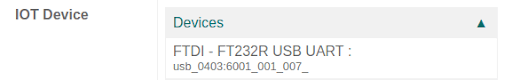
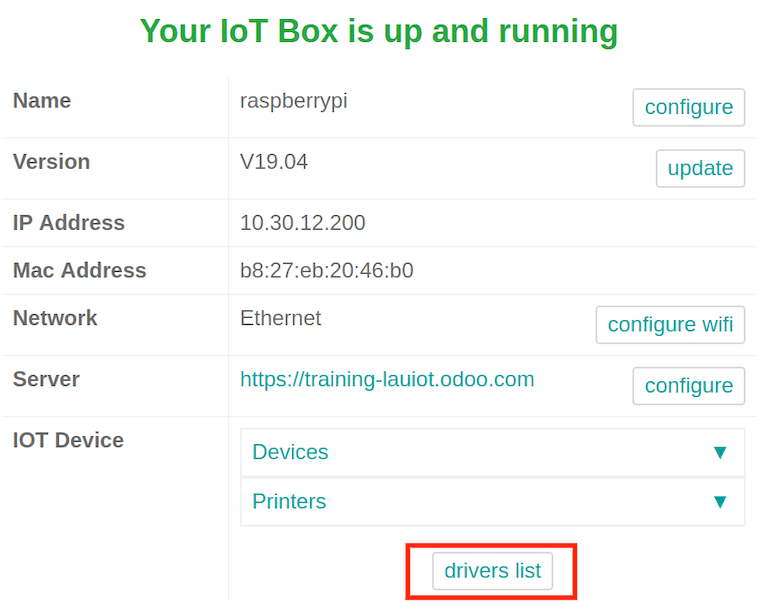

===============
Connect a scale
===============

A scale can be connected to the :abbr:`IoT (Internet of Things)` box on an Odoo database in a few
easy steps. After setup, the *Point of Sale* app can be used to weigh products, which is helpful if
their prices are calculated based on weight.

.. important::
   - In EU member states, `certification is legally required <https://eur-lex.europa.eu/legal-content/EN/TXT/?uri=uriserv%3AOJ.L_.2014.096.01.0107.01.ENG>`_
     to use a scale as an integrated device.
   - Odoo is not certified in several countries, including France, Germany, and Switzerland. If you
     reside in one of these countries, you can still use a scale but without integration to your
     Odoo database.
   - Alternatively, you have the option to acquire a *non-integrated* certified scale that prints
     certified labels, which can then be scanned into your Odoo database.

.. seealso::
   `Directive 2014/31/EU of the European Parliament <https://eur-lex.europa.eu/legal-content/EN/TXT/?uri=uriserv%3AOJ.L_.2014.096.01.0107.01.ENG>`_

Connection
==========

To link the scale to the :abbr:`IoT (Internet of Things)` box, connect it with a :abbr:`USB
(Universal Serial Bus)` cable.

.. note::
   In some cases, a serial port to :abbr:`USB (Universal Serial Bus)` adapter may be needed.

If the scale is `compatible with Odoo IoT Box <https://www.odoo.com/page/iot-hardware>`_, there is
no need to set up anything because it will be automatically detected as soon as it is connected.

The :abbr:`IoT (Internet of Things)` box may need to be restarted and the scale's drivers may need
to be downloaded to the box in some cases. To update the drivers, go to the :abbr:`IoT (Internet of
Things)` box homepage and click on :guilabel:`Drivers List`. Then, click on :guilabel:`Load
Drivers`.

If loading the drivers still doesn't allow for the scale to function, it may be that the scale is
not compatible with the Odoo :abbr:`IoT (Internet of Things)` box. In this case, a different scale
will need to be used.

Use a scale in a point of sale (POS) system
===========================================

To use the scale in the *Point of Sale app*, go to :menuselection:`PoS app --> 3-Dot Menu on the PoS
--> Settings`, then enable the :abbr:`IoT (Internet of Things)` box feature. After this is complete,
the scale device can be set.

Select the scale from the :guilabel:`Electronic Scale` drop-down menu. Then click :guilabel:`Save`
to save the changes, if required.

.. image:: scale/electronic-scale-feature.png
   :align: center
   :alt: List of the external tools that can be used with PoS and the IoT box.

The scale is now available in all the :abbr:`PoS (Point of Sale)` sessions. Now, if a product has a
price per weight set, clicking on it on the :guilabel:`PoS` screen opens the scale screen, where the
cashier can weigh the product and add the correct price to the cart.

.. image:: scale/scale-view.png
   :align: center
   :alt: Electronic Scale dashboard view when no items are being weighed.

Troubleshooting
===============

Set up Ariva S scales
---------------------

Odoo has determined that a specific setting in Ariva S series scales (manufactured by
Mettler-Toledo, LLC.) needs modification, and a dedicated Mettler :abbr:`USB (Universal Serial
Bus)`-to-proprietary RJ45 cable is required for the scale to function with Odoo's :abbr:`IoT
(Internet of Things)` box.

To correctly configure the scale for recognition by the :abbr:`IoT (Internet of Things)` box, follow
this setup process for the Ariva S series scales.

.. important::
   It is crucial to use the official Mettler :abbr:`USB (Universal Serial Bus)`-to-RJ45 cable during
   this process.

Cable
~~~~~

The Mettler part number is 72256236 - :abbr:`USB (Universal Serial Bus)`-to-:abbr:`POS (Point of
Sale)` cable. Contact Mettler, or a partner, to purchase an authentic cable. Note that **no other**
cable outside of this Mettler cable works for this configuration. Using a serial-only cable attached
to a serial-to-:abbr:`USB (Universal Serial Bus)` adapter is **not** effective.

.. image:: troubleshooting/cable-mettler.png
   :align: center
   :alt: Authentic Mettler USB to POS cable, part number 72256236.

Setup
~~~~~

Refer to Mettler's Setup Guide for Ariva S series scales during the following configuration: `Ariva
Checkout Scale User's Guide <https://www.mt.com/dam/RET_DOCS/Ariv.pdf>`_.

To begin, go to page 17 in the above manual for *Setup*. This guide lists potential settings for the
Ariva S series scales.

Follow the instructions, along with the following process, to set the scale to setup mode. First,
hold the **>T<** button for eight seconds, or until :guilabel:`CONF` appears.

Next, press **>T<** until :guilabel:`GRP 3` appears, then press **>0<** to confirm.

Under :guilabel:`3.1`, ensure the setting is set to :guilabel:`1` (USB Virtual COM ports). Press
**>T<** to cycle through the options under group 3.1.

Once :guilabel:`3.1` is set to :guilabel:`1`, press **>0<** to confirm the selection. Continue to
press **>0<** until :guilabel:`GRP 4` appears.

Now, press **>T<** until :guilabel:`EXIT` appears.

.. important::
   Do **not** make any other changes unless otherwise needed.

Once :guilabel:`EXIT` appears, press **>0<**. Following this, press **>0<** again to
:guilabel:`SAVE`. Now the scale restarts.

Finally, restart the :abbr:`IoT (Internet of Things)` box to recognize the changes made on the
scale's configuration. After restarting, the scale appears as `Toledo 8217`, as opposed to the
previous display, where it appeared as `Adam Equipment Serial`.

