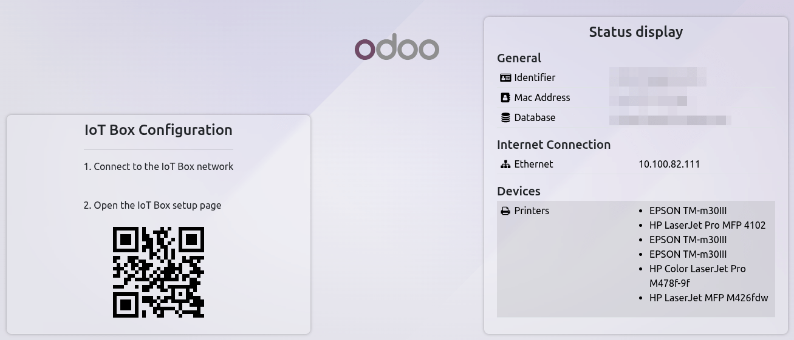

================
Connect a screen
================

The :doc:`IoT box <../iot_box>` can be connected to a screen, e.g. to ease the IoT box's setup
and/or serve as a :ref:`customer display <pos/hardware/display>` to show customers their :doc:`Point
of Sale </applications/sales/point_of_sale>` orders.

Connection
==========

Connect the screen to the IoT box using a micro-HDMI cable. If the connection was successful, the
external monitor displays the :guilabel:`Status display` screen.

The screen also appears in the IoT box's list of devices:

- on the :ref:`IoT box's form <iot/connect/IoT-form>`;
- on the :ref:`IoT box's homepage <iot/iot-box/homepage>`;
- in the IoT app, under the menu :menuselection:`IoT --> Devices`.

Customer display
================

To use the screen as a :ref:`customer display <pos/hardware/display>`, :ref:`configure the POS
accordingly <pos/hardware/display-configuration>`.

To display a specific website on the screen instead of the POS customer display, go to
:menuselection:`IoT --> Devices`, click the screen's card, then enter the desired website's URL in
the :guilabel:`Display URL` field.
