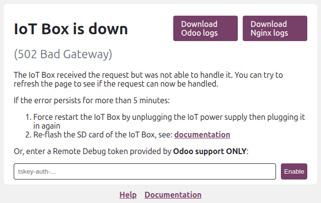

===============
Troubleshooting
===============

Frequently encountered issues
=============================

The pairing code does not appear or does not work
-------------------------------------------------

The :ref:`pairing code <iot/connect/pairing-code>` might not be displayed or printed under the
following circumstances:

- The IoT system is not connected to the network.
- The IoT system is already connected to an Odoo database. :ref:`Disconnect it from the database
  <iot/connect/disconnect>`.
- The :ref:`pairing code <iot/connect/pairing-code>` display time has expired. Restart the :ref:`IoT
  box <iot/iot-box/homepage>` or the :ref:`Windows virtual IoT service <iot/windows_iot/restart>` to
  generate and display the pairing code.

The IoT system does not connect to the database
-----------------------------------------------

The IoT system might take a few minutes to restart when it connects to a database. If it still does
not appear after a few minutes:

- Verify that the IoT system can reach the database and the server does not use a multi-database
  environment.
- Restart the :ref:`IoT box <iot/iot-box/homepage>` or the :ref:`Windows virtual IoT service
  <iot/windows_iot/restart>`.

The IoT system is connected to the Odoo database but cannot be reached
----------------------------------------------------------------------

Verify that the IoT system and the computer running the Odoo database are connected to the same
network and :ref:`update the DNS settings <iot/troubleshooting/dns>` if necessary.

The Windows virtual IoT's homepage cannot be accessed from another device
-------------------------------------------------------------------------

- Ensure the device is connected to the same network as the Windows virtual IoT.
- Check the :ref:`iot/windows-iot/firewall`.

The IoT system does not work after an Odoo upgrade
--------------------------------------------------

Restart the :ref:`IoT box <iot/iot-box/homepage>` or the :ref:`Windows virtual IoT service
<iot/windows_iot/restart>`.

If the issue persists, :ref:`update its image <iot/updating_iot/image-code>` by flashing the IoT
box's card or :ref:`uninstalling the Windows virtual IoT program <iot/windows_iot/uninstall>` and
:ref:`reinstalling the virtual IoT package <iot/windows-iot/installation>`.

.. _iot/troubleshooting/dns:

The IoT system's homepage can be accessed using its IP address but not the `xxx.odoo-iot.com` URL
-------------------------------------------------------------------------------------------------

Contact your system or network administrator to address the issue. Network-related problems are
beyond the scope of Odoo support services.

- If the router allows manual :abbr:`DNS (Domain Name System)` configuration, update the settings to
  use `Google DNS <https://developers.google.com/speed/public-dns>`_.
- If the router does not support this, you need to update the DNS settings directly on each device
  that interacts with the IoT system to use `Google DNS
  <https://developers.google.com/speed/public-dns>`_. Instructions for configuring DNS on individual
  devices can be found on the respective manufacturer's website.

.. note::
   - Some IoT devices, such as payment terminals, likely do not require DNS changes, as they are
     typically pre-configured with custom DNS settings.
   - On some browsers, an error code mentioning the DNS (such as `DNS_PROBE_FINISHED_NXDOMAIN`) is
     displayed.

.. _iot/troubleshooting/https_certificate:

HTTPS certificate generation issues and errors
==============================================

The HTTPS certificate does not generate
---------------------------------------

Potential causes include the following:

- The database doesn't meet the :ref:`eligibility requirements
  <iot/https_certificate_iot/iot-eligibility>` for generating an :ref:`HTTPS certificate
  <iot/connect/https_certificate>`.
- The firewall is preventing the HTTPS certificate from generating correctly. In this case,
  deactivate the firewall until the certificate is successfully generated.

  .. note::
     Some devices, such as routers with a built-in firewall, can prevent the HTTPS certificate from
     generating.

Errors
------

A specific error code is displayed on the IoT system's homepage if any issues occur during the
generation or reception of the :ref:`HTTPS certificate <iot/connect/https_certificate>`.

.. tip::
   When you access the IoT system's homepage, it automatically checks for an HTTPS certificate and
   attempts to generate one if it is missing. If an error appears, refresh the page to see if the
   issue is resolved.

Missing credentials
~~~~~~~~~~~~~~~~~~~

The contract and/or database :abbr:`UUID (Universal Unique Identifier)` is missing from the IoT.

Verify that both values are correctly configured. To update them, :ref:`access the IoT box's
<iot/iot-box/homepage>` or :ref:`Windows virtual IoT's homepage <iot/windows-iot/homepage>`,
click the :icon:`fa-cogs` (:guilabel:`cogs`) button, then click :guilabel:`Credentials`.

.. note::
   - To access the full request exception details with information regarding the error, :ref:`enable
     the developer mode <developer-mode>`, click the IoT system's card in the IoT app, and click
     :guilabel:`Download logs` on the :ref:`IoT system's form <iot/connect/IoT-form>`.
     To define the log levels recorded in the IoT system's log file, :ref:`access the IoT box's
     <iot/windows-iot/homepage>` or :ref:`Windows virtual IoT's <iot/iot-box/homepage>` homepage,
     click the :icon:`fa-cogs` (:guilabel:`cogs`) button, then :guilabel:`Log level` at the
     bottom of the page.
   - To address network-related issues, contact your system or network administrator; these issues
     are beyond the scope of Odoo support services.

Odoo.com not reachable
~~~~~~~~~~~~~~~~~~~~~~

The IoT system successfully reached `<https://www.odoo.com>`_ but received an unexpected
`HTTP response (status codes) <https://developer.mozilla.org/en-US/docs/Web/HTTP/Status>`_.

To solve this issue:

#. Open `<https://www.odoo.com>`_ in a web browser to check if the website is temporarily down for
   maintenance.
#. | If `<https://www.odoo.com>`_ is down for maintenance, wait for it to resume.
   | If the website is operational, open a `support ticket <https://www.odoo.com/help>`_ and make
     sure to include the 3-digit HTTPS status code in the ticket.

Still no certificate?
~~~~~~~~~~~~~~~~~~~~~

If the IoT system successfully connected to `<https://www.odoo.com>`_, but the server refused to
provide the :ref:`HTTPS certificate <iot/connect/https_certificate>`.

Check that the IoT system and database meet the :ref:`eligibility requirements
<iot/https_certificate_iot/iot-eligibility>` for an HTTPS certificate.

Grant Odoo support team access to an IoT Box
============================================

If you need to grant remote access to an IoT Box, you can provide a Tailscale token
on the IoT Box's homepage. This allows the Odoo support team to access the IoT Box
for troubleshooting securely.

.. warning::
    Only enter a token from a trusted source, such as an official Odoo support representative.
    Providing a token grants access to the IoT Box and your entire local network, so it should
    be done with caution.

On the :ref:`IoT Box's homepage <iot/iot-box/homepage>`, click the :icon:`fa-cogs`
(:guilabel:`cogs`) button, then click :guilabel:`Debugging Tools`. In the pop-up window,
enter the Tailscale token provided by the Odoo support team and click :guilabel:`Enable`.

.. note::
   **Remote Debug** is only available for :doc:`IoT boxes <../iot_box>`, not the :doc:`Windows
   virtual IoT <../windows_iot>`.

Is the IoT Box down?
--------------------

If the IoT Box is down, you can still enable remote access for the Odoo support team.
Just provide the key in the only field displayed on the :ref:`homepage <iot/iot-box/homepage>` and
click :guilabel:`Enable`.

.. note::
    Enabling remote access on a down IoT Box is only available from version above v26.01.2026.
    If your IoT Box doesn't have this option, you will need to :ref:`flash the IoT Box's card with
    the latest image <iot/updating_iot/image-code>`.
