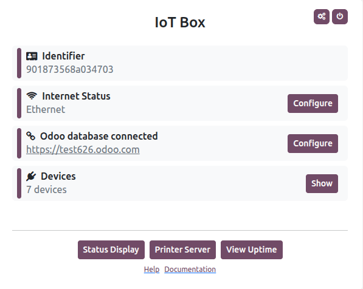

=======
IoT box
=======

To start using an IoT box:

#. Connect your :doc:`devices <devices>` to the IoT box.
#. :ref:`Connect the IoT box to the network <iot/iot_box/network>`.
#. :doc:`Connect the IoT box to your Odoo database <connect>`.

.. seealso::
   - `Video: How to Set Up and Use the Odoo IoT Box: A Beginner's Guide
     <https://www.youtube.com/watch?v=w2_Dcm3r_7o>`_
   - :doc:`iot_advanced/troubleshooting`

.. _iot/iot_box/network:

Network connection
==================

The IoT box can be connected to the network via :ref:`Ethernet <iot/iot_box/network-ethernet>` or
:ref:`Wi-Fi <iot/iot_box/network-wifi>`.

.. note::
   It is recommended to connect the IoT box to the same network as the :doc:`devices <devices>` it
   connects to.

.. important::
   Never make the IoT box accessible from the public Internet.
   IoT systems are designed to provide your database with access to devices on your local network.
   Exposing them to the public Internet would create a **security risk**.

.. _iot/iot_box/network-ethernet:

Ethernet
--------

Plug the Ethernet cable into the IoT box's Ethernet port and an available port on your router, then
connect the IoT box to a power source.

.. _iot/iot_box/network-wifi:

Wi-Fi
-----

Make sure no Ethernet cable is connected to the IoT box and follow these steps:

  #. Connect the IoT box to a power source and wait a few minutes for it to power on.
  #. Access the computer's Wi-Fi settings and select the IoT box's network. The network name is in
     the format `IoTBox-xxxxxxxxxxxx` (where `xxxxxxxxxxxx` is a unique identifier).
  #. Connect to the IoT box's Wi-Fi network and sign in to it; the browser should automatically
     open and redirect to the :ref:`IoT box's homepage <iot/iot-box/homepage>`.
  #. On the IoT box's homepage, click :guilabel:`Configure` next to the :guilabel:`Internet Status`
     section.
  #. Wait a few minutes for the available networks to be scanned, select the network, enter the
     Wi-Fi's password, and click :guilabel:`Connect`.

     .. image:: iot_box/iot-wifi.png
        :scale: 75%
        :alt: IoT box's WiFi hotspot

.. note::
   - Once connected to the Wi-Fi network, the IoT box stops emitting its Wi-Fi signal, and the
     computer should automatically reconnect to its original network. If it does not, reconnect to
     it manually.
   - Depending on the operating system used, the browser might not open and redirect to the IoT
     box's homepage. In this case, open the browser manually and navigate to `http://10.11.12.1` or
     any URL starting with **http** (e.g., `http://odoo.com`).

.. tip::
   If the IoT box is connected to an :doc:`external monitor <devices/screen>`, scan the first QR
   code displayed on the screen to connect to the network, then scan the second QR code to access
   the IoT box's :ref:`homepage <iot/iot-box/homepage>`. On the homepage, click
   :guilabel:`Configure` in the :guilabel:`Internet Status` section, select the relevant Wi-Fi
   network, enter the password, and click :guilabel:`Connect`.

.. _iot/iot-box/led-status:

LED status
==========

The IoT box features two LEDs, located to the right of the SD card slot, that indicate its status
and help with troubleshooting when no display is connected. The LEDs can be interpreted as follows:

- **Red LED lit**: The IoT box is not connected to the Internet. Ensure the Ethernet cable is
  properly connected, or :ref:`connect the IoT box via Wi-Fi <iot/iot_box/network-wifi>`.
- **Green LED flashing**: The IoT box is waiting to :doc:`connect to a database <connect>`.
- **Green LED constantly lit**: The IoT box is connected to a database; no further action is
  required.

.. _iot/iot-box/homepage:

IoT box homepage
================

To access the IoT box's homepage on a device, first ensure the device is on the same network as the
IoT box. Then, if using the IoT app, click :guilabel:`Homepage`, or open a browser on the device and
navigate to the IoT box's IP address.

If the IP address is not already known, use any of the following methods to retrieve it:

- While connected to the same network as the IoT box, open a web browser and navigate to
  `http://iotbox.local`. The page automatically redirects to the homepage, which displays the IP
  address.
- Connect a `supported receipt or label printer <https://www.odoo.com/app/iot-hardware>`_ using a
  USB cable, which then automatically prints a ticket with the IP address.
- Connect the IoT box to an :doc:`external monitor <devices/screen>`, which then displays the IP
  address on the screen.
- On IoT box images `L2026.05.25` and later, the IoT box IP address is displayed as a discovered
  Bluetooth device for 5 minutes after booting.
- Access the router's administrator interface, or use third-party software to scan the network.

   .. image:: iot_box/iot-status-display.png
      :scale: 75%
      :alt: Status display with IoT box's IP address

.. tip::
   - To manually restart the IoT box, access the :ref:`homepage <iot/iot-box/homepage>`, then click
     the :icon:`fa-power-off` :guilabel:`(power off)` button in the top-right corner.
   - If the IoT box is connected to an :doc:`external monitor <devices/screen>` or a :doc:`printer
     <devices/printer>`, its homepage can also be accessed by scanning the displayed or printed QR
     code with a device connected to the same network as the IoT box.
   - To fully reboot the IoT box, unplug it and plug it back in.
