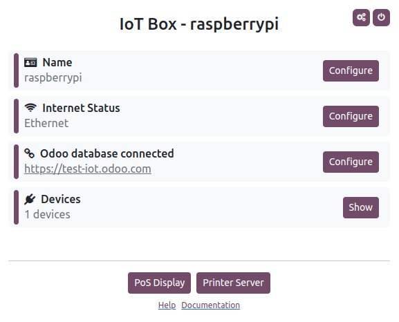

=======
IoT box
=======

To start using an IoT box:

#. Make sure you have a :ref:`valid IoT box subscription <iot/iot/iot-subscription>` in addition to
   your Odoo subscription.
#. Connect your :doc:`devices <devices>` to the IoT box.
#. :ref:`Connect the IoT box to the network <iot/iot_box/network>`.
#. :doc:`Connect the IoT box to your Odoo database <connect>`.

.. note::
   Devices can also be connected after the IoT box is added to the network and/or connected to the
   database; however, a reboot of the IoT box might be required.

.. _iot/iot_box/network:

Network connection
==================

The IoT box can be connected to the network via :ref:`Ethernet <iot/iot_box/network-ethernet>` or
:ref:`Wi-Fi <iot/iot_box/network-wifi>`.

.. important::
   **All** devices must be connected to the **same network**: the IoT box, the device(s) connected
   to the IoT box, and the computer connected to Odoo.

.. _iot/iot_box/network-ethernet:

Ethernet
--------

Plug the Ethernet cable into the IoT box's Ethernet port and an available port on your router, then
connect the IoT box to a power source.

.. _iot/iot_box/network-wifi:

Wi-Fi
-----

Make sure no Ethernet cable is connected to the IoT box and follow these steps:

  #. Connect the IoT box to a power source and wait a few minutes for it to power on.
  #. Access your computer's Wi-Fi settings and select the IoT box's network. The network name is in
     the format `IoTBox-xxxxxxxxxxxx` (where `xxxxxxxxxxxx` is a unique identifier).
  #. Connect to the IoT box's Wi-Fi network and sign into it; your browser should automatically
     open and redirect to the :ref:`IoT box's homepage <iot/iot-box/homepage>`.

     .. note::
        Depending on your operating system, the browser might not open and redirect to the IoT box's
        homepage. In this case, open your browser manually and navigate to `http://10.11.12.1`
        or any url starting with **http** (e.g., `http://odoo.com`).

  #. On the IoT box's homepage, click :guilabel:`Configure` next to the :guilabel:`Internet Status`
     section.
  #. Wait a few minutes for the available networks to be scanned, select the network, enter the
     Wi-Fi's password, and click :guilabel:`Connect`.

.. note::
   Once connected to the Wi-Fi network, the IoT box stops emitting its Wi-Fi signal, and the
   computer should automatically reconnect to its original network. If it does not, reconnect to it
   manually.

.. _iot/iot-box/homepage:

IoT box homepage
================

To access the IoT box's homepage, open a web browser **on the same network as the IoT box** and
navigate to the IoT box's IP address.

The IoT box's IP address can be retrieved by:

- connecting the IoT box to an external monitor: the IP address is displayed on the screen.

  .. image:: iot_box/iot-pos-display.png
     :scale: 75%
     :alt: POS display with IoT box's IP address

- connecting the IoT box to a `supported receipt or label printer <https://www.odoo.com/fr_FR/app/iot-hardware>`_
  with a USB cable: the IP address is automatically printed.
- accessing the administrator interface of the router to which the IoT box is connected or using
  third-party software to scan the network.

Once the IoT box is :doc:`connected to the Odoo database <connect>`, its homepage can be accessed
from Odoo by opening the IoT app and clicking the URL displayed on the IoT box's card.
