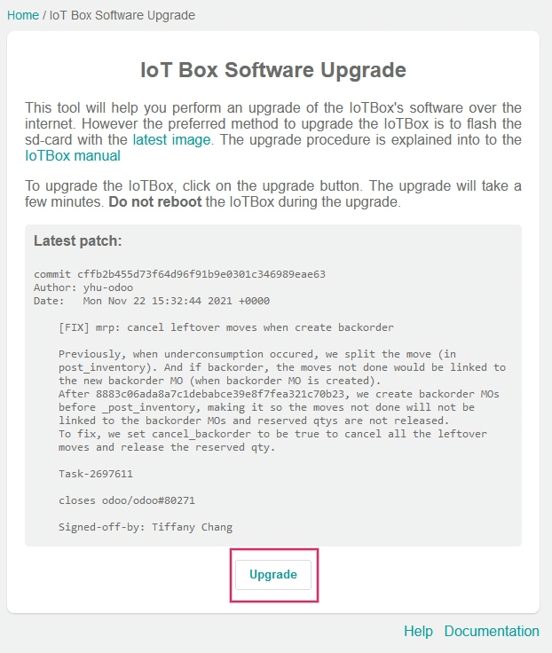

==============
Updating (IoT)
==============

Due to the complexity of the :abbr:`IoT (Internet of Things)` box, and virtual Windows :abbr:`IoT
(Internet of Things)` box, the term 'updating' can mean several different things.

The actual drivers can be updated, the core code on the :abbr:`IoT (Internet of Things)` box can be
updated, or a new image can be flashed (using a physical :abbr:`IoT (Internet of Things)` box).

This document explores the various ways to update :abbr:`IoT (Internet of Things)` boxes to ensure
smooth operation of :abbr:`IoT (Internet of Things)` box processes and devices.

.. _iot/config/homepage-upgrade:

Update from the IoT box home page
=================================

In the background, the :abbr:`IoT (Internet of Things)` box uses a version of Odoo code to run and
connect to the Odoo database. This code may need to be updated in order for the :abbr:`IoT (Internet
of Things)` box to operate effectively. This operation should be completed on a routine basis, to
ensure the :abbr:`IoT (Internet of Things)` system, and its processes, stay up-to-date.

Go to the :abbr:`IoT (Internet of Things)` box home page by navigating to :menuselection:`IoT app
--> IoT Boxes`, and clicking on the :guilabel:`IP address` of the :abbr:`IoT (Internet of Things)`
box. Then, click on :guilabel:`Update` (next to the version number).

If a new version of the :abbr:`IoT (Internet of Things)` box image is available, an
:guilabel:`Upgrade to _xx.xx_` button appears at the bottom of the page. Click this button to
upgrade the unit, at which point the :abbr:`IoT (Internet of Things)` box flashes itself to the
newer version. All of the previous configurations are then saved.

.. important::
   This process can take more than 30 minutes. Do **not** turn off, or unplug, the :abbr:`IoT
   (Internet of Things)` box, as it would leave it in an inconsistent state. This means the
   :abbr:`IoT (Internet of Things)` box needs to be :ref:`re-flashed <iot/config/flash>` with a new
   image.

Handler (driver) update
=======================

There may be some instances where drivers or interfaces need to be updated for individual devices
(e.g. scales, measurement tools, etc.). The IoT handler's (drivers and interfaces) code can be
modified by syncing them with the configured server handler's code.

This can be helpful in instances where :abbr:`IoT (Internet of Things)` devices (e.g. scales,
measurement tools, etc.) are not working properly with the :abbr:`IoT (Internet of Things)` box.

For both the Windows :abbr:`IoT (Internet of Things)` (Odoo 16 and higher) and physical :abbr:`IoT
(Internet of Things)` box, this process can be performed manually from the :abbr:`IoT (Internet of
Things)` box home page. Go to the :abbr:`IoT (Internet of Things)` box home page by navigating to
:menuselection:`IoT app --> IoT Boxes`, and clicking on the :guilabel:`IP address` of the :abbr:`IoT
(Internet of Things)` box.

Next, click :guilabel:`Handlers list`, and then select :guilabel:`Load Handlers` at the bottom of
the page.

.. image:: updating_iot/load-handlers.png
   :align: center
   :alt: Handlers list on an IoT box with the load handlers button highlighted.

.. important::
   Handler's code is fetched from the configured server, and it needs to be up-to-date to have the
   latest fixes and patches.

.. note::
   A handler update is also performed automatically each time the :abbr:`IoT (Internet of Things)`
   box is restarted. The only exception to this process is if the *Automatic drivers update* is
   unchecked in the form view of the :abbr:`IoT (Internet of Things)` box on the Odoo server. This
   setting can be reached by going to :menuselection:`IoT App --> Select the IoT box --> Automatic
   drivers update`.
