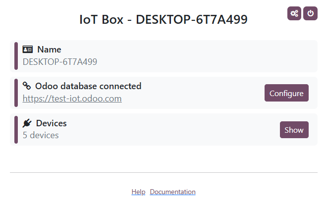

===================
Windows virtual IoT
===================

To start using the Windows virtual IoT:

#. Make sure all :ref:`prerequisites <iot/windows-iot/prerequisites>` are met.
#. :ref:`Install the Windows virtual IoT <iot/windows-iot/installation>` on a Windows computer.
#. :ref:`Configure the Windows Firewall <iot/windows-iot/firewall>`.
#. Connect your :doc:`devices <devices>` to the Windows virtual IoT.
#. :doc:`Connect the Windows virtual IoT to your Odoo database <connect>`.

.. _iot/windows-iot/prerequisites:

Prerequisites
=============

The following prerequisites must be met before setting up and using the Windows virtual IoT:

- A valid :ref:`IoT box subscription <iot/iot/iot-subscription>`.
- An updated and recent version of Windows (i.e., Windows 10 or Windows 11) installed on a Windows
  computer (laptop, desktop, or server).

.. note::
   - :abbr:`MRP (Material Requirement Planning)` devices, including cameras and measurement tools,
     are not compatible with Windows virtual IoT.
   - It is also possible to create a Windows Virtual Machine on a MacOS/Linux computer. However,
     this option is not supported by Odoo, and no troubleshooting assistance will be provided.

.. _iot/windows-iot/installation:

Installation
============

To install the Windows virtual IoT on a Windows computer:

#. Access `Odoo's download page <https://odoo.com/download>`_ and download the Odoo installation
   package for Windows **matching your database's version**.
#. Open the downloaded :file:`.exe` file, allow the app to make changes to your device, select
   a language, and click :guilabel:`OK`.
#. Click :guilabel:`Next`, then :guilabel:`I Agree` to accept the terms and conditions and continue.
#. Select :guilabel:`Odoo IoT` from the :guilabel:`Select the type of install` dropdown list. The
   following components should be selected: Odoo Server, Odoo IoT, Nginx WebServer, and Ghostscript
   interpreter.
#. Verify you have the required space on your computer and click :guilabel:`Next`.
#. In the :guilabel:`Destination folder`, enter C:\\odoo and click :guilabel:`Install`.

   .. warning::
      Do not install Odoo's Windows virtual IoT in any Windows user directory, as this can cause
      issues with :ref:`iot/https_certificate_iot/generation`.

#. Once the installation is complete, click :guilabel:`Next`.
#. Set up GPL Ghostscript: Click :guilabel:`Next`, agree to the terms and conditions, click
   :guilabel:`Install`, then :guilabel:`Finish`.
#. Click :guilabel:`Next`, :guilabel:`Next`, and :guilabel:`Finish` to complete the setup. The
   :ref:`IoT system's homepage <iot/windows-iot/homepage>` automatically opens in a web browser with
   the URL `http://localhost:8069`.

   .. tip::
      If the web browser does not show anything, :ref:`restart <iot/windows_iot/restart>` the
      Windows virtual IoT service.

#. Check that you can access the :ref:`IoT system's homepage <iot/windows-iot/homepage>` in a web
   browser:

   - on the Windows virtual IoT computer, and
   - on another device **on the same network as the IoT system** by navigating to the URL
     `http://xxx:8069` (where `xxx` is the IoT system's IP address).
   - on another device **on the same network as the IoT system** by navigating to the URL
     `https://xxx` (where `xxx` is the IoT system's IP address) to test for :doc:`HTTPS
     <iot_advanced/https_certificate_iot>` connection.

     .. tip::
        If you cannot access the :ref:`IoT system's homepage <iot/windows-iot/homepage>` from
        another device, create a :ref:`Windows Firewall <iot/windows-iot/firewall>` rule to allow
        communication through port `8069`.

.. _iot/windows-iot/firewall:

Windows Firewall configuration
==============================

Firewalls help keep devices secure but can sometimes block legitimate connections. If the Windows
virtual IoT isn't accessible on the :abbr:`LAN (Local Area Network)`, for example from another
device, it could be due to a firewall blocking the connection. To prevent this issue, configure
exceptions for network discovery in the :abbr:`OS (Operating System)` or firewall settings.

.. note::
   If third-party firewall software is installed on the Windows computer, refer to the software's
   documentation to configure firewall exceptions.

To create a rule on Windows Defender and allow communication through port `8069`, follow these
steps:

#. Search the Windows start menu for `firewall` and select the :guilabel:`Windows Defender Firewall
   with Advanced Security` app.
#. In the left part of the window, select :guilabel:`Inbound Rules`.
#. In the right part of the window, under :guilabel:`Actions`, click :guilabel:`New Rule`.
#. In the :guilabel:`New Inbound Rule Wizard` that opens, select the :guilabel:`Port` type of rule
   and click :guilabel:`Next`.
#. On the :guilabel:`Protocols and Ports` page, make sure :guilabel:`TCP` and :guilabel:`Specified
   local ports` are selected, enter the following in the field: `8069, 80, 443`, and click
   :guilabel:`Next`.

   .. note::
      Other ports may be necessary depending on your IoT devices. For example, for the
      :doc:`/applications/sales/point_of_sale/payment_methods/terminals/worldline` payment terminal,
      add the `9050` port.

#. On the :guilabel:`Action` page, select :guilabel:`Allow the connection` and click
   :guilabel:`Next`.
#. On the :guilabel:`Profile` page, disable any connection type(s) that don't apply to your
   Windows computer and click :guilabel:`Next`.
#. On the :guilabel:`Name` page, provide a :guilabel:`Name` (e.g., `Odoo`) and, optionally, a brief
   :guilabel:`Description`, then click :guilabel:`Finish`.

.. seealso::
   `Windows Firewall rules documentation
   <https://learn.microsoft.com/en-us/windows/security/operating-system-security/network-security/windows-firewall/rules>`_

.. _iot/windows-iot/homepage:

Windows virtual IoT homepage
============================

To access the Windows virtual IoT's homepage, navigate to the URL `http://localhost:8069` on the
Windows virtual IoT computer or open a web browser from another computer **on the same network as
the IoT system** and navigate to the URL `http://xxx:8069` (where `xxx` is the IoT system's IP
address).

Once the Windows virtual IoT is :doc:`connected to the Odoo database <connect>`, its homepage can
be accessed from Odoo by opening the IoT app and clicking the URL displayed on the IoT system's
card.

.. note::
   Make sure the :ref:`Windows Firewall is configured <iot/windows-iot/firewall>` to allow access.

Device connection
=================

Most :doc:`devices <devices>` automatically connect to the Windows computer used for the Windows
Virtual IoT through `Windows Plug and Play (PnP)
<https://learn.microsoft.com/en-us/windows-hardware/drivers/kernel/introduction-to-plug-and-play>`_.
However, if Windows does not recognize the device automatically upon connection, the administrator
may need to manually install the appropriate drivers.

.. tip::
   After connecting the devices to the computer, refresh the :ref:`IoT system's homepage
   <iot/windows-iot/homepage>` to verify that the device is listed. If the device does not appear,
   :ref:`reload the handlers <iot_updating_iot/handlers>` from the :ref:`IoT system's homepage
   <iot/windows-iot/homepage>`.

.. _iot/windows_iot/restart:

Windows virtual IoT restart
===========================

To manually restart the Windows IoT server, search the Windows start menu for `services` and
select the :guilabel:`Services` app. Scroll down to the :guilabel:`odoo-server-xxx` service (where
`xxx` is the odoo version), right-click it, and select :guilabel:`Start` or :guilabel:`Restart`.

.. _iot/windows_iot/uninstall:

Windows virtual IoT uninstall
=============================

To uninstall the Windows virtual IoT, `uninstall
<https://support.microsoft.com/en-us/windows/uninstall-or-remove-apps-and-programs-in-windows-4b55f974-2cc6-2d2b-d092-5905080eaf98#ID0EBD=Windows_11>`_
the Odoo program on your Windows computer. Confirm the uninstallation and complete the steps in the
:guilabel:`Odoo Uninstall` dialog.
