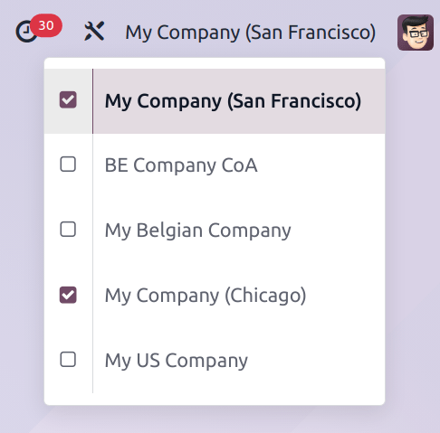

=============
Multi-company
=============

.. |mcd| replace:: multi-company database

In Odoo, multiple companies can exist within a single database. This allows for some data to be
shared among companies, while still maintaining some level of separation between entities.

Before deciding to use the multi-company feature, there are several factors to consider.

.. important::
   Multi-company is **only** available in *One App Free* databases, or with `Custom
   <https://www.odoo.com/pricing-plan>`_ plans.

Accessing multiple companies
============================

The list of :ref:`companies an employee has access to <general/employee-access>` in a |mcd| can be
found at the top-right of the main Odoo menu bar, where the active company is listed. Click on the
company name to reveal a list of all allowed companies. To switch to a different company, click on
the company name in the drop-down menu. To enable multiple companies at once, tick the checkbox next
to each desired company name.

   An example of a user with access to multiple companies. The current company is My Company (San
   Francisco), while My Company (Chicago) is also active.

.. note::
   The database may refresh after each checkbox is ticked.

.. _general/active-companies:

Multiple active companies
-------------------------

If more than one company is active at a time, one company is highlighted in purple, and is listed on
the menu bar. This is the considered the *current* company.

When creating a new record, the current company is added to the record in the *Company* field,
except under the following circumstances:

- The *Company* field for a new product, or a new contact, is left blank.
- If there is a related document already in the system, the *Company* field on the new record
  defaults to the same company.

.. example::
   Mitchell Admin has multiple companies enabled, but the current company is `My Company (Chicago)`.
   When he creates a new product record, the :guilabel:`Company` field is left blank by default.

   When a new sales team is created, the :guilabel:`Company` field automatically defaults to `My
   Company (Chicago)`.

.. _general/sharing-data:

Share data
==========

In a |mcd|, certain records are able to be utilized by all of the companies (or several, based on
permissions).

Products
--------

In an |mcd|, new products are created with the :ref:`Company field <general/active-companies>`
blank, by default. If the *Company* field remains blank, the product is shared across all companies.

Contacts
--------

Similar to products, contact records are shared across companies, by default. To limit access to a
single company, click the :ref:`Company field <general/active-companies>` on a contact form, and
select a company to assign the contact to.

Inter-company transactions
==========================

The :ref:`Inter-Company Transactions <general/inter-company>` feature allows for one company in the
database to sell or purchase goods and services from another company within the same database.
Counterpart documents for orders and invoices can be automatically generated and synchronized,
depending on the configuration settings.

.. warning::
   To ensure inter-company transactions are handled appropriately, certain configurations, such as
   fiscal positions and localizations, need to be accurately assigned. See :ref:`Inter-Company
   Transactions <general/inter-company>` for additional information.

Use cases
=========

Multinational companies
-----------------------

A multinational retail chain, which operates in the United States and Canada, needs to manage
transactions in both USD and CAD currencies.

Additionally, because both countries have different tax laws and regulations, it is in the best
interest of the customer to utilize the multi-company feature.

This allows for inter-company transactions they need to manage inventory moves across international
borders, while making it simple to sell to customers in both countries in their own currency.

Separate processes
------------------

A small furniture company is developing a new line of products that require a separate procurement,
inventory, and manufacturing process. The new products are drastically different from the existing
catalog. The company is considering utilizing the multi-company feature to treat this new line as a
different entity.

To keep their database from becoming overly complex, the furniture company does not need to add an
entirely new company. Instead, they can take advantage of existing features, such as :doc:`analytic
accounting <../finance/accounting/reporting/analytic_accounting>`, and multiple warehouses, to
manage the new product line, without having to overly complicate transactions.

Limitations
===========

In some instances, a |mcd| may *not* be the best option, due to potential limitations.

Access rights
-------------

A user's access rights are configured on a database level. If a user has access to more than one
company in a |mcd|, their access rights are the same across every company.

Shared records
--------------

Individual records are either :ref:`shared <general/sharing-data>` between all companies, or belong
to a single company.

PDF Reports
-----------

Some customizations, specifically for PDF reports, apply to all companies. It is not always possible
to separate reports for individual companies.
