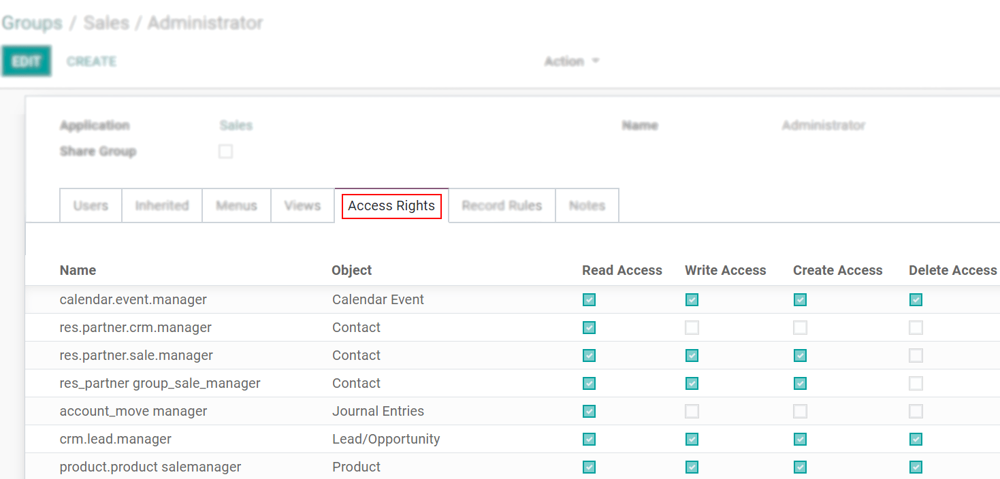

=======================
Users and Access Rights
=======================

Odoo defines a *user* as someone who has access to a database to perform daily tasks. You can add as
many users as you need and, in order to restrict the type of information each user can access, rules
can be applied. Users and access rights can be added and changed at any point.

.. _general/odoo_basics/add_individual_user:

Add individual users
====================

Go to :menuselection:`Settings --> Manage Users` and click on *Create*.

.. image:: users/manage-users.png
   :align: center
   :height: 280
   :alt: View of the settings page emphasizing the manage users field in Odoo

| Fill in the form with the needed information. Under the tab
  :ref:`Access Rights <general/odoo_basics/users/access_rights>` choose the group within
  each application the user can have access to.
| The list of applications shown is based on the applications installed on the database.

.. image:: media/new_user.png
   :align: center
   :alt: View of a user’s form emphasizing the access rights tab in Odoo

When you are done editing the page and have *Saved* it, an invitation email is automatically sent to
the user. The user must click on it to accept the invitation and create a login.

.. image:: users/invitation-email.png
   :align: center
   :alt: View of a user’s form with a notification that the invitation email has been sent in Odoo

.. note::
   Remember that subscription prices follow the number of users. Refer to our
   `pricing page <https://www.odoo.com/pricing>`_
   for more information.

With the :doc:`Developer mode </applications/general/developer_mode>` activated, *User Types* can
be selected.

.. image:: users/user-type.png
   :align: center
   :height: 300
   :alt: View of a user’s form in developer mode emphasizing the user type field in Odoo

The *Portal* and *Public* options do not allow you to choose access rights. Members have specific
ones (such as record rules and restricted menus) and usually do not belong to the usual Odoo
groups.

.. _users/passwords-management:

Passwords management
====================

.. _users/reset-password:

Reset passwords
---------------

.. _users/reset-password-login:

Enable password resets from login page
~~~~~~~~~~~~~~~~~~~~~~~~~~~~~~~~~~~~~~

It is possible to enable password resets directly from the login page.

To do so, go to :menuselection:`Settings --> Permissions`, activate **Password Reset** and *Save*.

.. image:: users/password-reset-login.png
   :align: center
   :alt: Enabling Password Reset in Odoo Settings

.. _users/reset-password-email:

Send reset instructions to users
~~~~~~~~~~~~~~~~~~~~~~~~~~~~~~~~

Go to :menuselection:`Settings --> Users & Companies --> Users`, select the user out of the list and
click on *Send Password Reset Instructions* on its user form. An email is automatically sent to
them.

.. note::
   The *Send Password Reset Instructions* button only appears if the Odoo invitation email has
   already been confirmed by the user.

This email contains all the instructions needed to reset the password, along with a link redirecting
the user to an Odoo login page.

.. _users/change-password:

Change users’ passwords
-----------------------

Go to :menuselection:`Settings --> Users  & Companies --> Users` and select a user to access its
form. Click on the *Action* button and select *Change Password*.

.. image:: users/change-password.png
   :align: center
   :alt: Change another user's password on Odoo

Enter a new password and confirm by clicking on *Change Password*.

.. note::
   This operation only modifies the password of the users locally and does not affect their odoo.com
   account. If you want to change the odoo.com password, you can :ref:`send the password reset
   instructions <users/reset-password-email>`.

Click on *Change Password* one more time. You are then redirected to an Odoo login page where you
can reaccess your database using your new password.

.. _general/odoo_basics/users/access_rights:

Access Rights in detail
=======================

Activate the :doc:`Developer mode </applications/general/developer_mode>`, then go to
:menuselection:`Settings --> Users & Companies --> Groups`.

Groups
------

| When choosing the groups the user can have access under
  :ref:`Access Rights <general/odoo_basics/add_individual_user>`, details of the rules and
  inheritances of that group are not shown, so this is when the menu *Groups* comes along. *Groups*
  are created to define rules to models within an application.
| Under *Users*, have a list of the current ones. The ones with administrative rights are shown
  in black.

.. image:: users/groups-users.png
   :align: center
   :alt: View of a group’s form emphasizing the tab users in Odoo

*Inherited* means that users added to this application group are automatically added to the
following ones. In the example below, users who have access to the group *Administrator* of *Sales*
also have access to *Website/Restricted Editor* and *Sales/User: All Documents*.

.. image:: users/groups-inherited.png
   :align: center
   :height: 330
   :alt: View of a group’s form emphasizing the tab inherited in Odoo

.. important::
   Remember to always test the settings being changed in order to ensure that they are being applied
   to the needed and right users.

The *Menus* tab is where you define which menus (models) the user can have access to.

.. image:: users/groups-menus.png
   :align: center
   :height: 330
   :alt: View of a group’s form emphasizing the tab menus in Odoo

*Access Rights* rules are the first level of rights. The field is composed of the object name, which
is the technical name given to a model. For each model, enable the following options as appropriate:

- *Read*: the values of that object can be only seen by the user.
- *Write*: the values of that object can be edited by the user.
- *Create*: values for that object can be created by the user.
- *Delete*: the values of that object can be deleted by the user.

| As a second layer of editing and visibility rules, *Record Rules* can be formed. They overwrite,
  or refine, the *Access Rights*.
| A record rule is written using a *Domain*. Domains are conditions used to filter or searching
  data. Therefore, a domain expression is a list of conditions. For each rule, choose among the
  following options: *Read*, *Write*, *Create* and *Delete* values.

.. image:: users/groups-record-rules.png
   :align: center
   :alt: View of a group’s form emphasizing the tab record rules in Odoo

.. important::
   Making changes in access rights can have a big impact on the database. For this reason, we
   recommend you to contact your Odoo Business Analyst or our Support Team, unless you have
   knowledge about Domains in Odoo.

Multi Companies
===============

The *Multi Companies* field allows you to set to which of the multiple companies database you hold
the user can have access.

.. note::
   Note that if not handled correctly, it may be the source of a lot of inconsistent multi-company
   behaviors. Therefore, a good knowledge of Odoo is required. For technical explanations refer
   to :doc:`this </developer/howtos/company>` documentation.

.. seealso::
   - :doc:`../multi_companies`
   - :doc:`../../settings/users_and_features`