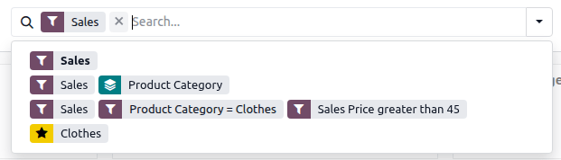

============
Offline mode
============

.. important::
   Odoo’s offline mode is not intended to offer full or long-term offline capabilities, but rather
   to provide a solution for short-term interruptions.

To ensure business continuity when connectivity is unreliable or unavailable, such as when commuting
or while working in locations with poor or no coverage, Odoo makes certain data and functionality
available offline for logged-in users.

As soon as the internet connection is no longer active, a :guilabel:`Working offline` button
appears in the database header. Views or records that were previously opened while online can be
re-opened, regardless of whether they were active in the browser at the moment connectivity was
lost. Previously opened records can be viewed but not modified while offline.

Elements that are *not* available offline, such as menu items, views, buttons, or other records, are
automatically grayed out.

.. image:: offline_mode/grayed-out.png
   :alt: Elements not available offline are grayed out

In addition, search queries that were previously performed while online are also available offline.
To repeat a previously performed search, click in the search bar, then choose from the available
searches.

.. tip::
   If you foresee connectivity issues, briefly open any views or records you expect to need, and
   perform any searches so they can still be accessed if/when connectivity is lost.

.. note::
   - Odoo supports offline access for apps and modules built using :doc:`standard Odoo
     framework components </developer/reference/frontend/framework_overview>`.
   - For performance reasons, Odoo allocates a maximum of 2 GB for offline data. When this limit is
     reached, the oldest data is removed to make room for the most recent activity.
   - Performing a hard refresh using `Ctrl + F5` or `Cmd + Shift + R`, e.g., for troubleshooting
     reasons, removes all locally stored data. This impacts the availability of views and records in
     offline mode.
