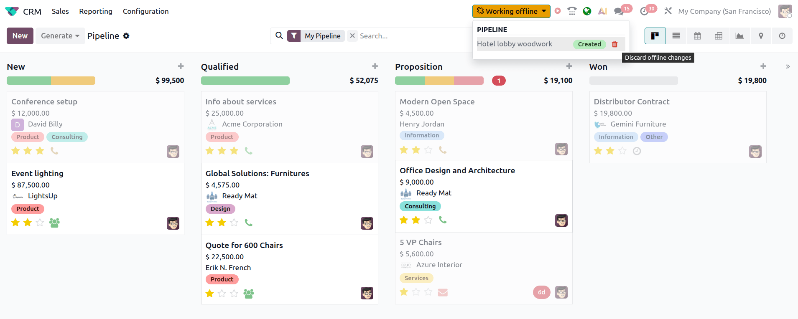

============
Offline mode
============

.. important::
   Odoo’s offline mode provides a solution for short-term interruptions; it is not intended to offer
   full or long-term offline capabilities.

To ensure business continuity when connectivity is unreliable or unavailable, such as while
commuting or when working in locations with poor or no coverage, Odoo makes certain functionality
available offline for logged-in users.

As soon as the internet connection is no longer active, a :guilabel:`Working offline` button appears
in the database header. Views or records that were previously opened while online can be reopened,
regardless of whether they were active in the browser at the moment connectivity was lost.
Records can be :ref:`edited, deleted, archived, unarchived, or created
<general/offline-mode/records-create-udpate>`, provided certain conditions are met. Previously
performed :ref:`search queries <general/offline-mode/search>` can be run again.

Items that are not available offline are grayed out.

Any changes made offline are :ref:`queued locally <general/offline-mode/manage-changes>`; when
connectivity is restored, changes are synced automatically and reflected in your database.

.. tip::
   If you foresee connectivity issues, briefly open any views or records you expect to need, and
   perform any searches so they can still be accessed if/when connectivity is lost.

.. note::
   - Odoo supports offline access for apps and modules built using :doc:`standard Odoo
     framework components </developer/reference/frontend/framework_overview>`.
   - For performance reasons, Odoo allocates a maximum of 2 GB for offline data. When this limit is
     reached, the oldest data is removed to make room for the most recent activity.
   - Performing a hard refresh using `Ctrl + F5` or `Cmd + Shift + R`, e.g., for troubleshooting
     reasons, removes all locally stored data. This impacts the availability of views and records in
     offline mode.

.. _general/offline-mode/records-create-udpate:

Create and update records
-------------------------

When offline, records can be:

- created, provided a record of the same type was previously created while you were online
- edited, deleted, archived, or unarchived, provided they were previously opened while you
  were online

.. note::
   Attachments and images can be opened while offline, but cannot be uploaded or deleted.

.. _general/offline-mode/search:

Perform searches
----------------

Search queries that were previously performed while online can be repeated offline. To repeat a
previously performed search, click in the search bar, then choose from the available searches.

  .. image:: offline_mode/saved-searches.png
     :alt: Previous executed searches available via search bar
     :scale: 80%

.. _general/offline-mode/manage-changes:

Manage offline changes
----------------------

When you create or update a record offline, the changes are stored locally in a temporary queue
until the internet connection is restored.

To view pending changes while still offline, click the :guilabel:`Working offline` button; modified
records are listed, with a tag showing whether the record was :guilabel:`Created`,
:guilabel:`Edited`, :guilabel:`Archived`, or :guilabel:`Unarchived`.

Hovering over an :guilabel:`Edited` tag reveals the changes made.

.. example::
   In the example, the :guilabel:`Office Design and Architecture` opportunity was edited to change
   the :guilabel:`Salesperson` (technical field name :guilabel:`user_id`) from `Mitchell
   Admin` to `Marc Demo` and the :guilabel:`Expected Revenue` from `9000` to `15000`.

   .. image:: offline_mode/queued-changes.png
      :alt: Dropdown on Working offline button showing list of changes made offline
      :scale: 80%

To make further changes to an edited record while still offline, click the record to open it
locally. To discard pending changes while still offline, for example, if changes were made in error
or in the wrong order, click the :icon:`fa-trash` :guilabel:`(Discard offline changes)` icon.

.. _general/offline-mode/disable:

Disable offline mode for specific views
---------------------------------------

In some cases, for example, for reporting views, displaying outdated or cached information may not
be appropriate. To disable data caching for a specific view and, as a result, make the view
unavailable offline, follow these steps:

#. Open the view in question.
#. Activate :ref:`developer mode <developer-mode>`.
#. Click the :icon:`fa-bug` :guilabel:`(bug)` icon in the database header, then select
   :guilabel:`Action`.
#. Disable :guilabel:`Data caching`.
