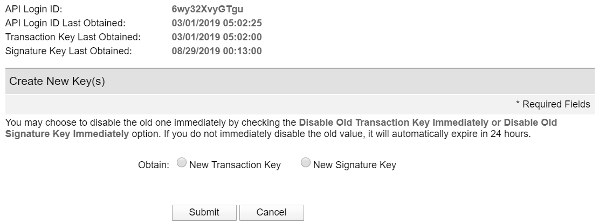
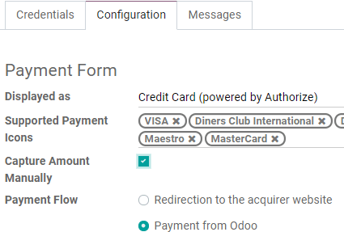
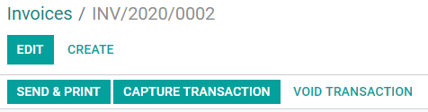

=============
Authorize.Net
=============

`Authorize.Net <https://www.authorize.net>`__ is a United States-based online payment solution
provider, allowing businesses to accept **credit cards**.

This Payment Acquirer offers additional options that are not available for other :doc:`Payment
Acquirers <../payment_acquirers>`, such as the ability to process your customer's payment after
delivery.

Authorize.Net account
=====================

If not done yet, choose a plan and `Sign Up for an Authorize.Net account
<https://www.authorize.net/sign-up.html>`__.

Odoo needs your **API Credentials & Keys** to connect with your Authorize.Net account, which
comprise:

- API Login ID
- Transaction Key
- Signature Key

To retrieve them, log into your Authorize.Net account, go to :menuselection:`Account --> Security
Settings --> General Security Settings --> API Credentials & Keys`, and generate your **Transaction
Key** and **Signature Key**.

.. seealso::

   - `Authorize.Net: Getting Started Guide
     <https://support.authorize.net/s/article/Authorize-Net-Getting-Started-Guide>`__

Payment Acquirer Configuration
==============================

To configure Authorize.Net as Payment Acquirer in Odoo, go to :menuselection:`Accounting -->
Configuration --> Payment Acquirers`, open **Authorize.Net**, and change the **State** to *Enabled*.
Don't forget to click on *Save* once you've set everything up.

.. note::
   Please refer to the :doc:`Payment Acquirers documentation <../payment_acquirers>` to read how to
   configure this payment acquirer.

Credentials
-----------

Copy your credentials from your Authorize.Net account (API Login Id, API Transaction Key, and API
Signature Key), paste them in the related fields under the **Credentials** tab, then click on
**Generate Client Key**.

.. note::
   The **API Client Key** is necessary only if you select *Payment from Odoo* option as
   :ref:`Payment Flow <payment_acquirers/payment_flow>`.

.. important::
   If you are trying Authorize.Net as a test, with a *sandbox account*, change the **State** to
   *Test Mode*. We recommend doing this on a test Odoo database, rather than on your main database.

Payment Flow
------------

The **Payment Flow** lets you decide if to redirect the user to the payment acquirer's portal to
authenticate the payment, or if to stay on the current page and authenticate the payment from Odoo.
This field is under the **Configuration** tab.

If you select *Redirection to the acquirer website*, make sure you add a **Default Receipt URL** and
a **Default Relay Response URL** to your Authorize.net account.

To do so, log into your Authorize.Net account, go to :menuselection:`Account --> Transaction Format
Settings --> Transaction Response Settings --> Response/Receipt URLs`, and set the default links:

- | Default Receipt URL:
  | *https://[yourcompany.odoo.com]*/**payment/authorize/return**
- | Default Relay Response URL:
  | *https://[yourcompany.odoo.com]*/**shop/confirmation**

.. note::
   | Failing to complete this step results in the following error:
   | *The referrer, relay response or receipt link URL is invalid.*

Capture the payment after the delivery
--------------------------------------

The **Capture Amount Manually** field is under the **Configuration** tab. If enabled, the funds are
reserved for 30 days on the customer's card, but not charged yet.

To capture the payment, go to the related Sales Order and click on *Capture Transaction*. If the
order is canceled, you can click on *Void Transaction* to unlock the funds from the customer's card.

.. warning::
   After **30 days**, the transaction is **voided automatically** by Authorize.net.

.. note::
   With other payment acquirers, you can manage the capture in their own interfaces, not from Odoo.

.. seealso::
   - `Authorize.Net: Getting Started Guide
     <https://support.authorize.net/s/article/Authorize-Net-Getting-Started-Guide>`__
   - :doc:`../payment_acquirers`
   - :doc:`../../websites/ecommerce/shopper_experience/payment_acquirer`
