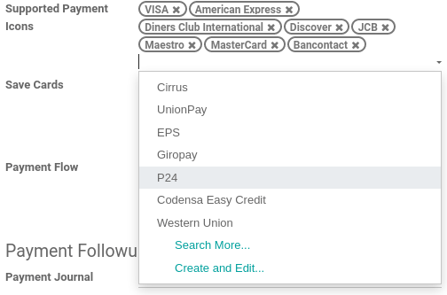

======
Stripe
======

`Stripe <https://stripe.com/>`_ is a United States-based online payment solution provider, allowing
businesses to accept **credit cards** and other payment methods.

Configuration
=============

.. seealso::
   - :ref:`payment_acquirers/add_new`

Credentials tab
---------------

Odoo needs your **API Credentials** to connect with your Stripe account, which comprise:

- Publishable Key: The key solely used to identify the account with Stripe.
- Secret Key: The key to sign the merchant account with Stripe.
- Webhook Signing Secret: If a webhook is enabled on your Stripe account
  (:menuselection:`Developers --> webhooks`), this signing secret must be set to authenticate the
  messages sent from Stripe to Odoo.

To retrieve the publishable and secret keys, log into your Stripe dashboard and go to
:menuselection:`Developers --> API Keys --> Standard Keys`

.. important::
   If you are trying Stripe as a test, in the **test mode**, change the **State** to *Test
   Mode*. We recommend doing this on a test Odoo database, rather than on your main database.

Enable local payment methods
****************************

Local payment methods are payment methods that are only available for certain merchants and
customers countries and currencies.

To enable specific local payment methods with Stripe, list them as supported payment icons. To do
so, go to :menuselection:`Payment Acquirers --> Stripe --> Configuration` and add the desired
payment methods in the **Supported Payment Icons** field. If the desired payment method is already
listed, you don't have anything to do. If a payment icon record doesn't exist in the database, its
related payment method is considered enabled with Stripe.

.. seealso::
   - :doc:`../payment_acquirers`
