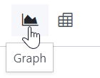
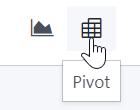

=========
Reporting
=========

You can find several reports under the :guilabel:`Reporting` menu of most apps that let you analyze
and visualize the data of your records.

.. _reporting/views:

Selecting a view
================

Depending on the report, Odoo can display the data in various ways. Sometimes, a unique view
fully tailored to the report is available, while several views are available for others. However,
two generic views are dedicated to reporting: the graph and pivot views.

.. _reporting/views/graph:

Graph view
----------

The :ref:`graph view <reporting/using-graph>` is used to visualize your records' data, helping you
identify patterns and trends. The view is often found under the :guilabel:`Reporting` menu of apps
but can be found elsewhere. Click the **graph view button** located at the top right to access
it.

.. _reporting/views/pivot:

Pivot view
----------

The :ref:`pivot view <reporting/using-pivot>` is used to aggregate your records' data and break it
down for analysis. The view is often found under the :guilabel:`Reporting` menu of apps but can be
found elsewhere. Click the **pivot view button** located at the top right to access it.

.. _reporting/choosing-measures:

Choosing measures
=================

After selecting a view, you should ensure only the relevant records are :doc:`filtered <search>`.
Next, you should choose what is measured. By default, a measure is always selected. If you wish to
edit it, click :guilabel:`Measures` and choose one or, only for pivots, multiple measures.

.. note::
   When you select a measure, Odoo aggregates the values recorded on that field for the filtered
   records. Only numerical fields (:ref:`integer <studio/fields/simple-fields/integer>`,
   :ref:`decimal <studio/fields/simple-fields/decimal>`, :ref:`monetary
   <studio/fields/simple-fields/monetary>`) can be measured. In addition, the :guilabel:`Count`
   option is used to count the total number of filtered records.

After choosing what you want to measure, you can define how the data should be :ref:`grouped
<search/group>` depending on the dimension you want to analyze. By default, the data is often
grouped by *Date > Month*, which is used to analyze the evolution of a measure over the months.

.. tip::
   When you filter a single time period, the option to compare it against another one appears.

   .. image:: reporting/comparison.png
      :alt: Using the comparison option

.. example::

   .. tabs::

      .. tab:: Select measures

         Among other measures, you could add the :guilabel:`Margin` and :guilabel:`Count` measures
         to the Sales Analysis report. By default, the :guilabel:`Untaxed Amount` measure is
         selected.

         .. image:: reporting/measures.png
            :alt: Selecting different measures on the Sales Analysis report

      .. tab:: Group measures

         You could group the measures by :guilabel:`Product Category` at the level of rows on the
         previous Sales Analysis report example.

         .. image:: reporting/single-group.png
            :alt: Adding a group on the Sales Analysis report

.. _reporting/using-pivot:

Using the pivot view
====================

Grouping data is quintessential to the pivot view. It enables drilling down the data to gain deeper
insights. While you can use the :guilabel:`Group By` option to quickly add a group at the level of
rows, as shown in the example above, you can also click the plus button (:guilabel:`➕`) next to the
:guilabel:`Total` header at the level of rows *and* columns, and then select one of the
**preconfigured groups**. To remove one, click the minus button (:guilabel:`➖`).

Once you have added a group, you can add new ones on the opposite axis or the newly created
subgroups.

.. example::
   You could further divide the measures on the previous Sales Analysis report example by the
   :guilabel:`Salesperson` group at the level of columns and by the :guilabel:`Order Date > Month`
   group on the :guilabel:`All / Saleable / Office Furniture` product category.

   .. image:: reporting/multiple-groups.png
      :alt: Adding multiple groups on the Sales Analysis report

.. tip::
   - Switch the rows and columns' groups by clicking the flip axis button (:guilabel:`⇄`).
   - Click on a measure's label to sort the values by ascending (⏶) or descending (⏷) order.
   - Download a `.xlsx` version of the pivot by clicking the download button (:guilabel:`⭳`).

.. _reporting/using-graph:

Using the graph view
====================

Three graphs are available: the bar, line, and pie charts.

**Bar charts** are used to show the distribution or a comparison of several categories. They are
especially useful as they can deal with larger data sets.

**Line charts** are useful to show changing time series and trends over time.

**Pie charts** are used to show the distribution or a comparison of a small number of categories
when they form a meaningful whole.

.. tabs::

   .. tab:: Bar chart

      .. image:: reporting/bar.png
         :alt: Viewing the Sales Analysis report as a bar chart

   .. tab:: Line chart

      .. image:: reporting/line.png
         :alt: Viewing the Sales Analysis report as a line chart

   .. tab:: Pie chart

      .. image:: reporting/pie.png
         :alt: Viewing the Sales Analysis report as a pie chart

.. tip::
   For **bar** and **line** charts, you can use the stacked option when you have at least two
   groups, which then appear on top of each other instead of next to each other.

   .. tabs::

      .. tab:: Stacked bar chart

         .. image:: reporting/stacked-bar.png
            :alt: Stacked bar chart example

      .. tab:: Regular bar chart

         .. image:: reporting/non-stacked-bar.png
            :alt: Non-stacked bar chart example

      .. tab:: Stacked line chart

         .. image:: reporting/stacked-line.png
            :alt: Stacked line chart example

      .. tab:: Regular line chart

         .. image:: reporting/non-stacked-line.png
            :alt: Non-stacked line chart example

   For **line** charts, you can use the cumulative option to sum values, which is especially useful
   to show the change in growth over a time period.

   .. tabs::

      .. tab:: Cumulative line chart

         .. image:: reporting/cumulative.png
            :alt: Cumulative line chart example

      .. tab:: Regular line chart

         .. image:: reporting/non-cumulative.png
            :alt: Regular line chart example
